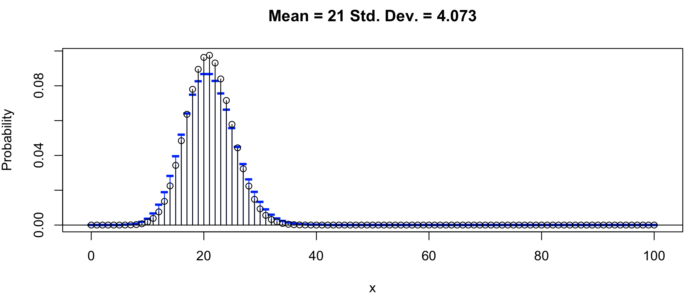
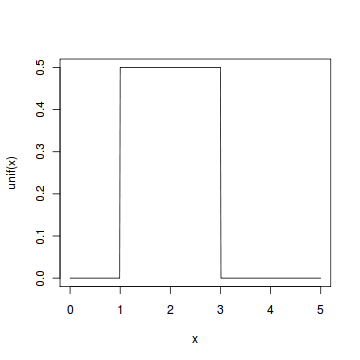
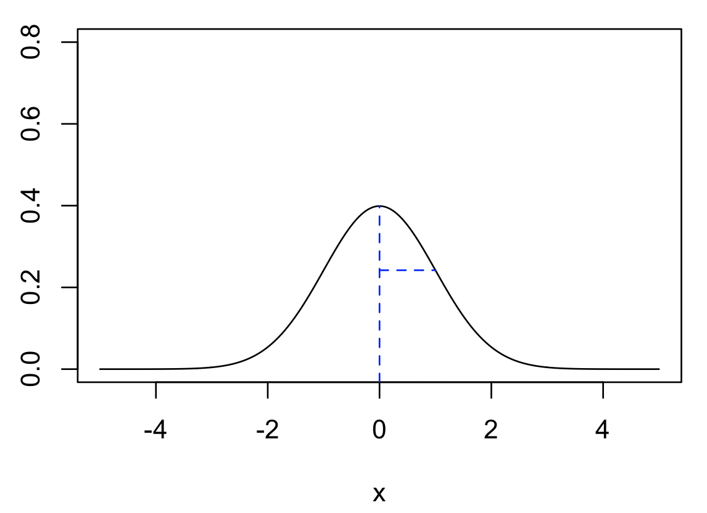
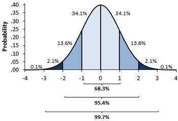
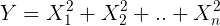
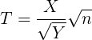
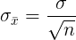

# Wstęp

Wiele zjawisk biologicznych czy ekonomicznych można wymodelować probabilistycznie. Polega to na odpowiednim wyborze modelu (np. rozkładu teoretycznego). Modelowanie tych zjawisk oraz rozkłady teoretyczne opierają się na rachunku prawdopodobieństwa.


# Podstawowe pojęcia w rachunku prawdopodobieństwa

### Zad. 1
>Przyporządkuj terminy do definicji 

Gdy rzucasz kostką do gry, **zmienna losowa** to liczba wyrzuconych oczek. 

**Zdarzenie losowe** polega na otrzymaniu jednej spośród sześciu możliwych wartości tej zmiennej. 

Pojedynczy wynik doświadczenia (np. wypadnięcie szóstki) nazywamy **zdarzeniem elementarnym**. 

Zbiór wszystkich możliwych wyników doświadczenia losowego nazywamy **przestrzenią zdarzeń elementarnych** i oznaczamy dużą grecką literą omega Ω 

```
Ω = {1, 2, 3, 4, 5, 6}
```

### Zad. 2
>Zapisz zdarzenie elementarne i oblicz prawdopodobieństwo wyrzucenia: (1) parzystej liczby oczek, (2) co najwyżej 4 oczek, (3) dokładnie 4 oczek, (4) co najmniej 1 oczka, (5) więcej niż 6 oczek.

Zdarzenia elementarne przyjęło się oznaczać wielkimi literami z początku alfabetu (A,B,C). Na przykład zdarzenie elementarne polegające na wyrzuceniu pięciu lub sześciu oczek w rzucie kostką zapiszemy: 

```
A = {5, 6}
```

Zatem prawdopodobieństwo trafienia piątki lub szóstki zapiszemy jako: 

```
P(A) = |A| / |Ω| = 2 / 6 = 0.33
```

Zdarzenia, których prawdopodobieństwo otrzymania wynosi 1 nazywają się zdarzeniami pewnymi. Z kolei, zdarzenia, których prawdopodobieństwo wynosi 0 nazywają się zdarzeniami niemożliwymi.

# Dyskretne rozkłady prawdopodobieństwa
W dyskretnych rozkładach prawdopodobieństwa zmienna losowa przyjmuje skończony zbiór wartości w przedziale liczbowym (np. liczba oczek na kostce, liczba dzieci, liczba pomyłek, liczba par zasad, liczba białek). Jest to zmienia, która najczęściej przyjmuje wartości liczb całkowitych i zmienia się o jeden.

## Rozkład dwumianowy (*Binomial distribution*)
Używamy tego rozkładu, kiedy w wyniku możemy otrzymać dwie wartości (np. sukces-porażka, zdrowy-chory, orzeł-reszka, puryna-pirymidyna).

### Zad. 3
>Rzucasz trzy razy monetą. Ile wynosi prawdopodobieństwo wypadnięcia orła dokładnie dwa razy?

Przestrzeń zdarzeń elementarnych:

Ω = {OOO, **OO**R, **O**R**O** R**OO**, RRO, ROR, ORR, RRR}

Prawdopodobieństwo wypadnięcia orła dokładnie dwa razy:

```
P(X = 2) = 3/8
```

### Zad. 4 (samodzielnie)
>Ile wynosi prawdopodobieństwo otrzymania zero orłów w rzucie z poprzedniego zadania?


### Zad. 5
>Narysuj w R wykres funkcji prawdopodobieństwa pojawienia się orła dokładnie 0, 1, 2, 3 razy w trzech rzutach monetą.

Przestrzeń zdarzeń elementarnych dla trzech rzutów monetą wynosi:

Ω = {OOO, OOR, ORO, ROO, RRO, ROR, ORR, RRR}

Podczas trzech rzutów monetą prawdopodobieństwo:
- wypadnięcia orła 0 razy: P(X = 0) = 1/8 
- wypadnięcia orła 1 raz: P(X = 1) = 3/8
- wypadnięcia orła 2 razy: P(X = 2) = 3/8
- wypadnięcia orła 3 razy: P(X = 3) = 1/8

Prawdopodobieństwa zdarzeń elementarnych muszą się sumować do 1.

Wykres prawdopodobieństwa w R:

```R
x = c(0, 1, 2, 3)
y = c(1/8, 3/8, 3/8, 1/8)
plot(x, y)
plot(x, y, type="h")
barplot(y, names.arg = x)
```

### Zad. 6
>Jakie jest prawdopodobieństwo, że w trzech rzutach monetą orzeł wypadnie przynajmniej jeden raz?

```
P(X >= 1) = 3/8 + 3/8 + 1/8
```

### Zad. 7
>Oblicz wartość oczekiwaną liczby wypadnięć orła w trzech rzutach monetą. 

Wartość oczekiwana określa spodziewany wynik doświadczenia losowego. Spodziewana liczba otrzymania orła w trzech rzutach monetą wynosi:

```
E(X) = 0 * 1/8 + 1 * 3/8 + 2 * 3/8 + 4 * 1/8
```

W R:

```R
sum(x*y)
```

Szybsze rozwiązanie: liczba rzutów monetą (*n*) razy prawdopodobieństwo wypadnięcia orła.

```
E(X) = n * p = 3 * 0.5
```


### Zad. 8
>Rzucasz 5 razy sześcienną kostką do gry. Jakie jest prawdopodobieństwo, że szóstka wypadnie: (1) dokładnie dwa razy, (2) co najwyżej dwa razy?

Zamiast wypisywać wszystkie kombinacje zdarzeń elementarnych (Ω = {11111, 11112, ..}), korzystamy z rozkładu dwumianowego.

Rozkład ten opisuje prawdopodobieństwo zajścia *k* sukcesów w ciągu *n* niezależnych prób (zdarzeń losowych), z których każda próba ma stałe prawdopodobieństwo sukcesu równe *p*. Innymi słowy, o tym rozkładzie mówimy wtedy, kiedy mamy *n* niezależnych doświadczeń losowych (np. 3 rzuty monetą), w których prawdopodobieństwo sukcesu (zajścia określonego zdarzenia np. wypadnięcia orła) w każdym doświadczeniu jest stałe i niezależne od wyników poprzednich i równe *p* (np. wynosi 0.5).

Funkcję prawdopodobieństwa otrzymania dokładnie *k* sukcesów na *n* prób określa wzór Bernouliego.


Obliczmy prawdopodobieństwo wypadnięcia 2 orłów w trzech rzutach monetą.


W programie R jest funkcja `dbinom`, która oblicza prawdopodobieństwo jeżeli podamy *k*, *n* i *p*.

```R
> dbinom(2, 3, 0.5)            # Funkcja prawdopodobieństwa
[1] 0.375                      # Prawdop. wypadnięcia orła dokładnie 2 razy.
```

Jakie jest prawdopodobieństwo, że orzeł wypadnie przynajmniej raz?

```R
> 1:3
[1] 1 2 3
> dbinom(1:3, 3, 0.5)
[1] 0.375 0.375 0.125          # Prawdop. wypadnięcia orła 1, 2 i 3 razy  
> sum(dbinom(1:3, 3, 0.5))     # Suma wartości tych prawdopodobieństw
[1] 0.875
```

Ile wynosi prawdopodobieństwo, że w 5 rzutach kostkach:
1. szóstka wypadnie dokładnie dwa razy?
2. szóstka wypadnie co najwyżej dwa razy?

### Zad. 9 (samodzielnie)
>Narysuj wykres rozkład funkcji prawdopodobieństwa pojawienia się szóstki w 5 rzutach (tj. pojawienia się 0, 1, 2, 3, 4, 5 razy). Wzrokowo określ asymetrię tego rozkładu.


### Zad. 10 (samodzielnie)
>Jeżeli kobieta i mężczyzna są nosicielami genu albinizmu to prawdopodobieństwo, że ich dziecko rodzi się dotknięte bielactwem wynosi 1/4. Jakie jest prawdopodobieństwo, że spośród trójki ich dzieci dokładnie jedno będzie chore?


### Zad. 11 (samodzielnie)
>Niech prawdopodobieństwo, że mikroorganizm przeżyje w środowisku testowym wynosi 3%. Jakie jest prawdopodobieństwo, że wśród 200 mikroogranizmów dokładnie 5 przeżyje?

### Zad. 12
>Koszykarz oddaje 4 rzuty do kosza. Piłka wpada do kosza z prawdopodobieństwem 0.8. Oblicz: (1) wartość prawdopodobieństwa celnych rzutów do kosza (0, 1, 2, 3, 4), (2) wartość oczekiwaną celnych rzutów do kosza, (3) wartość prawdopodobieństwa, że koszykarz trafi celnie co najwyżej 3 razy. 

1. Wartość prawdopodobieństwa celnych rzutów do kosza (0, 1, 2, 3, 4):

   ```R
   dbinom(0:4, 4, 0.8)
   ```
2. Wartość oczekiwaną celnych rzutów do kosza:

   ```R
   4 * 0.8       # E(X) = n * p
   ```

   lub:

   ```R
   x = 0:4
   y = dbinom(x, 4, 0.8)
   sum(x * y)
   ```

3. Wartość prawdopodobieństwa, że koszykarz trafi celnie co najwyżej 3 razy:

   ```R
   sum(dbinom(0:3, 4, 0.8))
   ```
   
   lub

   ```R
   pbinom(3, 4, 0.8)   # Dystrybuanta. Odpowiada ona na pytanie ile wynosi 
                       # prawdop. znalezienia wartości mniejszej bądź równej
                       # od danej wartości X 

   ```

### Zad. 13 (samodzielnie)
>W cząsteczkach miRNA o długości 22 nukleotydów puryny występują z częstością 0.7. Utwórz wykres pokazujący rozkład prawdopodobieństwa występowania cząsteczek miRNA zbudowanych kolejno z: 0, 1, .. 22 puryn. Zatytułuj: wykres (miRNA probability), oś X jako (Number of purins), oś Y (Probability). Określ asymetrię rozkładu.


### Zad. 14 (samodzielnie)
>Ile wynosi prawdopodobieństwo uzyskania cząsteczki miRNA zbudowanej z co najwyżej 13 puryn. 

### Zad. 15 (samodzielnie)
>Ile wynosi prawdopodobieństwo uzyskania cząsteczki miRNA zbudowanej z przynajmniej 10 puryn.

### Zad. 16
>Używając biblioteki TeachingDemos wyświetl dwumianowy rozkład prawdopodobieństwa. Jak zmienia się asymetria rozkładu kiedy p < 0.5 i kiedy p > 0.5.

```R
library("TeachingDemos")              # Załaduj pakiet
install.packages("TeachingDemos")     # Zainstaluj pakiet (jeżeli niezainstalowany)
vis.binom()
```

Gdy *p* jest większe niż 0.5 to rozkład jest lewoskośny (długi lewy ogon), gdy mniejsze to prawoskośny (długi prawy ogon).

## Rozkład Poissona (*Poisson distribution*)
Drugim popularnym typem dyskretnego rozkładu prawdopodobieństwa jest rozkład Poissona. Rozkład ten jest często nazywany rozkładem zdarzeń rzadkich. Tak więc przykłady zmiennych o rozkładzie Poissona to: liczba wypadków na osobę, liczba wygranych w totolotku, liczba awarii występujących w procesie produkcyjnym, liczba zwierząt na pewnym terenie. Te liczby są zgodne z rozkładem Poissona. 

Rozkładu Poissona używamy, kiedy nie jesteśmy w stanie określić, ile maksymalnie zajść zdarzenia może wystąpić w pewnym czasie *t*. W przeciwieństwie do rozkładu dwumianowego, gdzie zlicza się liczbę sukcesów i porażek, w rozkładzie Poissona liczy się jedynie zajście zdarzenia.

Funkcja prawdopodobieństwa ma postać:


Parametr λ jest wartością oczekiwaną (*n * p*) w tym rozkładzie, natomiast *k* oznacza liczbę zajść pewnego zdarzenia.


### Zad. 17
>Polimeraza DNA wprowadza średnio dwa błędne nukleotydy podczas replikacji genomu człowieka. Jakie jest prawdopodobieństwo, że wprowadzi trzy błędne nukleotydy?

Dane z zadania:

* λ = 2
* *k* = 3

Obliczenie prawdopodobieństwa wprowadzenia 3 błędnych nukleotydów podczas replikacji DNA człowieka.


W R:

```R
> dpois(3, 2)
[1] 0.180447
```

### Zad. 18
>Średnia liczba odwiedzin serwisu BLAST w ciągu godziny to 10 tys. użytkowników. Jakie jest prawdopodobieństwo, że serwis w ciągu godziny odwiedzi co najwyżej 10 100 osób? 

Dane z zadania:
* λ = 10000
* k = 10100

```R
sum(dpois(0:10100, 10000))   
```

lub 

```R
ppois(10100, 10000)
```

### Zad. 19
>Używasz nowej technologii sekwencjonowania, którą charakteryzuje niewielki odsetek błędnie wprowadzonych nukleotydów (1 pomyłka na 10 000 pz). Sekwencjonujesz odcinek genomu długości 2000 pz. Jakie jest prawdopodobieństwo otrzymania bezbłędnej sekwencji? 

Dane z zadania:

```
p = 1/10000         # Prawdopodobieństwo pomyłki polimeraz
n = 2000            # Maksymalna liczba prób
k = 0
```

Mamy zatem wszystkie dane aby rozwiązać zadanie używając rozkładu dwumianowego.

```R
> dbinom(k, n, p) # dokładne prawdopodobieństwo
```

Rozkład Poissona ma zastosowanie do obliczenia przybliżonej wartości prawdopodobieństwa w rozkładzie dwumianowym przy dużej liczbie prób i niskim prawdopodobieństwie sukcesu, tj. wtedy, gdy iloczy λ = *np* staje się wielkością stała. Jeżeli jest duża liczba prób (czyli *n* >= 100) i prawdopodobieństwo sukcesu jest niskie (*p* <= 0.2) to rozkład Poissona ma zastosowanie do obliczenia przybliżonej wartości prawdopodobieństwa w rozkładzie dwumianowym.


```R
> lambda = n*p
> dpois(0, lambda)  # przybliżona wartość prawdopodobieństwa
```

Zależność między rozkładem dwumianowym a Poissona można zobaczyć korzystając z biblioteki TeachingDemos i funkcji vis.binom(). Wyraźne podobieństwo w dwóch rozkładach widoczne jest gdy *n* >= 100 i *p* <= 0.2. Niebieskiem kolorem zaznaczony jest rozkład Poissona, z kolei czarne słupki oznaczają rozkład dwumianowy. 




### Zad. 20 (samodzielnie)
>Oblicz prawdopodobieństwo wylosowania co najwyżej trzech osób leworęcznych w 200 losowaniach, jeśli wiadomo, że prawdopodobieństwo spotkania osoby leworęcznej w pewnej populacji ludzi wynosi 0.05.

# Ciągłe rozkłady prawdopodobieństwa
W odróżnieniu od dyskretnych rozkładów prawdopodobieństwa, w których zmienna losowa przyjmuje skończony zbiór wartości w przedziale liczbowym, w rozkładach ciągłych zmienna losowa może przyjmować wartości ciągłe (czyli dowolne wartości zmiennoprzecinkowe). 

W ciągłym rozkładzie prawdopodobieństwa nie zadajemy już pytania, o prawdopodobieństwo otrzymania jednej konkretnej wartości zmiennej losowej (bo wynosi ono zero). Możemy jedynie pytać jakie jest prawdopodobieństwo, że zmienna ciągła przyjmuje wartości w pewnym przedziale liczbowym (mówimy wtedy o gęstości prawdopodobieństwa).

## Rozkład jednostajny (*Uniform distribution*)
Inaczej rozkład prostokątny. Jest to rozkład prawdopodobieństwa, dla którego gęstość prawdopodobieństwa w przedziale od *a* do *b* jest stała i różna od zera, a poza nim równa zeru.

Na przykład, rozkład jednostajny, w którym *a* = 1 i *b* = 3.



Prawdopodobieństwo uzyskania konkretnej wartości między 1 i 3 wynosi 0. Pole pod krzywą to prawdopodobieństwo całkowite wynoszące 1.


### Zad. 21
>Czas oczekiwania na autobus na pewnym przystanku ma rozkład jednostajny na odcinku pomiędzy 0 i 15 minut. (1) Jakie jest prawdopodobieństwo, że osoba będzie czekała mniej niż 12,5 minuty? (2) Poniżej jakiej wartości czasu czekamy 90% razy?

1. Prawdopodobieństwo czekania mniej niż 12.5 minuty wynosi:

```R 
punif(12.5, 0, 15)
```

2. Poniżej jakiej wartości czasu czekamy 90% razy. Jest to pytanie o kwantyl rzędu 90% (percentyl 9) z zadanego rozkładu.

```R
qunif(0.9, 0, 15)
```

## Rozkład normalny (*Normal distribution*)
Rozkład normalny zwany jest także rozkładem Gaussa. Rozkład ten ma charakterystyczny kształt "krzywej dzwonowej" i jest symetryczny względem średniej (średnia jest na środku). 

Jest to teoretyczny rozkład prawdopodobieństwa powszechnie wykorzystywany do modelowania wielu zjawisk przyrodniczych, ekonomicznych itd. Zmienne losowe, które podlegają rozkładowi normalnemu zależą od wielu czynników (a formalnie od nieskończonej liczby innych niezależnych zmiennych losowych). Przykładowo, istnieje prawie nieograniczona liczba czynników warunkujących wzrost człowieka (np. sposób odżywiania, predyspozycje genetyczne, przebyte choroby, poziom hormonu wzrostu itd.). Tak więc należy się̨ spodziewać, że w populacji wzrost podlega rozkładowi normalnemu - najwięcej mamy ludzi średniego wzrostu, mało ludzi bardzo niskich i mało ludzi bardzo wysokich.

Kształt rozkładu zależy od dwóch parametrów: średniej i odchylenia standardowego.

```R
library("TeachingDemos")
vis.normal()
```



Średnia jest zaznaczona niebieską kreską pionową, a odchylenie standardowe poziomą. Średnia i odchylenie standardowe w populacji oznaczane są małymi greckimi literami: μ (mi) i σ (sigma). Średnia przesuwa krzywą wzdłuż osi odciętych, natomiast parametr odchylenia standardowego powoduje, że krzywa jest bardziej spłaszczona lub wysmukła (im większe σ, tym bardziej wykres jest spłaszczony). Mimo zmiany parametrów rozkład jest cały czas symetryczny (średnia = medianie = dominancie). 

W odległości 1 odchylenia standardowego od średniej znajduje się 34.14% wszystkich obserwacji po jednej stronie wykresu (po dwóch 68.28%). Z kolei 95.45% wszystkich obserwacji nie różni się od średniej arytmetycznej o więcej niż 2 odchylenia standardowe. Jeżeli μ = 0, a σ = 1 to rozkład normalny nazywa się standardowym rozkładem normalnym i oznaczany jest jako N(0, 1).

 

Poniżej znajduje się krótki i jasny opis rozkładu normalnego [5min12sek]:

[](https://youtu.be/rzFX5NWojp0)

### Zad. 22 (samodzielnie)
>Ile wynosi prawdopodobieństwo otrzymania wartości mniejszej niż 1 w rozkładzie normalnym (μ = 0, σ = 1)?


### Zad. 23
>Odpowiedz na pytanie z poprzedniego zadania w formie kodu R.

```R
pnorm(1, mean=0, sd=1)
```

### Zad. 24
>Biorąc pod uwagę rozkład z zad. 22, odpowiedz poniżej jakiej wartości zmiennej znajduje się 90% obserwacji?

```R
> qnorm(0.9, mean=0, sd=1)
```

### Zad. 25
>Rozkład poziomu ekspresji genu CCND3 jest normalny o  μ=1.9 i σ=0.5. Ile wyniesie prawdopodobieństwo, że dany gen ulega ekspresji: (1) mniejszej lub równej 1.9? (2) mniejszej lub równej 2.2? (3) większej od 2.2? (4) na poziomie 1.4-2.4? (5) poniżej jakiego poziomu ekspresji znajduje się 75% genów? 

Skorzystaj z `vis.norm()` i ustaw rozkład dla μ = 1.9 i σ = 0.5.

1. Mniejszej lub równej 1.9:

   ```R
   pnorm(1.9, 1.9, 0.5)
   ```

2. Mniejszej lub równej 2.2:

   ```R
   pnorm(2.2, 1.9, 0.5)
   ```

3. Większej od 2.2:

   ```R
   1 - pnorm(2.2, 1.9, 0.5)
   ```

4. Na poziomie 1.4-2.4:

   ```R
   pnorm(2.4, 1.9, 0.5) - pnorm(1.4, 1.9, 0.5)
   ```

5. Poniżej jakiego poziomu ekspresji znajduje się 75% genów:

   ```R
   qnorm(0.75, 1.9, 0.5)
   ```

### Zad. 26 (samodzielnie)
>Aby ubiegać się o przyjęcie do stowarzyszenia Mensa skupiającego osoby o wysokim ilorazie inteligencji należy uzyskać co najmniej 148 punktów w skali Cattela. Wyniki skali Cattela mają w populacji rozkład normalny  μ = 100 i σ = 24. (1) Jaki procent populacji ma szansę stać się członkami towarzystwa? (2) Poniżej jakiej wartości IQ znajduje się 90% społeczeństwa?


### Zad. 27
>W pliku http://www.combio.pl/files/aln_scores.txt znajduje się 10 tys. punktacji dopasowań między sekwencjami cząsteczek miRNA. Wykonaj następujące polecenia i odpowiedz na pytania: (1) Utwórz histogram tych danych. Czy dane są zbliżone do rozkładu normalnego? (2) Ile wynosi średnia i odchylenie standardowe. (3) Dokonaj standaryzacji danych (zamiana na Z-scores). Dla wartości wystandaryzowanych utwórz histogram oraz oblicz średnią i odchylenie standardowe. (4) Czy standaryzacja danych zmienia kształt rozkładu? 

Wczytanie danych do wektora.

```R
vec = scan('http://www.combio.pl/files/aln_scores.txt')
```

1. Utworzenie histogramu tych danych.
   
   ```R
   hist(vec)
   ```

2. Obliczenie średniej i odchylenia standardowego.

   ```R
   mean(vec)
   sd(vec)
   ```

3. Standaryzacja danych.

   ```R
   vec.z = scale(vec)
   mean(vec.z)
   sd(vec.z)
   hist(vec.z)
   ```

4. Samodzielnie

**Wykres kwantyl-kwantyl (QQ)**: Przy sprawdzaniu, czy dane mają rozkład normalny bardzo często korzysta się z wykresów kwantylowych, w których na jednej osi X umieszczone są kwantyle teoretyczne rozkładu normalnego wyestymowane z próby, a na osi Y kwantye próbkowanego rozkładu. Jeżeli zmienna ma idealnie zadany rozkład, wykres przedstawia dokładną prostą. Odchyłki od prostej wskazują na określone typy odchylenia np. skośny, spłaszczony.

```R
qqnorm(x)
qqline(x)
```

## Rozkład Chi-kwadrat (*Chi-squared distribution*)

Rozkład chi-kwadrat jest szczególnym przypadkiem rozkładu gamma. 

```R
library("TeachingDemos")
vis.gamma()                 # 1. Zaznacz 'Show Chi-squared distribution'
                            # 2. Zwiększ `Xmax` do 30
                            # 3. Zmieniaj `Shape`
```
Rozkład chi-kwadrat powstaje poprzez losowanie zmiennych losowych ze standardowego rozkładu normalnego N(0,1) i zsumowaniu ich kwadratów.



Gdzie zmienne losowe *X*<sub>i</sub> ~ *N*(0,1) są niezależne. Wtedy zmienna losowa Y ma rozkład χ2(*n*), gdzie *n* jest liczbą stopni swobody (w tym przypadku jest to liczba obserwacji). Rozkład chi-kwadrat dla jednego stopnia swobody powstaje po prostu podniesienie do kwadratu wylosowanego Z-score. 


### Zad. 28
>Korzystając z pakietu TeachingDemos przedstaw wykres funkcji gęstości rozkładu chi-kwadrat. Od czego zależy kształt tego rozkładu? 

Kształt rozkładu zależy od liczby stopni swobody *n*. Im więcej obserwacji wybieram (zwiększam *shape* – liczbę stopniu swobody) wykres zmienia się z prawoskośnego na bardziej dzwonowaty przypominający rozkład normalny. Dla małych wartości *n* rozkład jest silnie asymetryczny. W miarę wzrostu *n*, wykres staje się coraz bardziej symetryczny i podobny do rozkładu normalnego.

Rozkład chi-kwadrat ma liczne zastosowanie w statystyce - będziemy go używać w testach niezależności i zgodności. Poza tym rozkład jest wykorzystywany do konstrukcji innych rozkładów na przykład rozkładu t-Studenta.


### Zad. 29
>Losujesz 12 obserwacji z rozkładu N(0, 1), podnosisz każdą do kwadratu i sumujesz otrzymane kwadraty. Ile stopni swobody będzie posiadał taki rozkład chi-kwadrat? 

Liczba stopni swobody (*df*) w rozkładzie Chi-kwadrat jest równa liczbie losowanych obseracji *n*.

### Zad. 30
>Losujesz 3 obserwacje z rozkładu N(0,1), podnosisz każdą do kwadratu i sumujesz otrzymane kwadraty. Ile wynosi prawdopodobieństwo, że otrzymana wartość będzie (1) mniejsza lub równa 9, (2) większa lub równa 9.

1. mniejsza lub równa 9

    ```R
    pchisq(9, df=3)
    ```
2. większa lub równa 9

    ```R
    1 - pchisq(9, df=3)
    ```

## Rozkład t-Studenta (*t-distribution*)
Rozkład t-Studenta (William Gosset, angielski chemik i statystyk o pseudonimie Student) z *n* stopniami swobody nazywamy rozkład zmiennej losowej *T* określonej następująco:



Gdzie *X* ~ N(0, 1) oraz *Y* ~ χ2(*n*) są niezależnymi zmiennymi losowymi. Tak więc konstrukcja tego rozkładu odbywa się w oparciu o rozkład normalny i chi-kwadrat.

### Zad. 31
>Korzystając z biblioteki TeachingDemos przedstaw wykres funkcji gęstości rozkładu t-Studenta. Od czego zależy kształt tego rozkładu? 

Funkcja gęstości ma skomplikowaną postać analityczną, a jej wykres można obejrzeć przy użyciu pakietu TeachingDemos. 

```R
vis.t()
```

Rozkład t jest symetryczny względem zera, a jego ogólny kształt jest podobny do kształtu standardowego rozkładu normalnego. Gdy *n* > 30 rozkład t jest już bardzo zbliżony do rozkładu normalnego

Testu t-Studenta będziemy używać w testowaniu hipotez (np. gdy będziemy sprawdzać czy istnieją istotne różnice w ekspresji genu między chorymi pacjentami a ludźmi zdrowymi). Z testu t-Studenta korzystamy, gdy nasze próby mają niewielką liczebność (n <= 30). W przypadku prób o większej liczebności, rozkład ten jest bardzo zbliżony do standardowego rozkładu normalnego.


### Zad. 32
>Wylosuj 10 tys. zmiennych losowych z rozkładu t-Studenta dla 10 stopni swobody i narysuj histogram. 

```R
rt(10000, df=10)  # Wylosowanie 10 tys. liczb
```

### Zad. 33
>Ile wynosi prawdopodobieństwo znalezienia wartości mniejszych lub równych 1 w rozkładzie t-Studenta z 10 stopniami swobody. 

Prawdopodobieństwo znalezienia wartości mniejszych lub równych 1 w rozkładzie t-Studenta z 10 stopniami swobody wynosi:

```R
pt(1, df=10)
```

## Centralne Twierdzenie Graniczne
Centralne Twierdzenie Graniczne jest jedną z bardzo interesujących i jednocześnie zaskakujących obserwacji o naszym świecie. Jest to jedno z najważniejszych twierdzeń rachunku prawdopodobieństwa. Obejrzyj poniższy film [7min34sek].

[](https://youtu.be/YAlJCEDH2uY)

Centralne Twierdzenie Graniczne daje nam dwie zależności matematyczne:

1. Średnia uzyskanego rozkładu normalnego jest równa średniej w wejściowej oryginalnej populacji.

   


2. Odchylenie standardowe w uzyskanym rozkładzie normalnym jest równe: 

   

Twierdzenie Graniczne działa dla każdego parametru (nie tylko średniej): np. mediany, sumy liczb, dominanty, rozstępu.

### Zad. 34 (samodzielnie)
> Sprawdź, jak działa w praktyce CTG przeprowadzając symulację http://www.ltcconline.net/greenl/java/Statistics/clt/cltsimulation.html dla: (1) rozkładu jednostajnego (2) rozkładu prawostronnego i (3) swojego narysowanego rozkładu.


