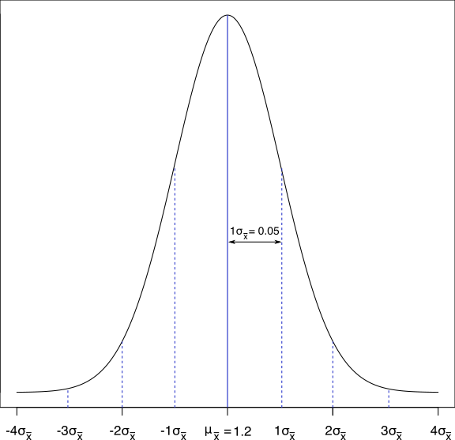

# Wstęp

W oparciu o zebrane przez nas obserwacje (dane z próby losowej) możemy formułować pewne hipotezy dotyczące całej populacji. Wyobraź sobie, że mierzysz w laboratorium aktywność jakiegoś enzymu w kilku komórkach. Na podstawie zmierzonych aktywności obliczasz średnią aktywność tego enzymu. Tak naprawdę nie jesteś zainteresowana/y średnią aktywnością enzymy w obrębie Twoich obserwacji, ale średnią tego enzymy w całej populacji (tj. we wszystkich komórkach organizmu). 

Możesz postawić zatem hipotezę, że średnia aktywność tego enzymu wynosi jakąś wartość. Sprawdzenie postawionej hipotezy dokonuje się za pomocą testu statystycznego. **Test statystyczny to procedura pozwalająca oszacować prawdopodobieństwo spełnienia pewnej hipotezy dotyczącej populacji na podstawie danych pochodzących z próby losowej**.

# 1. Testy istotności dla średniej (jednej próby)
Testy istotności dla średniej sprawdzają, czy średnia obliczona na podstawie próby jest równa średniej w całej populacji.

## Test *z*

### Zad. 1
>Neurolog testuje działanie nowego leku, który ma za zadanie zmieniać czas, po jakim następuje reakcja na bodźce neurologiczne. Neurolog wstrzykuje lek 100 szczurom, następnie każde zwierzę zostaje poddane bodźcom i zmierzony zostaje czas po jakim następuje reakcja. Średni czas reakcji u przetestowanych 100 szczurów to 1.05 sekundy, a odchylenie standardowe to 0.5 sek. Neurolog wie, że średni czas reakcji na bodźce bez leków wynosi u szczurów μ = 1.2 sek. Czy lek ma istotny wpływ na czas po jakim następuje odpowiedź neurologiczna?

Dane z zadania: 

<pre>n = 100       # Liczba szczurów (liczba obserwacji w próbie)
x<sub>śr</sub> = 1.05    # Średni czas reakcji obliczony z próby (po podaniu leku)
s = 0.5       # Odchylenie standardowe obliczone z próby (po podaniu leku)
μ = 1.2       # Średni czas reakcji na bodźce w populacji (bez leku)</pre>

#### Układ hipotez
Aby odpowiedzieć na pytanie **czy lek ma istotny wpływ na czas po jakim następuje odpowiedź neurologiczna** formułujemy dwie hipotezy: hipotezę zerową (H<sub>0</sub>) i hipotezę alternatywną (H<sub>1</sub>). 


<pre>H<sub>0</sub>: lek nie ma wpływu na czas reakcji
H<sub>1</sub>: lek ma wpływ na czas reakcji</pre>


Hipoteza zerowa zawsze oznacza niezmieniony stan rzeczy (*status quo*) - tj. że Twoje działania (np. podanie leku) nie mają żadnego wpływu na dane (np. na czas reakcji na bodźce). **W każdym teście statystycznym hipoteza zerowa jest równa jakiejś wartości.** Natomiast hipoteza alternatywna jest zaprzeczeniem hipotezy zerowej - jest hipotezą, którą jesteśmy skłonni przyjąć gdy odrzucimy hipotezę zerową. Formalnie układ hipotez zapisujemy w poniższy sposób:


<pre>H<sub>0</sub>: μ = 1.2 (po podaniu leku) 
H<sub>1</sub>: μ ≠ 1.2 (po podaniu leku)</pre>

Patrząc na nasze pomiary czasu reakcji na bodźce 100 szczurów widzimy, że średnia z próby (x<sub>śr</sub> = 1.05) różni się od normalnego czasu reakcji na bodźce (średniej w populacji μ = 1.2 sek.). Trudno jednak stwierdzić, czy ta różnica jest znacząca (tj. czy lek ma wpływ na czas reakcji). Jak zdecydować, która z dwóch hipotez jest prawdziwa?


#### Idea testowania

>**W każdym teście statystycznym zakładamy, że H<sub>0</sub> jest prawdziwa.**

W tym przypadku zakładamy, że lek **nie ma wpływu** na czas reakcji. Zakładając, że H<sub>0</sub> jest prawdziwa, obliczamy prawdopodobieństwo otrzymania średniej x<sub>śr</sub> = 1.05 lub średniej jeszcze bardziej odległej od μ = 1.2. Jeżeli wyliczone prawdopodobieństwo jest bardzo małe to najprawdopodobniej H<sub>0</sub> nie jest prawdziwa. Wówczas mamy przesłankę, aby odrzucić H<sub>0</sub> na rzecz H<sub>1</sub>. Natomiast jeżeli prawdopodobieństwo uzyskania średniej x<sub>śr</sub> = 1.05 będzie wysokie to nie będziemy mieli podstaw do odrzucenia H<sub>0</sub>.

#### Ręczne wykonanie testu *z*
Zakładamy, że H<sub>0</sub> jest prawdziwa. Spróbujmy zatem znaleźć prawdopodobieństwo uzyskania średniej x<sub>śr</sub> = 1.05 lub średniej jeszcze bardziej skrajnej. Z **Centralnego Twierdzenia Granicznego** wiemy (poprzednie zajęcia), że jeżeli losował(a)byś z populacji szczurów wiele prób składających się z 100 szczurów i dla każdej próby liczył(a)byś średnią to rozkład tych średnich (rozkład średnich μ<sub>x</sub>) będzie normalny. Ponadto, średnia (μ<sub>x</sub>) i odchylenie standardowe (σ<sub>x</sub>) w otrzymanym rozkładzie normalnym będą wynosić:


<pre>μ<sub>x</sub> = μ = 1.2        # Średnia uzyskanego rozkładu normalnego
σ<sub>x</sub> = σ / sqrt(n)    # Odchylenie standard. uzyskanego rozkładu normalnego
</pre>


 
Zauważ, że nie znamy odchylenia standardowego w całej populacji szczurów (σ), co uniemożliwia nam obliczenie odchylenia standardowego w rozkładzie normalnym (σ<sub>x</sub>). Musimy zatem oszacować σ. W tym celu najczęściej wykorzystuje się odchylenie standardowe z próby (*s*) - mówimy wtedy, że odchylenie standardowe próby (*s*) jest estymatorem odchylenia standardowego populacji (σ). Zatem otrzymany rozkład normalny będzie miał następujące parametry:

<pre>μ<sub>x</sub> = μ = 1.2
σ<sub>x</sub> = s / sqrt(n) = 0.5/10 = 0.05
</pre>

Otrzymany rozkład normalny (μ<sub>x</sub> = 1.2, σ<sub>x</sub> = 0.05):




Ile wynosi prawdopodobieństwo uzyskania średniej x<sub>śr</sub> = 1.05 sekund w powyższym rozkładzie? To pytanie możemy zadać w inny sposób: w odległości ilu odchyleń standardowych od średniej μ<sub>x</sub> = 1.2 znajduje się średnia z próby x<sub>śr</sub> = 1.05 sekund? I jakie jest prawdopodobieństwo uzyskania średniej z próby przynajmniej tak odległej od średniej populacji μ<sub>x</sub> = 1.2? Aby sprawdzić, jak daleko w rozkładzie znajduje się wartość 1.05 od średniej μ = 1.2 obliczamy *Z*-score (lab02):


Zatem średnia z próby (x<sub>śr</sub> = 1.05) jest o 3 odchylenia standardowe mniejsza od średniej μ<sub>x</sub> = 1.2. 


Ile wynosi prawdopodobieństwo uzyskania wyniku przynajmniej tak odległego od średniej μ<sub>x</sub> = 1.2 (tj. gdy *Z*-score ≤ -3 lub *Z*-score ≥ 3)?


```R
> pnorm(-3)                 # Prawdopodobieństwo Z ≤ -3
[1] 0.001349898             
> 1 - pnorm(3)              # Prawdopodobieństwo Z ≥ 3
[1] 0.00134989 
> 2 * pnorm(-3)             # Prawdopodobieństwo Z ≤ -3 lub Z ≥ 3
[1] 0.002699796 
```


#### *p*-value
Przy założeniu H<sub>0</sub> (tj. że lek nie ma wpływu na czas reakcji) prawdopodobieństwo uzyskania średniej x<sub>śr</sub> = 1.05 lub średniej jeszcze bardziej ekstremalnej wynosi `0.0027`. Innymi słowy, przy założeniu, że H<sub>0</sub> jest prawdziwa istnieje tylko 0.27% szans, że wylosujemy próbę 100 szczurów o średniej x<sub>śr</sub> = 1.05 lub średniej jeszcze bardziej odległej od średniej μ<sub>x</sub> = 1.2 sekund. Wynik ten sprzyja zatem bardziej hipotezie alternatywnej, dlatego racjonalne wydaje się odrzucenie hipotezy zerowej. Obliczona wartość prawdopodobieństwa (`p = 0.0027`) nazywa się **p-value**.

Wykonanie całego zadania w R:

```R
> library("TeachingDemos")
> z.test(1.05, mu=1.2, stdev=0.5, n=100)
```

Wynik testu *z*:

<pre>    One Sample z-test

data:  1.05
<b>z = -3</b>, n = 1e+02, Std. Dev. = 5e-01, Std. Dev. of the sample mean =
5e-02, <b>p-value = 0.0027</b>
alternative hypothesis: true mean is not equal to 1.2
95 percent confidence interval:
 0.9520018 1.1479982
sample estimates:
mean of 1.05 
        1.05</pre>

Pogrubioną czcionką zaznaczona jest obliczona statystyka *Z-score* oraz wartość *p-value*.


#### Poziom/współczynnik istotności 
Im wartość *p-value* w teście statystycznym jest mniejsza tym silniejsze przeświadczenie o odrzuceniu H<sub>0</sub>. No dobrze, ale przy jakich wartościach *p* będziemy bronili H<sub>0</sub>, a przy jakich ją odrzucali na rzecz H<sub>1</sub>? Tutaj trzeba dokonać pewnego założenia. W biologii, medycynie i ekonomii przyjmuje się 95% przedział ufności. Jest to taki region na wykresie, w którym, jeżeli znajdzie się wartość *Z-score* to przyjmiemy H<sub>0</sub>. Natomiast w przypadku, gdy *Z-score* wykracza poza ten przedział ufności to należy odrzucić H<sub>0</sub> i przyjąć H<sub>1</sub> 


Poziom istnotności (α) wyrażony jest jako `1 - przedział ufności`. W przypadku nauk biomedycznych:

```
α = 1 - 0.95 = 0.05
```

Jeżeli *p*-value jest mniejsze od współczynnika istotności to należy odrzucić H<sub>0</sub>


#### Odpowiedź na zadanie
Jeżeli założymy H<sub>0</sub> (tj. że lek nie ma wpływu na czas reakcji na bodźce) to prawdopodobieństwo, wylosowania 100 szczurów, w obrębie których średni czas reakcji to 1.05 sek, wynosi 0.0027. Ponieważ prawdopodobieństwo uzyskania takiego wyniku (*p*-value) jest mniejsze od zakładanego poziomu istotności (α = 0.05) odrzucamy hipotezę zerową na rzecz hipotezy alternatywnej. Zatem, lek użyty przez neurologa istotnie wpływa na czas reakcji szczurów na bodźce.


#### Rozwiązanie zadania na YouTube (11min)

[](https://youtu.be/-FtlH4svqx4)


### Zad. 2
>Sprawdź hipotezę, czy lek z zad. 1 spowalnia czas odpowiedzi na bodźce neurologiczne.

#### Układ hipotez
W poprzednim zadaniu nasza hipoteza alternatywna była dwustronna. Dwustronna, ponieważ sprawdzaliśmy, czy średnia jest różna od wartości 1.2 (tj. może być mniejsza lub większa). 

<pre>H<sub>0</sub>: μ = 1.2 (po podaniu leku) 
H<sub>1</sub>: μ ≠ 1.2 (po podaniu leku)</pre>

Podczas wykonywania testu spoglądaliśmy na oba ogony rozkładu (lewy i prawy). W naszym przypadku wartość *Z-score* znajdowała się w lewym ogonie rozkładu. Jednak jeżeli wartość *Z*-score znajdowałaby się w prawym ogonie rozkładu to również odrzucilibyśmy hipotezę zerową.

W tym zadaniu nasza hipoteza alternatywna jest lewostronna, ponieważ chcemy sprawdzić, czy lek spowalnia czas odpowiedzi na bodźce neurologiczne.

<pre>H<sub>0</sub>: μ = 1.2 (po podaniu leku) 
H<sub>1</sub>: μ < 1.2 (po podaniu leku)</pre>

Zatem podczas wykonywania testu rozważamy tylko lewy ogon rozkładu:


#### Wykonanie lewostronnego testu *z* w R:
Zakładając H<sub>0</sub> obliczamy prawdopodobieństwo otrzymania próby, która będzie miała średnią 1.2 sek. lub niższą.

```R
> z.test(1.05, mu=1.2, stdev=0.5, n=100, alternative="less")
```

Wynik w R:

<pre>    One Sample z-test

data:  1.05
<b>z = -3</b>, n = 1e+02, Std. Dev. = 5e-01, Std. Dev. of the sample mean =
5e-02, <b>p-value = 0.00135</b>
alternative hypothesis: true mean is less than 1.2
95 percent confidence interval:
     -Inf 1.132243
sample estimates:
mean of 1.05</pre> 

Ponieważ obliczona wartość *p*-value (`p-value = 0.00135`) jest mniejsze od poziomu istotności α = 0.05 odrzucamy hipotezę zerową i przyjmujemy hipotezę alternatywną. Zatem lek istotnie zmniejsza czas reakcji na bodźce u szczurów.

#### Przedział ufności
Zauważ, że przedział ufności dla hipotezy lewostronnej wygląda inaczej niż dla hipotezy dwustronnej, ponieważ przy hipotezie lewostronnej rozpatrujemy tylko lewy ogon rozkładu:

```R
> qnorm(0.05, 0, 1)
[1] -1.644854
```


### Zad. 3
> Sprawdź hipotezę, czy lek z zad. 1 przyspiesza czas odpowiedzi na bodźce neurologiczne.

#### Układ hipotez
W tym zadaniu sprawdzamy, czy lek przyspiesza czas odpowiedzi na bodźce. Dlatego nasza hipoteza alternatywna jest prawostronna.

<pre>H<sub>0</sub>: μ = 1.2 (po podaniu leku) 
H<sub>1</sub>: μ > 1.2 (po podaniu leku)</pre>

#### Wykonanie prawostronnego testu *z* w R
Zakładając H<sub>0</sub> obliczamy prawdopodobieństwo otrzymania próby, która będzie miała średnią 1.2 sek. lub wyższą.

```R
z.test(1.05, mu=1.2, stdev=0.5, n=100, alternative="greater")
```

Wynik prawostronnego testu *z*:

<pre>   One Sample z-test

data:  1.05
<b>z = -3</b>, n = 1e+02, Std. Dev. = 5e-01, Std. Dev. of the sample mean =
5e-02, <b>p-value = 0.9987</b>
alternative hypothesis: true mean is greater than 1.2
95 percent confidence interval:
 0.9677573       Inf
sample estimates:
mean of 1.05 
        1.05</pre>

Ponieważ obliczona wartość *p*-value (`p-value = 0.9987`) jest większe od poziomu istotności α = 0.05 nie mamy podstaw do odrzucenia H<sub>0</sub>. Wynika z tego, że lek nie zwiększa czasu reakcji na bodźce.


### Zad. 4
> Program komputerowy wymodelował 12 struktur białkowych i uzyskał następujące oceny (od 0 do 1): 0.467, 0.645, 0.568, 0.472, 0.544, 0.679, 0.405, 0.604, 0.587, 0.449, 0.472, 0.780. Wiedząc, że rozkład ocen generowanych przez program jest normalny z σ = 0.2, zweryfikuj hipotezę na poziomie istotności α = 0.05, że przeciętna wiarygodność przewidywań programu wynosi 0.5.

#### Układ hipotez
W tym zadaniu wiemy, że ocena przewidywań programu ma rozkład normalny z σ = 0.2. Chcemy się przekonać na podstawie próby, czy przeciętna ocena przewidywań programu to 0.5. Inaczej mówiąc stawiamy hipotezę, że generalnie średnia przewidywań tego programu to 0.5.

<pre>H<sub>0</sub>: μ = 0.5 
H<sub>1</sub>: μ ≠ 0.5</pre>

#### Centralne Twierdzenie Graniczne
Zakładając H<sub>0</sub> wiemy z Centralnego Twierdzenia Granicznego, że otrzymany rozkład normalny będzie miał poniższe wartości parametrów μ<sub>x</sub> i σ<sub>x</sub>:

<pre>μ<sub>x</sub> = μ = 0.5
σ<sub>x</sub> = σ / sqrt(n) = 0.2/sqrt(12) = 0.058
</pre>


#### Obliczenie średniej w próbie

```R
> sample = c(0.467, 0.645, 0.568, 0.472, 0.544, 0.679, 0.405, 0.604, 0.587, 0.449, 0.472, 0.780)
> sample.mean = mean(sample)
> sample.mean
[1] 0.556
```

#### Ręczne wykonanie testu *z*
Podobnie jak w poprzednich zadaniach sprawdzamy, w którym miejscu w rozkładzie normalnym znajduje się średnia obliczona z próby = `0.556`. W tym celu obliczamy *Z*-score:


```R
> (sample.mean - 0.5) / 0.058
[1] 0.9655172
```

Średnia z próby `0.556` jest większa o niemal 1 odchylenie standardowe (σ<sub>x</sub>) od średniej μ<sub>x</sub> = 0.5.


Ile zatem wynosi prawdopodobieństwo uzyskania wartości Z ≤ -0.9655172 lub Z ≥ 0.9655172.

```R
> 2 * (1 - pnorm(0.9655172))
[1] 0.3342858                          # p-value
``` 

lub:

```R
> 2 * pnorm(-0.9655172)
[1] 0.3342858                          # p-value
```

Przy założeniu H<sub>0</sub> (tj. że μ = 0.5), prawdopodobieństwo wylosowania próby 12 obserwacji o średniej 0.556 wynosi 0.33. Ponieważ obliczone p-value (`p-value = 0.33`) jest większe od zakładanego poziomu istotności α = 0.05, nie mamy podstaw do odrzucenia H<sub>0</sub>. Zatem, średnia wiarygodność przewidywań programu wynosi 0.5.


#### Wykonanie testu *z* w R:

```R
> z.test(sample.mean, mu=0.5, stdev=0.2, n=12)
```

lub

```R
> z.test(sample, mu=0.5, stdev=0.2, n=12)
```

Wynik testu:

<pre>   One Sample z-test

data:  sample.mean
<b>z = 0.96995</b>, n = 12.000000, Std. Dev. = 0.200000, Std. Dev. of the
sample mean = 0.057735, <b>p-value = 0.3321</b>
alternative hypothesis: true mean is not equal to 0.5
95 percent confidence interval:
 0.4428414 0.6691586
sample estimates:
mean of sample.mean 
              0.556</pre>

## Test *t*

### Zad. 5
> Rozkład czasu półtrwania enzymu metylazy DNA u zdrowych osób jest normalny. Dokonałeś(aś) 5 niezależnych pomiarów okresu półtrwania enzymu i otrzymałeś(aś) następujące wyniki [min]: 216, 222, 230, 228, 233. Zweryfikuj hipotezę, że przeciętny czas działania enzymu wynosi 227 min.

#### Układ hipotez

<pre>H<sub>0</sub>: μ = 227 
H<sub>1</sub>: μ ≠ 227</pre>

#### Ręczne wykonanie testu *t*
Z testu *z* korzystamy, gdy spełniony jest przynajmniej jeden z dwóch poniższych warunków:
1. Liczebność próby jest większa niż 30
2. Odchylenie standardowe populacji (σ) jest znane. 

Zauważ, że w poprzednich zadaniach 1-3 mieliśmy liczebność próby 100 dlatego testowaliśmy hipotezy przy użyciu testu *z*. Wprawdzie w zadaniu 4 liczebność próby była mniejsza od 30 (mieliśmy tylko 12 obserwacji), ale była podana wartość odchylenie standardowe w populacji (σ = 0.2) dlatego byliśmy uprawnieni do wykonania testu *z*.

Obliczenia dla testu *t* są takie same jak w teście *z* z dwoma różnicami: 
* statystyka, którą liczymy nie nazywa się *Z-score* tylko *t* 
* prawdopodobieństwo wystąpienia statystyki *t* rozpatrujemy nie w rozkładzie normalnym, ale w rozkładzie t-Studenta.

```R
> sample = c(216, 222, 230, 228, 223)
> sample.mean = mean(sample)
> sample.mean
[1] 223.8
> sample.sd = sd(sample)
> t = (sample.mean - 227)/(sample.sd/sqrt(5))
> t
[1] -1.302062
> pt(t, 4)
[1] 0.1314059
> pt(t, 4)*2
[1] 0.2628117
```

Przy założeniu H<sub>0</sub>, prawdpodobieństwo wylosowania 5-elementowej próby o średniej `223.8` wynosi `0.26`. Ponieważ p-value (`p-value = 0.26`) jest większe od współczynnika α = 0.05, nie mamy podstaw do odrzucenia H<sub>0</sub>. Zatem średni czasu działania enzymu wynosi 227 min.

#### Wykonanie testu *t* w R

```R
t.test(sample, mu=227)
```

Wynik testu *t*:

<pre>   One Sample t-test

data:  sample
<b>t = -1.3021</b>, df = 4, <b>p-value = 0.2628</b>
alternative hypothesis: true mean is not equal to 227
95 percent confidence interval:
 216.9765 230.6235
sample estimates:
mean of x 
    223.8</pre>


### Zad. 6
> Współczesne programy komputerowe służące do porównywania dwóch struktur RNA działają poniżej 20 sekund. Utworzyłeś(aś) swój program i dokonałeś 10 porównań różnych struktur otrzymując czas dla każdego z nich: 17.6, 16.2, 22.5, 20.5, 16.4, 19.4, 17.6, 17.9, 12.7, 13.9. Na poziomie istotności α = 0.05 zweryfikuj hipotezę, że średni czas Twojego programu jest *mniejszy* od 20 sekund.

#### Układ hipotez
Nasza hipoteza alternatywna jest lewostronna, ponieważ sprawdzamy, czy średni czas działania programu jest mniejszy od 20 sekund.

<pre>H<sub>0</sub>: μ = 20
H<sub>1</sub>: μ < 20</pre>

#### Wykonanie testu
Ponieważ liczba obserwacji jest mała (*n* = 10), a odchylenie standardowe w populacji (σ) jest nieznane wykonujemy test *t*.

```R
sample = c(17.6, 16.2, 22.5, 20.5, 16.4, 19.4, 17.6, 17.9, 12.7, 13.9)
t.test(sample, mu=20, alternative="less")
```


### Zad. 7
> Która odpowiedź jest poprawna gdy założymy poziom istotności α = 0.01? 

```R
t.test(sample, mu=20, alternative="less", conf.level=0.99)
```

Paramert `conf.level` to poziom ufności, który jest równy `1 - α`. Ponieważ w zadaniu `α = 0.01`, wartość parametru `conf.level` wynosi `0.99`. Obliczona wartość *p*-value w teście jest prawdopodobieństwem popełnienia tzw. błedu I rodzaju - czyli odrzucenia H<sub>0</sub> w przypadku gdy jest ona prawdziwa. Poziom istotności jest maksymalnym ryzykiem jakie badacz jest skłonny zaakceptować - zakładając poziom istotności `α = 0.01` jesteśmy skłonni przyjąć prawdopodobieństwo popełnienia błędu = 0.01.


### Zad. 8 (samodzielnie)
>Norma dopuszczalnej zawartości ołowiu w żywności wynosi 1.50 mg/kg suchej masy. Na pięciu plantacjach porzeczki czerwonej usytuowanych w niewielkiej odległości od drogi lokalnej wykonano oznaczenia zawartości tego metalu w owocach: 1.5595, 1.6824, 1.5273, 1.7140, 1.400. Na poziomie istotności α = 0.01 sprawdź hipotezę, że zawartość ołowiu w owocach mieści się w normie.


# Testy normalności
Do tej pory mieliśmy tylko jedną próbę, której średnią porównywaliśmy do średniej w populacji (μ). Najczęściej jednak będziemy mieli dwie lub więcej prób: np. ekspresję genu u chorych pacjentów i ekspresję tego samego genu u ludzi zdrowych. Będziemy chcieli odpowiedzieć na pytanie, czy istnieje statystycznie istotna różnica w ekspresji genu między ludźmi chorymi a zdrowymi. 

W statystyce wyróżniamy dwa główne rodzaje testów statystycznych: 
1. Testy parametryczne, które porównują próby pod względem parametrów statystycznych w populacji (np. średniej, wariancji, mediany). Testy te mają dużą moc (czyli wysokie prawdopodobieństwo odrzucenia fałszywej H<sub>0</sub>), ale wymagają założenia normalnego rozkładu badanej cechy. 
2. Testy nieparametryczne porównują próby pod względem kształtu rozkładów danej cechy. Testy te mają mniejszą moc (czyli trudniej jest odrzucić fałszywą H<sub>0</sub>), ale nie wymagają wielu założeń. 

Dlatego przed przystąpieniem do testowania bardzo często musimy sprawdzić, czy badana przez nas cecha ma rozkład normalny.


### Zad. 9
> Dokonał(e/a)ś 10-krotnego pomiaru poziomu ekspresji genu PP2A w jednodniowych odstępach: 11.54, 10.07, 9.08, 10.28, 11.27, 10.36, 12.46, 8.80, 10.50, 11.49. Zweryfikuj hipotezę, że poziom ekspresji tego genu przyjmuje rozkład normalny.

Istnieją specjalne testy przeznaczone do sprawdzania, czy dana próba pochodzi z rozkładu normalnego (np. test Kolmogorowa-Smirnova-Lillieforsa, test Cramera, test Andersona-Darlinga). Każdy z tych testów jest czuły na inne odstępstwa od rozkładu normalnego. Jednak największą moc ma **test Shapiro-Wilka**. Hipoteza zerowa tego testu mówi, że dana próba pochodzi z rozkładu normalnego.

<pre>H<sub>0</sub>: dana próba pochodzi z rozkładu normalnego
H<sub>1</sub>: dana próba nie pochodzi z rozkładu normalnego</pre>


Wykonanie testu Shapiro-Wilka w R:

```R
> x = c(11.54, 10.07, 9.08, 10.28, 11.27, 10.36, 12.46, 8.80, 10.50, 11.49)
> shapiro.test(x)

    Shapiro-Wilk normality test

data:  x
W = 0.96343, p-value = 0.8242
```

Ponieważ wartość *p*-value obliczona w teście (`p-value = 0.8242`) jest większa od poziomu istotności α = 0.05, nie mamy podstaw do odrzucenia hipotezy zerowej. Zatem ekspresja genu PP2A przyjmuje rozkład normalny.

# Testy istotności dla 2 prób

## Test istotności dla dwóch wariancji (test *F*)
W badaniach bardzo często musimy dokonać porównania dwóch populacji ze względu na rozproszenie danej cechy. Weryfikujemy wtedy hipotezę o równości wariancji w dwóch populacjach. Założenie równości wariancji jest wymagane przy wielu dalszych analizach: np. teście *t*, analizie wariancji, regresji, itd. Test o równości wariancji nazywa się testem *F*. Test F możemy stosować jedynie w przypadku, gdy analizowane przez nas próby pochodzą z rozkładu normalnego.

### Zad. 10
> Zbadano wzrost kolonii dwóch szczepów bakterii *Staphylococcus aureus*: chorobotwórczego (MRSA) i oportunistycznego (MSSA). Czy można powiedzieć, że szczep MRSA charakteryzują się większą zmiennością wzrostu?

```R
> mrsa = c(71, 76, 79, 89, 76, 82, 73, 79, 84, 86, 89, 67, 77)
> mssa = c(61, 62, 63, 62, 66, 64, 68, 65, 68, 57, 62, 72)
```

#### Sprawdzenie normalności rozkładu
Ponieważ test *F* wymaga, aby dwie próby pochodziły z rozkładu normalnego, najpierw przeprowadzamy test Shapiro-Wilka.

```R
> shapiro.test(mrsa)       # p-value = 0.8595 -> rozkład normalny
> shapiro.test(mssa)       # p-value = 0.8871 -> rozkład normalny
```

Ponieważ wartość *p*-value dla obu prób jest większa od α = 0.05 możemy uznać, że obie próby pochodzą z rozkładu normalnego.

#### Wykonanie testu istotności dla dwóch wariancji (test *F*)
Hipoteza zerowa testu *F* mówi, że dwie próby pochodzą z populacji o tej samej wariancji.

<pre>H<sub>0</sub>: σ<sup>2</sup><sub>1</sub> = σ<sup>2</sup><sub>2</sub>
H<sub>1</sub>: σ<sup>2</sup><sub>1</sub> > σ<sup>2</sup><sub>2</sub></pre>

```R
var.test(mrsa, mssa, alternative = "greater")
```

Wynik testu *F*:

<pre>   F test to compare two variances

data:  mrsa and mssa
F = 2.9311, num df = 12, denom df = 11, <b>p-value = 0.04254</b>
alternative hypothesis: true ratio of variances is greater than 1
95 percent confidence interval:
 1.051505      Inf
sample estimates:
ratio of variances 
          2.931143</pre>

Ponieważ wartość *p*-value (`p-value = 0.04254`) jest mniejsza niż poziom istotności α = 0.05, odrzucamy H<sub>0</sub>. Zatem wariancja wzrostu opornych na antybiotyki bakterii MRSA jest istotnie większa niż szczepów bakteryjnych MSSA.

#### Wizualizacja danych
Przedstawienie na wykresie pudełkowym rozkładów wzrostu bakterii u szczepów MRSA i MSSA.

```R
boxplot(mrsa, mssa)
```


# Test istotności dla dwóch średnich (dla 2 prób) [test *t*]
Test *t* dla dwóch średnich jest prawdopodobnie najpopularniejszym testem w badaniach biomedycznych. Odpowiada on na pytanie, czy dwie próby różnią się istotnie pod względem swoich średnich. Formalnie jednak, test *t* weryfikuje, czy dwie próby pochodzą z populacji o tych samych wartościach średnich. Hipotezę zerową tego testu zapisujemy w postaci: 

<pre>H<sub>0</sub>: μ<sub>1</sub> = μ<sub>2</sub></pre>

Test *t* wymaga, aby dwie próby pochodziły z rozkładu normalnego. Ponadto, w zależności od posiadanych informacji wyróżniamy **trzy modele testu *t***:
1.  Próby są niezależne, a ich wariancje są równe. 
    > Próby niezależne to takie, gdy badamy różne obiekty (np. badamy dwie różne linie hodowlane, dwa różne środowiska, itd.).
2.  Próby są niezależne, a ich wariancje nie są równe.
3.  Próby są zależne. 
    > Próby zależne to takie, gdy te same obiekty poddane są kilkukrotnym pomiarom w różnych warunkach (np. badamy tego samego pacjenta przed i po podaniu leku). Próby zależny muszą mieć zatem te same liczebności.

### Zad. 11
> Ostatnie doniesienia naukowe sugerują, że gen CCND3 odgrywa istotną rolę w rozróżnieniu pacjentów z ostrą białaczką limfoblastyczną (ALL) od pacjentów z ostrą białaczką szpikową (AML). W pliku http://www.combio.pl/files/ccnd3.txt znajdują się wyniki badań ekspresji tego genu osobno u pacjentów ALL i AML. Zbadaj czy między pacjentami ALL i AML występują statystycznie istotne (α = 0.05) różnice w ekspresji genu CCND3.

Pacjenci ALL i AML to próby niezależne czy zależne? Niezależe, bo pacjenci ALL i AML to inni ludzie. Układ hipotez jest następujący:

<pre>H<sub>0</sub>: μ<sub>ALL</sub> = μ<sub>AML</sub>
H<sub>1</sub>: μ<sub>ALL</sub> ≠ μ<sub>AML</pre>

#### Wczytanie danych w R 

```R
patients = read.csv(file="http://www.combio.pl/files/ccnd3.txt")
```

#### Test Shapiro-Wilka
Przed przystąpieniem do testu *t* sprawdzamy, czy rozkład ekspresji genu CCND3 w obu próbach jest normalny i czy wariancje między obiema próbami są równe.

```R
> shapiro.test(patients$ALL)          # p-value = 0.5287 -> rozkład normalny
> shapiro.test(patients$AML)          # p-value = 0.812  -> rozkład normalny
```

#### Test istotności dla wariancji (test *F*):

```R
var.test(patients$ALL, patients$AML)  # p-value = 3.75e-11 -> różne wariancje
```

#### Test istotności dla dwóch wartości oczekiwanych (test *t*):

```R
t.test(patients$ALL, patients$AML, var.equal=FALSE)
```

#### Wizualizacja danych
Przedstawienie rozkładu ekspresji genu CCND3 u obu typów pacjentów:

```R
boxplot(patients)
```

### Zad. 12
> W dwóch plikach - http://www.combio.pl/files/pathogenic_genomes.txt i http://www.combio.pl/files/opportunist_genomes.txt - znajdują się długości genomów [Mpz] dwóch grup bakterii: silnie chorobotwórczych i oportunistycznych. Przyjmując rozkład normalny długości genomów, na poziomie istotności α = 0.01, zweryfikuj hipotezę, że średnie długości genomów w obu grupach bakterii są takie same.

#### Układ hipotez

<pre>H<sub>0</sub>: μ<sub>path</sub> = μ<sub>oppo</sub>
H<sub>1</sub>: μ<sub>path</sub> ≠ μ<sub>oppo</pre>


#### Wczytanie danych w R:

```R
p = scan(file="http://www.combio.pl/files/pathogenic_genomes.txt")
o = scan(file="http://www.combio.pl/files/opportunist_genomes.txt")
```

#### Wizualizacja danych:

```R
boxplot(o, p)
```

#### Test Shapiro-Wilka
Najpierw sprawdzamy, czy długości genomów u obu typów bakterii przyjmują rozkład normalny:

```R
shapiro.test(p)             # p-value = 0.5425 -> rozkład normalny
shapiro.test(o)             # p-value = 0.4701 -> rozkład normalny
```

#### Test istotności dla wariancji (test *F*):
Następnie sprawdzamy, czy w obu próbach wariancje długości genomów są równe:

```R
var.test(o, p)              # p-value = 0.4841 -> równe wariancje
```

#### Test istotności dla dwóch wartości oczekiwanych (test *t*):

```R
t.test(o, p, var.equal=TRUE, conf.level=0.99)
```

### Zad. 13
> Najnowsze badania sugerują, że po zawale serca we krwi obserwuje się wzmożoną ilość białka C wiążącego miozynę serca. To odkrycie może pomóc w opracowaniu nowych metod diagnozowania zawałów serca. W tym celu, w grupie 10 pacjentów zbadałeś(aś) próbki krwi po okresie 6 godzin od zawału oraz po 2-tygodniowym okresie rehabilitacji. Przyjmując poziom istotności α = 0.01, sprawdź hipotezę, że ilość białka C we krwi zmniejsza się po rehabilitacji.

W tym zadaniu chcemy porównać dwie próby zależne, ponieważ badano tych samych ludzi dwukrotnie (tj. przed i po zawale).

```R
> zawal = c(89, 92, 98, 95, 95, 92, 95, 92, 98, 101)
> rehab = c(84, 87, 87, 90, 90, 90, 90, 93, 93, 96)
```

#### Układ hipotez
W przypadku prób zależnych układ hipotez formalnie zapisujemy jako różnicę ich średnich.

<pre>H<sub>0</sub>: μ<sub>Z</sub> - μ<sub>R</sub> = 0
H1: μ<sub>Z</sub> - μ<sub>R</sub> > 0</pre>

#### Test Shapiro-Wilka
Przed przystąpieniem do testu *t*, sprawdzamy, czy ilości białka C w obu próbach przyjmują rozkład normalny:

```R
> shapiro.test(zawal)           # p-value = 0.6915 -> rozkład normalny
> shapiro.test(rehab)           # p-value = 0.7026 -> rozkład normalny
```

#### Test istotności dla dwóch wartości oczekiwanych (test *t*):

```R
t.test(zawal, rehab, paired = T, conf.level = 0.99, alternative = "greater")
```

### Zad. 14 (samodzielnie)
> Plik http://www.combio.pl/files/homework.csv zawiera informacje na temat ilości czasu poświęcanego na wykonywanie zadań domowych przez uczniów prywatnych oraz publicznych liceów. Na poziomie istotności α = 0.05 sprawdź czy uczniowie szkół publicznych i prywatnych poświęcają tyle samo czasu na wykonywanie zadań domowych.

### Zad. 15 (samodzielnie)
>W pliku http://www.combio.pl/files/blood.csv znajdują się pomiary ciśnienia krwi wykonane jednocześnie przez urządzenie oraz przez lekarza. Przyjmując poziom istotności α = 0.01, sprawdź hipotezę, że pomiary wykonane przez lekarza są większe od tych zbadanych przez maszynę. 