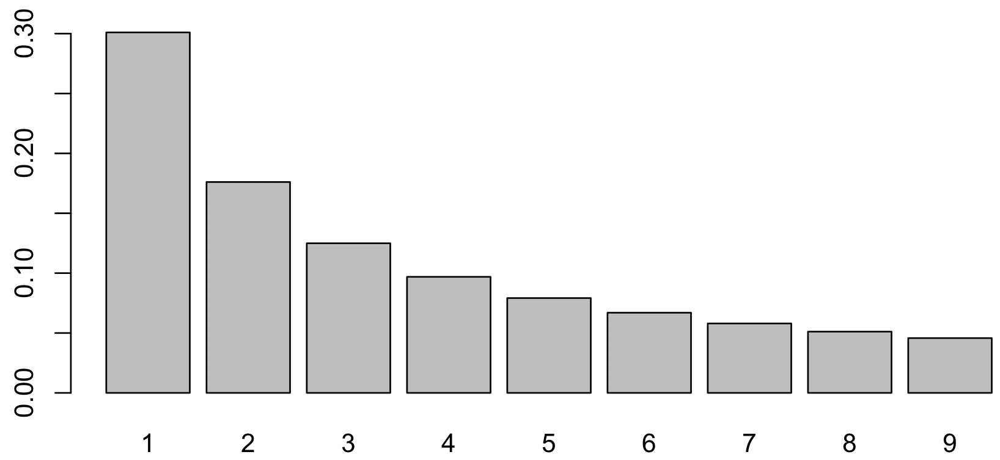
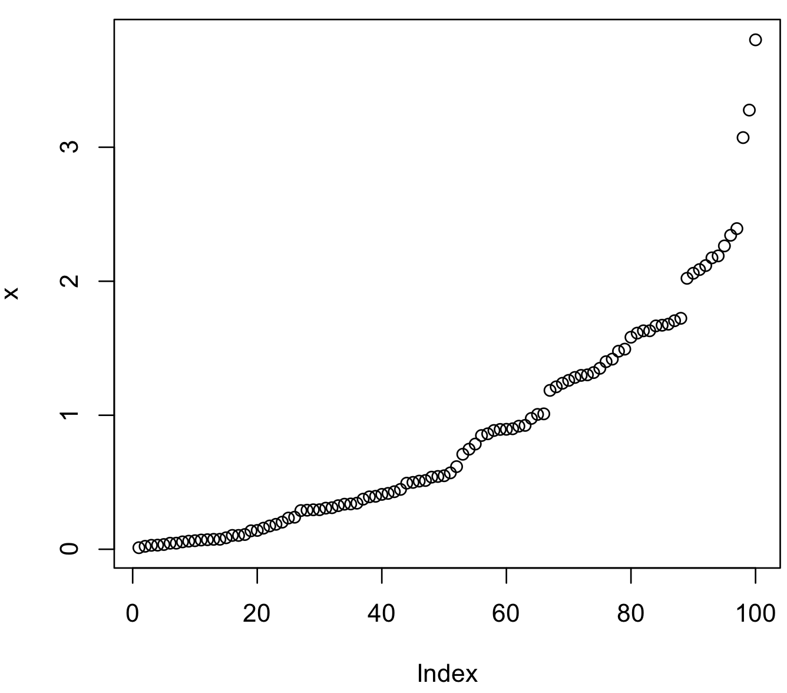

# Wstęp

Na poprzednich zajęciach do porównywania dwóch prób używaliśmy testów parametrycznych (tj. porównujących parametry rozkładów np. średnią za pomocą testu *t* lub wariancję za pomocą testu *F*). Testy te wymagają, aby nasze dane w próbach pochodziły z rozkładu normalnego. Jednak w wielu sytuacjach nie znamy rozkładu teoretycznego, z którego pochodzą nasze dane i wtedy korzystamy z **testów nieparametrycznych**. 

Testy nieparametryczne oparte są na porównywaniu całych rozkładów (tzn. ich kształtu). Testy takie mają niestety mniejszą moc niż testy parametryczne, co oznacza, że trudniej jest odrzucić hipotezę zerową (H<sub>0</sub>). Łatwiej zatem popełnić błąd II rodzaju, tzn. przyjąć nieprawdziwą H<sub>0</sub>. W tego rodzaju testach do odrzucenia H<sub>0</sub> potrzebne są zazwyczaj próby o większej liczebności niż w odpowiadających im testach parametrycznych. Inaczej mówiąc, trzeba mieć silniejsze argumenty, żeby dowodzić swoich racji.

Zasada przeprowadzenia testów nieparametrycznych jest taka sama: (i) zapisujemy układ hipotez, (ii) obliczamy statystykę danego testu i (iii) sprawdzamy, w którym miejscu w rozkładzie się ona znajduje. Jeżeli obliczona statystyka znajduje się w obszarze krytycznym (tzn. takim, który zajmuje pole mniejsze niż poziom istotności α) to odrzucamy H<sub>0</sub>.

# 1. Testy zgodności dla 2 prób niezależnych

## 1.1. Test Manna-Whitneya-Wilcoxona

### Zad. 1
> Przebadałeś(aś) zdolność fagocytowania ciał obcych osobno w linii komórek monocytów i neutrofilów. Wiedząc, że dane nie są zgodne z rozkładem normalnym, zweryfikuj hipotezę (na poziomie istotności α = 0.05), że monocyty są w tym aspekcie bardziej wydajne. 


#### Dane z zadania
* Próby są niezależne: dwie różne linie komórkowe (tj. monocyty i neutrofile)
* Dane nie pochodzą z rozkładu normalnego

#### Układ hipotez
Hipoteza zerowa testu Manna-Whitneya-Wilcoxona informuje, że próby pobrano z tego samego rozkładu. W testach nieparametrycznych hipotezy zapisujemy jako różnicę dwóch wartości. Hipoteza alternatywna w tym zadaniu jest prawostronna, ponieważ sprawdzamy, czy monocyty są bardziej wydajne pod względem fagocytozy.

<pre>H<sub>0</sub>: μ<sub>M</sub> - μ<sub>N</sub> = 0     # monocoty i neutrofile są tak samo wydajne
H<sub>1</sub>: μ<sub>M</sub> - μ<sub>N</sub> > 0     # monocyty są bardziej wydajne od neutrofilów</pre>  

#### Wykonanie testu Manna-Whitneya-Wilcoxona w R

```R
M = c(9, 12, 19, 21, 24)
N = c(11, 16, 20, 23)
wilcox.test(M, N, alternative = "greater")                
```

Wynik testu:

```R
    Wilcoxon rank sum test

data:  m and n
W = 10, p-value = 0.5476
alternative hypothesis: true location shift is greater than 0
```

#### Odpowiedź na zadanie
Statystyka testu *W* (formalnie oznaczana jako *U*) wynosi 10. Wartość *p*-value (`p-value = 0.547619`) jest większa od poziomu istotności (`α = 0.05`). Dlatego nie mamy podstaw do odrzucenia H<sub>0</sub>. Zatem nie można stwierdzić, że monocoty są bardziej wydajnie w zdolności żerczej niż neutrofile. Innymi słowy: zakładając H<sub>0</sub> (tj. monocoty są tak samo wydajne jak neutrofile) mamy aż 54% szans, że losowe dwie próby monocytów i neutrofili o liczebnościach 5 i 4 będą miały kształt rozkładu jak próby, które badamy. Wynika z tego, że badane przez nas próby monocotyów i neutrofili nie różnią się istotnie.


#### Ręczne wykonanie testu Manna-Whitneya-Wilcoxona (DLA ZAINTERESOWANYCH)
Układamy wszystkie obserwacje (z dwóch prób: M i N) w kolejności rosnącej. Statystyka *U* jest określona jako liczba obserwacji z pierwszej próby, które poprzedzają (są mniejsze bądź równe) obserwacje z drugiej próby. Innymi słowy, wyliczamy dla każdej obserwacji z pierwszej próby, ile obserwacji ona poprzedza z próby drugiej.

| Obserwacja | Próba | Poprzedzenia | Komentarz
| :---: | :---: | --- | --- |
| 9 | M | 4 | obs. 9 poprzedza 4 obserwacje z próby N (11, 16, 20 i 23)|
| 11 | N | - | |
| 12 | M | 3 | obs. 12 poprzedza 3 obserwacje z próby N (16, 20 i 23)|
| 16 | N |  - | |
| 19 | M |  2 | obs. 19 poprzedza 2 obserwacje z próby N (20 i 23)|
| 20 | N |  - | |
| 21 | M |  1 | obs. 21 poprzedza 1 obserwację z próby N (23) |
| 23 | N |  - | |
| 24 | M |  0 | obs. 24 nie poprzedza żadnej obserwacji z próby N |

Wartość statystyki testowej wynosi:

```
U = 4 + 3 + 2 + 1 = 10 
```

Następnie obliczamy prawdopodobieństwo otrzymania *U* ≤ 10 w rozkładzie statystyki *U* dla dwóch prób o liczebnościach *m* = 5 i *n* = 4.

```R
> pwilcox(10, 5, 4)
[1] 0.547619            # p-value
```

Rozkład statystyki *U* dla dwóch prób o liczebnościach *m* = 5 i *n* = 4:

```R
x = 0:20                                      # Wektor liczb całkowitych od 0 do 20
y = dwilcox(x, 5, 4)                          # Prawdop. każdej liczby od 0 do 20
colors = c("white", "blue")[(x == 10) + 1]    # Zaznaczenie kolorem niebieskim U = 10 w rozkładzie
barplot(y, names.arg = x, col = colors)
```


Zaznaczenie w powyższym rozkładzie obszaru odrzucenia hipotezy H<sub>0</sub> (tj. p ≤ 0.05).

```R
x = 0:20
y = dwilcox(x, 5, 4)
critic = qwilcox(0.95, 5, 4)
colors = c("white", "red")[(x >= critic) + 1]
colors[11] = "blue"
barplot(y, names.arg = x, col = colors)
```


Przedział ufności dla hipotezy prawostronnej znajduje się między [0, 16], natomiast obszar odrzucenia znajduje się w przedziale [17, 20]. Ponieważ wartość statystyki *U* = 10 znajduje się w przedziale ufności, nie ma podstaw do odrzucenia H<sub>0</sub>. Jeśli obliczona statystyka *U* znajdowała się w przedziale [17, 20] wówczas odrzucilibyśmy H<sub>0</sub>.

### Zad. 2 (samodzielnie)
> Zbadano poziom ekspresji genu p53 w liniach komórkowych myszy z mutacją (mut) i myszy dzikiego typu (wt): http://www.combio.pl/files/p53_mouse.csv. Zweryfikuj hipotezę, że myszy mut wykazują istotnie (α = 0.01) mniejszy poziom ekspresji genu p53.


# 2. Testy zgodności dla 2 prób zależnych

## 2.1. Test znaków (*Sign test*)

### Zad. 3
> Wśród 10 pacjentów zbadano działanie preparatu poprawiającego samopoczucie. W tym celu każdy pacjent miał za zadanie ocenić swoje samopoczucie przed i po spożyciu preparatu w skali od 1 (bardzo źle) do 6 (bardzo dobrze). bez_leku = c(4, 3, 1, 5, 4, 2, 4, 4, 2, 1) z_lekiem = c(5, 5, 1, 4, 4, 6, 6, 5, 3, 4). Sprawdź na poziomie istotności α = 0.05 czy podany preparat istotnie poprawił humor badanym.

Test znaków (*sign test*) jest testem nieparametrycznym służącym do zbadania jednorodności rozkładów dwóch prób zależnych. W zadaniu mamy do czynienia z próbami zależnymi, ponieważ każdy pacjent badany był dwukrotnie (przed i po podaniu leku). Test znaków jest nieparametrycznym odpowiednikiem testu *t* dla prób zależnych. W odróżnieniu od testu *t*, test znaków można stosować dla danych niezgodnych z rozkładem normalnych, a także w doświadczeniach, w których obserwacje należą do skali porządkowej (np. preferencje, rankingi). Testu znaków używa się najczęściej w sytuacji, kiedy nie znamy wielkości różnicy między pomiarami, a jesteśmy w stanie określić jedynie kierunek zmian (lepszy gorszy, taki sam).

#### Układ hipotez

<pre>H<sub>0</sub>: μ<sub>B</sub> - μ<sub>L</sub> = 0    # lek nie ma wpływu na samopoczucie
H<sub>1</sub>: μ<sub>B</sub> - μ<sub>L</sub> < 0    # lek poprawia samopoczucie</pre> 

#### Wykonanie testu znaków w R

```R
bez_leku = c(4, 3, 1, 5, 4, 2, 4, 4, 2, 1)
z_lekiem = c(5, 5, 1, 4, 4, 6, 6, 5, 3, 4)
```

Odpowiednia funkcja przeprowadzająca test znaków znajduje się w pakiecie `BSDA`.

```R
install.packages("BSDA")
library("BSDA")
SIGN.test(bez_leku, z_lekiem, alternative="less")
```

Wynik testu:

```
    Dependent-samples Sign-Test

data:  bez_leku and z_lekiem
S = 1, p-value = 0.03516
alternative hypothesis: true median difference is less than 0
95 percent confidence interval:
 -Inf    0
```

#### Ręczne wykonanie testu znaków (DLA ZAINTERESOWANYCH)

Obliczamy różnice między odpowiadającymi sobie obserwacjami.

| Bez leku (x<sub>i</sub>) | Z lekiem (y<sub>i</sub>) | y<sub>i</sub> - x<sub>i</sub> | Znak różnicy
| :---: | :---: | :---: | :---: |
| 4 | 5 | 1 | + |
| 3 | 5 | 2 | + |
| 1 | 1 | 0 | = |
| 5 | 4 | -1 | - |
| 4 | 4 | 0 | = |
| 2 | 6 | 4 | + |
| 4 | 6 | 2 | + |
| 4 | 5 | 1 | + |
| 2 | 3 | 1 | + |
| 1 | 4 | 3 | + |

Jako statystykę testową wykorzystuję się *S<sup>+</sup>* (liczba różnic dodatnich) oraz *S<sup>-</sup>* (liczba różnic ujemnych). Mamy *S<sup>+</sup>* = 7 oraz *S<sup>-</sup>* = 1 i dwa remisy (remisy nie są brane pod uwagę). Dla lewostronnej hipotezy H<sub>1</sub> używamy *S<sup>-</sup>*, dla prawostronnej *S<sup>+</sup>*, a dla dwustronnej *S* = min(*S<sup>-</sup>*, *S<sup>+</sup>*). Wszystkie te statystyki mają przy prawdziwości H<sub>0</sub> rozkład dwumianowy b(n, 0.5), w którym prawdopodobieństwo uzyskania znaku `+` i znaku `-` jest takie samo i równe 0.5.

```R
> pbinom(1, 8, 0.5)      # n = 8, ponieważ remisy są ignorowane
[1] 0.0351562            # p-value
```

Rozkład statystyki *S<sup>-</sup>* w rozkładzie b(8, 0.5):

```R
x = 0:8
y = dbinom(x, 8, 0.5)
critic = qbinom(0.05, 8, 0.5)                       # Wartość krytyczna = 2
colors = c("white", "red")[(x <= critic) + 1]       # Zaznaczenie obszaru krytycznego
barplot(y, names.arg = x, col = colors)
```


Wartość statystyki *S<sup>-</sup>* = 1 znajduje się w obszarze odrzucenia.


## Test kolejności par Wilcoxona (test znaków rangowanych Wilcoxona)

### Zad. 4
> Ponieważ zamierzasz być miliarderem prowadzisz badania nad lekiem przyspieszającym czas rozkładu alkoholu w wątrobie. Aby przetestować prototyp leku zmierzyłeś(aś) poziom alkoholu we krwi 10 osób dwukrotnie – 2 godz. po ukończeniu spożywania alkoholu i przyjęciu leku oraz po 2 godz. po ukończeniu spożywania alkoholu bez leku. Uzyskane wyniki znajdują się w pliku: http://www.combio.pl/files/alcohol.csv. Na poziomie istotności (α = 0.05) sprawdź czy nowy lek przyspiesza spalanie alkoholu.

Korzystając z testu znaków tracimy informację niesioną przez liczbowe wartości różnic. Test kolejności par Wilcoxona uwzględnia zarówno znak różnic, ich wielkość, jak i kolejność. Z tego powodu ma większą moc niż test znaków.

#### Układ hipotez

<pre>H<sub>0</sub>: μ<sub>L</sub> - μ<sub>B</sub> = 0    # lek nie ma wpływu na rozkład alkoholu
H<sub>1</sub>: μ<sub>L</sub> - μ<sub>B</sub> < 0    # lek przyspiesza rozkład alkoholu </pre> 

#### Wykonanie testu znaków w R

```R
x = read.csv("http://www.combio.pl/files/alcohol.csv")
wilcox.test(x$z_lekiem, x$bez_leku, pair = TRUE, alternative = "less")
```

Wynik testu:

```
    Wilcoxon signed rank test

data:  x$z_lekiem and x$bez_leku
V = 9, p-value = 0.03223
alternative hypothesis: true location shift is less than 0
```

#### Ręczne wykonanie testu kolejności par Wilcoxona (DLA ZAINTERESOWANYCH)
W celu przeprowadzenia tego testu dla każdej pary obserwacji wpierw liczymy różnice D<sub>i</sub> = Y<sub>i</sub> - X<sub>i</sub>. Po uporządkowaniu wartości bezwględnych różnic w sposób rosnący są im przypisywane rangi r(|D<sub>i</sub>|) (pomijamy zerowe różnice, elementy o tych samych wartościach różnic otrzymują jako rangę średnią artymetyczną odpowiednich rang), a następnie sumujemy osobno rangi różnic dodatnich *r*(D<sub>i</sub><sup>+</sup>) oraz ujemnych *r*(D<sub>i</sub><sup>-</sup>), które oznaczamy *V*<sup>+</sup> oraz *V*<sup>-</sup>.


| X<sub>i</sub> | Y<sub>i</sub> | D<sub>i</sub> = Y<sub>i</sub> - X<sub>i</sub> | Rank(\|D<sub>i</sub>\|) | Ranga znakowa
| :---: | :---: | :---: | :---: | :---: |
| 0.4 | 0.8 | 0.4  | 5.5 | +5.5 |
| 1.2 | 1.6 | 0.4  | 5.5 | +5.5 |
| 0.8 | 0.9 | 0.1  | 1.5 | +1.5 |
| 0.3 | 0.4 | 0.1  | 1.5 | +1.5 |
| 2.2 | 3.0 | 0.8  | 10 | +10 |
| 0.2 | 0.5 | 0.3  | 4  | +4 |
| 0.7 | 1.2 | 0.5  | 7 | +7 |
| 1.3 | 0.6 | -0.7   | 9 | -9 |
| 1.3 | 1.5 | 0.2  | 3 | +3 |
| 0.6 | 1.2 | 0.6  | 8 | +8 |


Zliczamy statystykę *V*<sup>+</sup> i *V*<sup>-</sup>:

```
V+ = 5.5 + 5.5 + 1.5 + 1.5 + 10 + 4 + 7 + 3 + 8 = 46
V- = 9
```

Podobnie jak w teście znaków w zależności od rodzaju hipotezy alternatywnej wykorzystywana jest inna statystyka testowa. Dla hipotezy lewostronnej używamy *V*<sup>-</sup>, dla prawostronnej *V*<sup>+</sup>, a dla dwustronnej *V* = min(*V*<sup>-</sup>, *V*<sup>+</sup>) Następnie obliczamy prawdopodobieństw uzyskania statystyki *V*<sup>-</sup> = 9 w rozkładzie statystyk testu znakowanych rank Wilcoxona.

```R
> psignrank(9, 10)
[1] 0.03222656              # p-value
```


### Zad. 5 (samodzielnie)
> W grupie 8 pacjentów przeprowadzono badanie mające na celu zbadanie wpływu hipnozy na redukcję bólu. Wyniki odczuwalnego bólu przed i po hipnozie nie są zgodne z rozkładem normalnym i znajdują się w pliku http://www.combio.pl/files/hypnosis.csv. Czy na poziomie istotności α = 0.05 można twierdzić, że hipnoza redukuje odczuwalny ból? Wykonaj test znaków oraz test par Wilcoxona.

### Zad. 6 (samodzielnie)
> Wykonano badanie mające na celu stwierdzenie, czy studenci tyją podczas pierwszego roku studiów. W pliku http://www.combio.pl/files/student_weights.csv znajdują się wagi 30 studentów przed wstąpieniem na studia oraz po skończeniu pierwszego roku. Czy na poziomie istotności 5% można twierdzić, że studenci istotnie tyją podczas pierwszego roku studiów? Wykonaj test znaków oraz test par Wilcoxona.


# 3. Test zgodności Chi-kwadrat Pearsona

### Zad. 7
> Liczba nukleotydów (A, T, G, C) genu Zyxin człowieka wynosi, odpowiednio: 410, 789, 573, 394. Przyjmując poziom istotności α = 0.05 zweryfikuj hipotezę, że częstości występowania nukleotydów w tej sekwencji są równe.

Algorytm testu Chi-kwadrat (χ<sup>2</sup>) opiera się na porównaniu częstości zdarzeń empirycznych (tych wynikających z doświadczenia) z teoretycznymi. Używamy go, gdy chcemy sprawdzić zgodność naszych danych z oczekiwanymi danymi np. wyniki krzyżówek genetycznych z oczekiwanymi proporcjami mendlowskimi.

#### Układ hipotez

Hipoteza zerowa zakłada, że rozkład zmiennej, którą badamy jest zgodny z danym rozkładem teoretycznym. Hipoteza alternatywna mówi, że rozkład teoretyczny i empiryczny się różnią (hipoteza alternatywna w teście χ<sup>2</sup> może być tylko dwustronna). W przypadku naszego zadania:

<pre>H<sub>0</sub>: p<sub>A</sub> = p<sub>C</sub> = p<sub>G</sub> = p<sub>T</sub> = 0.25                          # Częstości nukleotydów są równe
H<sub>1</sub>: pA ≠ 0.25 ∨ pC ≠ 0.25 ∨ pG ≠ 0.25 ∨ pT ≠ 0.25    # Krócej: H<sub>1</sub>: ~H<sub>0</sub> </pre>

#### Wykonanie testu χ<sup>2</sup> w R

```R
chisq.test(c(410, 789, 573, 394), p=c(0.25, 0.25, 0.25, 0.25))
```

Wynik testu:

```
    Chi-squared test for given probabilities

data:  c(410, 789, 573, 394)
X-squared = 187.07, df = 3, p-value < 2.2e-16
```

#### Ręczne wykonanie testu χ<sup>2</sup> (DLA ZAINTERESOWANYCH)

Odległość między rozkładami obliczamy za pomocą statystyki χ<sup>2</sup>:


gdzie *n* - liczebność próby, *o<sub>i</sub>* - obserwowana wartość obserwacji, *e<sub>i</sub>* - oczekiwana wartość obserwacji.

Oczekiwana wartość obserwacji (*e<sub>i</sub>*) to liczba wystąpień nukleotydu w sekwencji genu, tak aby jego częstość w całej sekwencji wynosiła 0.25. Zatem *e<sub>i</sub>* wynosi:

```R
> sum(c(410, 789, 573, 394)) / 4
[1] 541.5
```

Statystyka testowa χ<sup>2</sup> wynosi:


Funkcja gęstości rozkładu χ<sup>2</sup> przyjmuje jako parametr liczbę stopni swobody (*degrees of freedom*). Liczba stopni swobody jest równa liczebności pomiarów `n-1`, w naszym przpadku `4 - 1 = 3`. Obliczamy wartość *p-value* uzyskania statystyki testowej χ<sup>2</sup> ≥ 187.0674.

```
> 1 - pchisq(187.0674, df=3)
[1] 0                           # p-value
```

Rozkład statystyki χ<sup>2</sup> dla 3 stopni swobody, z zaznaczeniem obszaru krytycznego (czerwone pole) oraz obliczonej statystyki testowej χ<sup>2</sup> ≥ 187.0674 (niebieska linia). Widzimy, że χ<sup>2</sup> ≥ 187.0674 jest w bardzo skrajnej części wykresu.


### Zad. 8 (samodzielnie)
> Laptopy pewnej marki produkowane są w kolorach białym, szarym i czarnym, przy czym wielkość produkcji w poszczególnych kolorach ustalono w stosunku 2:5:3. Sprawdź na poziomie istotności α = 0.05, czy proporcje te odpowiadają preferencjom klientów, jeśli w badaniu 150 wylosowanych potencjalnych nabywców 38 wybrało kolor biały, 72 osoby wybrały kolor szary i 40 osób wybrało kolor czarny.

### Zad. 9
> W pliku http://www.combio.pl/files/accountant.txt znajdują się przychody pewnej firmy przygotowane przez pewnego księgowego. Na poziomie istotności α = 0.05 sprawdź, czy księgowy nie popełnił oszustwa.

#### Prawo Benforda

Mogłoby się wydawać, że w losowych zbiorach danych wszystkie cyfry będą się pojawiać z jednakową częstotliwością. Istnieje jednak prawo Benforda (*Benford’s law*) – że im cyfra mniejsza, tym częściej będzie się pojawiała jako cyfra wiodąca. Na przykład w liczbie 341 pierwszą wiodąca cyfra to 3, w liczbie 0.013 pierwsza wiodąca cyfra to 1. Prawo to nazywane jest również prawem pierwszej cyfry wiodącej. Jest ono wykorzystywane np. w księgowości do wykrywania fałszywych danych (lub niezamierzonych błędów) oraz wykrywania fałszerstw podatkowych (oszust zbyt często podaje pewne cyfry lub stara się wymyślać liczby w sposób jak najbardziej w jego rozumieniu losowy).

YouTube (~1min30sek)

[](https://youtu.be/ml-OP4EL8iE)

Zgodnie z prawem Benforda w zbiorach danych pierwsza cyfra wiodąca podlega logarytmicznemu rozkładowi prawdopodobieństwa:

```R
n = seq(1:9)
p = log(n+1, 10) - log(n, 10)
barplot(p, names.arg=1:9)
```



Jeżeli weźmiesz do ręki dowolną gazetę lub książkę i wypiszesz wszystkie liczby, które się w niej znajdują to 30% tych liczb będzie zaczynać się od cyfry 1, a 18% liczb będzie zaczynać się od cyfry 2.

Prawo to można zaobserwować naprawdę w wielu miejscach, np. analizując numery telefonów, ceny akcji na giełdzie, PKB krajów, liczbę ludności w poszczególnych krajach, liczby w gazecie. Funkcjonuje ono najlepiej dla danych o dużej zmienności, bez ustalonych ograniczeń, w dużej próbie oraz losowych. Nie działa ono dobrze z liczbami, które są swego rodzaju identyfikatorami jak np. PESEL czy NIP.

#### Wykonanie zadania
W pakiecie `benford.analysis` znajduje się funkcja zliczająca występowanie cyfr wiodących dla dowolnego zbioru.

```R
install.packages("benford.analysis")
library("benford.analysis")
```

Wczytujemy dane z pliku:

```R
x = scan("http://www.combio.pl/files/accountant.txt")
```

Uruchamiamy funkcję benford, która obliczy częstości występowania pierwszych cyfr wiodących:

```R
results = benford(x, number.of.digits = 1)
names(results)
```

Możemy narysować wykres słupkowy porównujący dochody i ich zgodność z prawem Benforda.

```R
plot(results)
```

Częstości pierwszej cyfry wiodącej w naszym zestawie znajdują się pod zmienną `results$bfd$data.dist`, a zliczenia pod zmienną `results$bfd$data.dist.freq`. Z kolei częstości cyfr wiodących według prawa Benforda znajdują się pod zmienną `results$bfd$benford.dist`.

Test χ<sup>2</sup>:

```R
chisq.test(results$bfd$data.dist.freq, p=results$bfd$benford.dist)
```

# 4. Test zgodności Kołgomorowa-Smirnowa

### Zad. 10
> W pliku http://www.combio.pl/files/tumorGrowth.txt znajdują się pomiary wielkości guza nowotworowego dokonywane u pacjenta w równych odstępach czasu. Na poziomie istotności α = 0.05 zweryfikuj hipotezę, że wielkość nowotworu wzrasta w tempie wykładniczym.

W przypadku porównywania danych z teoretycznymi rozkładami ciągłymi można użyć testu zgodności Kołmogorowa-Smirnowa dla jednej próby. Niestety należy w pełni znać rozkład, z którym chcemy porównać posiadane dane (oprócz klasy rozkładu trzeba znać jego parametry - nie można szacować ich z próby). 

#### Układ hipotez

<pre>H<sub>0</sub>: dane mają rozkład wykładniczy
H<sub>1</sub>: dane nie mają rozkladu wykładniczego</pre>

#### Wczytanie danych

```R
x = scan("http://www.combio.pl/files/tumorGrowth.txt")
plot(x)
```



#### Wykonanie testu w R

```R
ks.test(x, 'pexp')       # Porównanie z dystrybuantą rozkładu wykładniczego
```

W ten sposób możemy sprawdzić inne rozkłady, np. rozkład normalny:

```R
> ks.test(x, 'pnorm')
> ks.test(x, 'pnorm', 1, 1)    # Rozkład normalny o średniej = 1 i odch.std. = 1
```

### Zad. 11
> Ponad 200 cząsteczek RNA zaklasyfikowano do dwóch klas na podstawie pełnionej funkcji. W pliku http://www.combio.pl/files/rna_class.csv znajdują się pomiary wartości energii swobodnej [kcal/Mol] dla każdej cząsteczki. Sprawdź na poziomie istotności α = 0.05 czy zaproponowany podział na dwie klasy jest również słuszny w oparciu o wartości energii. Dodatkowo, zweryfikuj tę hipotezę korzystając z testu *t* oraz testu Manna-Whitneya-Wilcoxona.

#### Test Kołmogorowa-Smirnowa dla dwóch prób
Test zgodności Kołmogorowa-Smirnowa można zastosować również do porównanie dwóch prób. Zaletą tego testu jest wrażliwość nie tylko na różnice położenia rozkładów (np. różnice średnich), ale również zwraca uwagę na kształt rozkładu. Jest to również test nieparametryczny tzn. nie wymaga, aby próby pochodziły z rozkładu normalnego.


```R
x = read.csv("http://www.combio.pl/files/rna_class.csv")
ks.test(x$classA, x$classB)
```

#### Test *t* dla dwóch wartości oczekiwanych (dwóch prób)

```R
shapiro.test(x$classA)                          # p-value = 0.1587
shapiro.test(x$classB)                          # p-value = 0.1587
var.test(x$classA, x$classB)                    # p-value = 0.2121
t.test(x$classA, x$classB, var.equal = TRUE)
```

#### Test Manna-Whitneya-Wilcoxona

```R
wilcox.test(x$classA, x$classB)
```