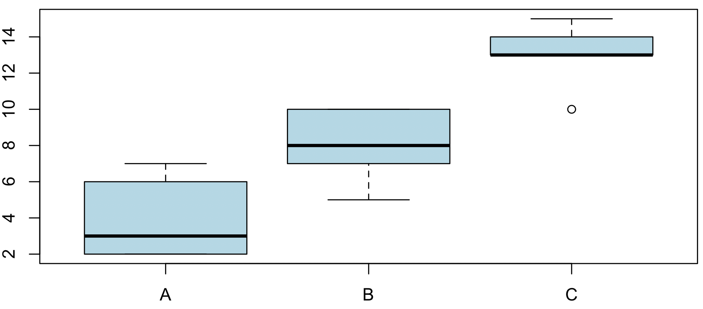
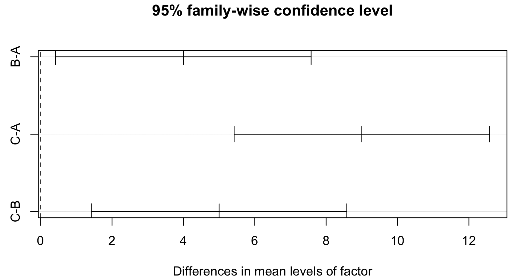
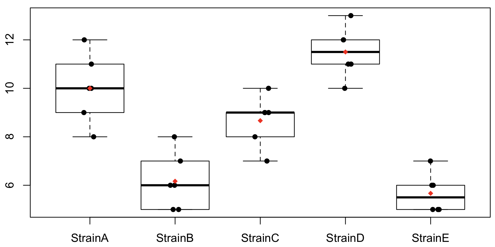

# Wstęp

Dotychczas podczas testowania hipotez mieliśmy do czynienia z jedną lub dwiema grupami tej samej zmiennej. Na przykład za pomocą testu *t* badaliśmy, czy wartości ekspresji genu w grupie chorych i grupie zdrowych pochodzą z populacji o tych samych średnich.

W przypadku, gdy mamy więcej niż dwie grupy i chcemy ocenić istotność statystyczną wielu średnich używamy **analizy wariancji (ANOVA)**. Jest to technika badania wyników (doświadczeń, obserwacji), które zależą od jednego lub kilku czynników działających jednocześnie. Czynnikami takimi mogą być metody prowadzenia eksperymentu, metody leczenia. Analiza wariancji umożliwia sprawdzenie, czy analizowane czynniki wywierają istotny wpływ na obserwowane zmienne. Mimo, że technika nazywa się analiza wariancji to tak naprawdę porównujemy średnie między grupami. Jeśli średnie różnią się istotnie między sobą, to intuicyjnie możemy wnioskować, że analizowany czynnik wpływa na zmienną zależną. Istotą analizy wariancji jest więc równoczesne badanie istotności różnic między wieloma średnimi pochodzącymi z wielu grup. 

Skąd wobec tego wzięła się nazwa analiza wariancji? Bierze się to stąd, że w celu testowania statystycznej istotności różnic między średnimi w rzeczywistości przeprowadzamy porównanie wariancji.

# 1. Analiza wariancji (ANOVA)

### Zad. 1
> Pewna firma farmaceutyczna testuje działania trzech leków, które mają przerwać migrenowe bóle głowy. W tym celu, 15 ochotników zostało losowo rozdzielonych do jednej z trzech grup leków. Ochotnicy zostali następnie poproszeni o wzięcie leku podczas następnego napadu migreny i ocenę bólu w skali od 1 do 20. Zakładając rozkład normalny danych i równość wariancji we wszystkich trzech grupach sprawdź, czy rodzaj leku ma wpływ na ból głowy (poziom istotności α = 0.05).


#### Układ hipotez
Chcemy odpowiedzieć na pytanie, czy średnie między trzema grupami różnią się istotnie. Formalnie, ANOVA weryfikuje hipotezę zerową, która mówi, że porównywane grupy pochodzą z populacji o tej samej średniej. Innymi słowy, ANOVA weryfikuje, czy średnia populacji ludzi, którzy przyjęli lek A jest równa średniej w populacji ludzi, którzy przyjęli lek B i C. Jeżeli te średnie są równe to lek nie ma wpływu na ból. Jeżeli średnie nie są równe to podawany lek ma wpływ na te dane.

<pre>H<sub>0</sub>: μ<sub>A</sub> = μ<sub>B</sub> = μ<sub>C</sub>    # Lek nie ma wpływu (hipoteza typu omnibus, tzn. kilka warunków jednocześnie)
H<sub>1</sub>: ~H<sub>0</sub>            # Lek ma wpływ</pre>


#### Założenia analizy wariancji
W analizie wariancji muszą być spełnione dwa założenia:
1. Dane we wszystkich grupach muszą pochodzić z rozkładu normalnego.
2. Wariancja we wszystkich grupach powinna być taka sama.

W treści zadania podana jest informacja, że oba warunki są spełnione dlatego nie będziemy ich weryfikować.


#### Idea analizy wariancji

Obejrzyj poniższy film na YouTubie (14min30sek), ponieważ jest on niezbędny do zrozumienia rozwiązania zadania.

[](https://youtu.be/-yQb_ZJnFXw)


#### Dane wejściowe
Wszystkie programy statystyczne (np. R, Statistica) wymagają, aby dane do ANOVY były sprowadzone do dwóch zmiennych. Jedna to zmienna ilościowa (często nazywana `response`), natomiast druga zmienna jest nominalna (często nazywana `factor`).

```R
response = c(2, 3, 7, 2, 6, 10, 8, 7, 5, 10, 10, 13, 14, 13, 15)
factor = c(rep("A", 5), rep("B", 5), rep("C", 5))
#factor = c("A", "A", "A", "A", "A", "B", "B", "B", "B", "B", "C", "C", "C", "C", "C")
```

#### Wykonanie ANOVY w R

```R
results = aov(response ~ factor)
```

Obliczenia analizy wariancji:

```
Call:
   aov(formula = response ~ factor)

Terms:
                  factor Residuals
Sum of Squares  203.3333   54.0000
Deg. of Freedom        2        12

Residual standard error: 2.12132
Estimated effects may be unbalanced
```
 
Suma kwadratów odchyleń od średniej pomiędzy grupami (SSB) wynosi `203.333`, natomiast suma kwadratów odchyleń od średniej wewnątrz grup (SSW) wynosi `54`. Wartość SSB wyższa od SSW sugeruje, że lek może mieć wpływ na dane. Powstaje pytanie, czy ten stosunek SSB i SSW jest statystycznie istotny. Aby się o tym przekonać korzystamy z polecenia:

```R
summary(results)
```

Wynik analizy wariancji

```
            Df Sum Sq Mean Sq F value   Pr(>F)    
factor       2  203.3   101.7   22.59 8.54e-05 ***
Residuals   12   54.0     4.5                     
---
Signif. codes:  0 ‘***’ 0.001 ‘**’ 0.01 ‘*’ 0.05 ‘.’ 0.1 ‘ ’ 1
```

Obliczona wartość statystyki *F* wynosi `22.59` oraz *p-value* = `8.54e-05`. Ponieważ wartość *p-value* jest mniejsze od poziomu istotności α = 0.05 odrzucamy hipotezę zerową na rzecz hipotezy alternatywnej. Zatem, lek wywiera istotny wpływ na samopoczucie pacjentów.


#### 1.1. Testy *post-hoc*
Jeżeli analiza wariancji wykaże (jak w naszym zadaniu) istotne różnice pomiędzy rozpatrywanymi średnimi, to powstaje pytanie, które z porównywanych populacji są odpowiedzialne za odrzucenie hipotezy zerowej. Chcemy wiedzieć, które średnie różnią się między sobą, a które są równe. Musimy wtedy przeprowadzić dokładniejsze badania różnic między średnimi z poszczególnych grup. Moglibyśmy oczywiście przeprowadzić serię prostych testów *t*, aby porównać wszystkie możliwe pary średnich. Jednak procedura tego typu byłaby niepoprawna. Test *t* dla prób niezależnych będzie sprawdzał, czy dwie średnie różnią się istotnie, pod warunkiem, że były to jedyne brane pod uwagę próby. W efekcie prowadziłoby to do przeszacowania wartości *p-value*. Z tego względu wykorzystuje się do tego specjalne testy **post hoc** (po fakcie), zwane też testami porównań wielokrotnych - biorą one pod uwagę fakt, że pobrano więcej niż dwie próby. Nazwa tych testów wynika stąd, że stosujemy je dopiero po fakcie stwierdzenia (za pomocą analizy wariancji) braku równości między średnimi.

##### 1.1.1. Test *t* wykonywany parami
Test *t* wykonywany parami uwzględnienia poprawkę na wielokrotne testowanie (poprawka Bonfferoniego).

```R
pairwise.t.test(response, factor)
```
W wyniku otrzymujemy tabelę z wartościami *p-value* porównań każdej grupy z każdą. Na przykład, *p-value* porównania śrenich z grup A i C wynosi `6.5e-05`

```
    Pairwise comparisons using t tests with pooled SD 

data:  response and factor 

  A       B     
B 0.0115  -     
C 6.5e-05 0.0058
```

Zobrazujmy rozkład w trzech grupach na wykresie pudełkowym:

```R
boxplot(response ~ factor, col="lightblue")
```




##### 1.1.2. Test Tukeya HSD
Drugim bardzo powszechnie stosowanym testem jest test Tukeya HSD. Dla każdej grupy tworzy on przedziały ufności dla średniej i porównuje je między sobą każdy-z-każdym.

```R
TukeyHSD(results)
```

W wyniku otrzymujemy tabelę, której wiersze odpowiadają porównaniom grup parami. W pierwszej kolumnie (`diff`) jest różnica między średnimi w dwóch grupach, kolejne dwie kolumny wyznaczają przedział ufności dla średniej (`lwr` i `upr`), a w ostatniej kolumnie (`p adj`) jest wartość *p-value*. Wszystkie trzy porównania (tj. `B-A`, `C-A` i `C-B`) uzyskały wartość *p-value* niższą niż poziom istotności α = 0.05.

```R
> TukeyHSD(results)
  Tukey multiple comparisons of means
    95% family-wise confidence level

Fit: aov(formula = response ~ factor)

$factor
    diff       lwr       upr     p adj
B-A    4 0.4206853  7.579315 0.0286585
C-A    9 5.4206853 12.579315 0.0000598
C-B    5 1.4206853  8.579315 0.0075279
```

Graficzna prezentacja wyników testu Tukeya HSD:

```R
plot(TukeyHSD(results))
```



Jeśli narysowana prosta pozioma nie przecina pionowej linii kropkowanej (na wykresie po lewej stronie), oznacza to, że rozpatrywane grupy różnią się.

##### 1.1.3. Inne testy *post-hoc*
Istnieje jeszcze kilka innych testów *post-hoc*, których nie będziemy poruszać, np. test LSD (*Least Significatn Difference*), Test Scheffego, Test Duncana. Każdy z tych testów ma swoje zalety i wady, a wybór odpowiedniego testu uzależniony jest najczęściej od danych wejściowych. Niektóre z tych testów są bardziej konserwatywne (ostrożniej odrzucają hipotezę zerową), inne dają nam dodatkowe informacje. Nie będziemy jednak wnikać w to, ponieważ materiał ten wykracza poza ramy tego przedmiotu. W przypadku porównania średnich w parach polecana jest procedura Tukeya albo test *t*.

> Po co trzeba najpierw wykonać metodę ANOVA, jak moglibyśmy przecież użyć od razu testów *post-hoc*? Ponieważ, może być taka sytuacja, że jakaś para grup będzie rzeczywiście istotnie różna pod względem średniej, ale pozostałe grupy będą bardzo zbliżone. Wynik analizy wariancji może być wtedy nieznaczący statystycznie żeby uznać, że dany czynnik wpływa istotnie na dane. Testy *post-hoc* mogą być wtedy mylące. Chyba, że doświadczenie jest z góry nastawione na to żeby szukać istotności statystycznej między jakąś konkretną parą grup. Wtedy można używać tych testów od razu.


### Zad. 2
> W celu opracowania skuteczniejszego leczenia malarii, 5 grup myszy zostało poddanych obserwacjom po zainfekowaniu ich różnymi szczepami *Plasmodium vivax*. W pliku http://www.combio.pl/files/malaria.csv znajdują się informacje dotyczące przeżywalności badanych grup myszy. Sprawdź czy średnia przeżywalność myszy jest taka sama dla różnych szczepów *P. vivax*.

#### Układ hipotez

<pre>H<sub>0</sub>: μ<sub>A</sub> = μ<sub>B</sub> = μ<sub>C</sub> = μ<sub>D</sub> = μ<sub>E</sub>
H<sub>1</sub>: ~ H<sub>0</sub></pre>

#### Wczytanie danych

```R
malaria = read.csv('http://www.combio.pl/files/malaria.csv')
```

#### Podgląd danych
W kolumnie `days` znajduje się liczba dni przeżywalności myszy, a w kolumnie `strain` oznaczony jest szczep *P. vivax*.

```R
> head(malaria)
  days  strain
1   10 StrainA
2    9 StrainA
3    8 StrainA
4   11 StrainA
5   12 StrainA
6   10 StrainA
```

#### Sprawawdzenie założenia o równości wariancji
Aby skorzystać z analizy wariancji, należy sprawdzić, czu wariancja we wszystkich szczepach jest taka sama. Weryfikujemy zatem hipotezę:

<pre>H<sub>0</sub>: σ<sup>2</sup><sub>A</sub> = σ<sup>2</sup><sub>B</sub> = σ<sup>2</sup><sub>C</sub> = σ<sup>2</sup><sub>D</sub> = σ<sup>2</sup><sub>E</sub>
H<sub>1</sub>: ~ H<sub>0</sub></pre>

Do weryfikacji używa się testu Bartletta.

```R
bartlett.test(malaria$days, malaria$strain)         # p-value = 0.8335
```

Ponieważ wartość *p-value* jest większa od poziomu istotności α = 0.05, nie mamy podstaw do odrzucenia hipotezy zerowej. Zatem wariancja przeżywalności w pięciu (grupach) szczepach *P. vivax* jest równa.


#### Sprawdzenia założenia o rozkładzie normalnym
Nie możemy tak po prostu sprawdzać, czy zmienna `days` przyjmuje rozkład normalny, ponieważ zawiera ona obserwacje pochodzące z różnych grup (np. `StrainA`, `StrainB`), a każda z grup może pochodzić z rozkładów normalnych o różnej wartości średniej. 

W obrębie każdej z grup obserwujemy pewne zróżnicowanie obserwacji (czarne punkty) od średniej (czerwony punkt).



To zróżnicowania od średniej wewnątrz grup nie wynika ze szczepu (ponieważ szczep jest taki sam w obrębie grupy). Zmienność wewnątrzgrupowa musi zatem zależeć od innych czynników. Taka zmienność wewnątrzgrupowa (zależna od innych czynników) definiowana jest przez residua. **Residuum** to odległość każdej obserwacji od średniej w grupie. Przyjętą praktyką jest sprawdzanie, czy residua rozkładają się zgodnie z rozkładem normalnym.

```R
results = aov(malaria$days ~ malaria$strain)
residuals(object=results)                      # lub results$residuals
shapiro.test(residuals(object=results))        # p-value = 0.8275
```

Na poziomie istotności α = 0.05 nie mamy podstaw do odrzucenia hipotezy zerowej, a więc rozkład residuów jest normalny.


#### Wynik analizy wariancji
Ponieważ oba założenia analizy wariancji są spełnione, możemy użyć metody ANOVA.

```R
> summary(results)
            Df Sum Sq Mean Sq F value   Pr(>F)    
strain       4  148.2   37.05   29.88 3.39e-09 ***
Residuals   25   31.0    1.24                     
---
Signif. codes:  0 ‘***’ 0.001 ‘**’ 0.01 ‘*’ 0.05 ‘.’ 0.1 ‘ ’ 1
```

W związku z tym, że wartość *p-value* (`p-value = 3.39e-09`) jest mniejsza od poziomu istotności α = 0.05, stwierdzamy, że średnie przeżywalności myszy różnią się istotnie między szczepami *P. vivax*. Oznacza to, że szczep *P. vivax* wpływa istotnie na czas przeżywalności myszy.


#### Test *post-hoc*
Ponieważ średnie między grupami różnią się istotnie możemy przejść do testów *post-hoc*.

```R
pairwise.t.test(malaria$days, malaria$strain)
```

### Zad. 3 (samodzielnie)
> Testujesz cztery różne suplementy diety dla sportowców. W tym celu, 100 ochotników zostało losowo rozdzielonych do jednej z czterech grup suplementów. Każdemu ochotnikowi rozpisałeś ten sam zestaw ćwiczeń siłowych oraz zbilansowaną do potrzeb dietę. W pliku http://www.combio.pl/files/muscle.csv znajdują się przyrosty tkanki mięśniowej po 12 miesiącach treningów (kg). Sprawdź, czy rodzaj suplementu ma wpływ na przyrost mięśni.

### Zad. 4 (samodzielnie)
> Cztery grupy bakterii zostały poddane działaniu różnych inhibitorów transkrypcji. W pliku http://www.combio.pl/files/expr_inhibit.csv znajdują się informacje dotyczące poziomu ekspresji genów. Zweryfikuj hipotezę (poziom istotności α = 0.05), że rodzaj inhibitora ma wpływ na poziom ekspresji genów.

# 2. Analiza wariancji (ANOVA) z powtarzanymi pomiarami

### Zad. 5
>  Pięć osób poproszono o zapamiętanie listy słów. Słowa podzielono na 3 typy: negatywne, neutralne i pozytywne. Otrzymano następujące rezultaty. Czy typ słowa wpływa na zdolność zapamiętywania?


W zadaniu mamy do czynienia z próbami zależnymi, ponieważ tę samą osobę badano trzykrotnie. Na przykład, osoba A zapamiętała 32% słów negatywnych, 15% słów neutralnych i 45% słów pozytywnych.

#### Układ hipotez

<pre>H<sub>0</sub>: μ<sub>neg</sub> = μ<sub>neu</sub> = μ<sub>poz</sub>
H<sub>1</sub>: ~H<sub>0</sub></pre>

#### Wprowadzenie danych w R

```R
words = c(32, 15, 45, 30, 13, 40, 26, 12, 42, 22, 10, 38, 29, 8, 35)        # response
type = rep(c("neg", "neu", "poz"), 5)                                       # factor
people = c(rep("A", 3), rep("B", 3), rep("C", 3), rep("D", 3), rep("E", 3)) # obiekt badań
```

#### Sprawdzenie założenia o równości wariancji

```R
bartlett.test(words ~ type)                 # p-value = 0.7585 -> wariancje są równe
```

#### Sprawdzenie założenia o rozkładzie normalnym

Podobnie jak w poprzednich zadaniach analizę wariancji przeprowadzamy przy użyciu funkcji `aov`. Nalezy zwrócić uwagę na funkcję `Error`, która pozwala określić, co jest obiektem badania - w liczniku jest obiekt badań, a w mianowniku jest czynnik.

```R
results = aov(words ~ type + Error(people/type))
```

Wartości residuów w wynikach analizy wariancji z powtórzonymi pomiarami znajdują się pod zmienną:

```R
p = proj(results)                         # Macierz list (projekcja danych)
r = p[["people:type"]][, "Residuals"]     # Residua
shapiro.test(r)                           # p-value = 0.8536 -> rozkład normalny
```

#### Wykonanie analizy wariancji

```R
summary(results)                                        
```

Wynik:

```

Error: people
          Df Sum Sq Mean Sq F value Pr(>F)
Residuals  4  105.1   26.27               

Error: people:type
          Df Sum Sq Mean Sq F value   Pr(>F)    
type       2 2029.7  1014.9   189.1 1.84e-07 ***
Residuals  8   42.9     5.4                     
---
Signif. codes:  0 ‘***’ 0.001 ‘**’ 0.01 ‘*’ 0.05 ‘.’ 0.1 ‘ ’ 1
```

Z analizy wariancji wynika, że należy odrzucić H<sub>0</sub>, ponieważ wartość *p-value* (`p-value = 1.84e-07`) jest mniejsza niż poziom istotności α = 0.05. Wynika z tego, że rodzaj słowa wpływa na zdolność zapamiętywania. 

#### Testy *post-hoc*.
Na modelu z powtórzeniami test Tukeya HSD nie działa. Możemy wykonać test *t* dla prób zależnych.

```R
pairwise.t.test(words, type, paired = TRUE)
```

Wynik testu *t*:

```
    Pairwise comparisons using paired t tests 

data:  words and type 

    neg    neu    
neu 0.0009 -      
poz 0.0031 5.8e-06

P value adjustment method: holm
```

### Zad. 6 (samodzielnie)
> Testujesz działanie nowego leku antydepresyjnego. Trzykrotnie zmierzyłeś poziom leku 7 pacjentów: przed podaniem leku, tydzień po podaniu leku i dwa tygodnie po podaniu leku. Poziom lęku jest mierzony w skali 1-10, gdzie 10 to silny stan lękowy, a 1 to niewielki poziom lękowy. Uzyskane wyniki znajdują się w pliku  http://www.combio.pl/files/anxiety.csv. Sprawdź, czy istnieją istotne różnice w poziomie lęku między różnymi etapami leczenia.


# 3. Test Kruskala-Wallisa

W przypadku, gdy założenia metody ANOVA nie są spełnione (tj.: nierówność wariancji lub niezgodność z rozkładem normalnym) to korzystamy z nieparametrycznej alternatywny tego testu, która nazywa się testem Kruskala-Wallisa. Test ten jest uogólnieniem testu Manna-Whitneya-Wilcoxona na więcej niż 2 populacje. Hipoteza zerowa informuje, że wszystkie próby pochodzą z populacji o 
tej samej medianie (tym samym kształcie rozkładu), a hipoteza alternatywna jest jej zaprzeczeniem. Tak więc sposób interpretacji tego testu jest identyczny jak w metodzie ANOVA, z tą różnicą, że test ten jest oparty na rangach, a nie średnich.

### Zad. 7
> Najnowsze badania wykazały, że po spożyciu posiłku składającego się z ryżu, cząsteczka miRNA168a ryżu może regulować poziom ekspresji genu lipoproteiny człowieka. W pliku http://www.combio.pl/files/rice.csv znajdują się pomiary ekspresji genu lipoproteiny 153 ochotników, którzy zostali podzieleni na pięć grup w zależności od spożytej dawki ryżu. Na poziomie istotności α = 0.05 sprawdź, czy ilość zjedzonego ryżu ma wpływ na ekspresję genu lipoproteiny.

#### Układ hipotez

<pre>H<sub>0</sub>: μ<sub>1</sub> = μ<sub>2</sub> = μ<sub>3</sub> = μ<sub>4</sub> = μ<sub>5</sub>
H<sub>1</sub>: ~H<sub>0</sub></pre>


#### Wczytanie danych

```R
rice = read.csv("http://www.combio.pl/files/rice.csv")
```

#### Sprawdzenie założeń analizy wariancji

```R
bartlett.test(rice$expr ~ rice$dosage)             # p-value = 0.00927 -> nierówność wariancji
```

#### Wykonanie testu Kruskala-Wallisa
Ponieważ założenie o równości wariancji nie jest spełnione, wykonujemy test Kruskala-Wallisa.

```R
kruskal.test(rice$expr ~ rice$dosage)
```

Wynik testu:

```
    Kruskal-Wallis rank sum test

data:  rice$expr by rice$dosage
Kruskal-Wallis chi-squared = 29.267, df = 4, p-value = 6.901e-06
```

Ponieważ wartość `p-value` jest mniejsza od poziomu istotności α = 0.05, odrzucamy H<sub>0</sub>. Zatem ilość zjedzonego ryżu ma wpływ na poziom ekspresji genu lipoproteiny.


#### Testy *post-hoc*
W tym przypadku można również oczekiwać odpowiedzi na pytanie, które grupy różnią się istotnie. W przypadku testu Kruskala-Wallisa, przeprowadzamy test Wilcoxona dla każdej pary z uwzględnieniem poprawki na wielokrotne testowanie.

```R
pairwise.wilcox.test(rice$expr, rice$dosage, exact=F)
```

Wynik testu:

```R
  Pairwise comparisons using Wilcoxon rank sum test 

data:  rice$expr and rice$dosage 

        dosage1 dosage2 dosage3 dosage4
dosage2 1.0000  -       -       -      
dosage3 0.0227  0.0060  -       -      
dosage4 0.1295  0.0848  1.0000  -      
dosage5 0.0011  0.0003  0.4744  0.5775 

P value adjustment method: holm
```

Wynikiem jest tabela przedstawiająca wartości *p-value* dla każdej pary grup.


# 4. Test Friedmana
Test Friedmana jest uogólnieniem testu znaków dla więcej niż dwóch prób. Test ten jest traktowany jako nieparametryczny odpowiednik analizy wariancji (ANOVA) z powtarzanymi pomiarami.


### Zad. 7
> W pewnym doświadczeniu medycznym oceniano różnice między średnimi stężeniami kortyzolu w kolejnych etapach leczenia chorych na udar mózgu. Oznaczono w tym celu 3-krotnie (w stałych odstępach czasowych) stężenie kortyzolu [μg/dl] u 10 pacjentów. Dane te znajdują się w pliku: http://www.combio.pl/files/cortisol.csv. Zakładając, że dane nie pochodzą z rozkładu normalnego sprawdź (na poziomie istotności α = 0.05) czy etapy leczenia mają istotny wpływ na stężenie kortyzolu.

#### Układ hipotez

<pre>H<sub>0</sub>: μ<sub>Stage1</sub> = μ<sub>Stage2</sub> = μ<sub>Stage3</sub>
H<sub>1</sub>: ~H<sub>0</sub></pre>

#### Wczytanie danych
W tym zadaniu mamy do czynienia z próbami zależnymi, ponieważ ci sami pacjenci byli badani pod kątem ilości kortyzolu w trzech etapach leczenia. 

```R
> cortisol = read.csv('http://www.combio.pl/files/cortisol.csv')
> head(cortisol)
  cortisol  person  stage
1      9.0 Person1 Stage1
2      7.0 Person1 Stage2
3      6.0 Person1 Stage3
4      9.5 Person2 Stage1
5      6.5 Person2 Stage2
6      8.0 Person2 Stage3
```

W pierwszej kolumnie podana jest ilość kortyzolu, w drugiej kolumnie nazwa pacjenta, a w trzeciej kolumnie nazwa stadium leczenia. 


#### Wykonanie testu Friedmana
Wiemy z treści zadania, że dane nie pochodzą z rozkładu normalnego, dlatego nie możemy użyć metody ANOVA z powtarzanymi pomiarami.

```R
friedman.test(cortisol$cortisol, cortisol$stage, cortisol$person)
```

Wynik testu:

```
    Friedman rank sum test

data:  cortisol$cortisol, cortisol$stage and cortisol$person
Friedman chi-squared = 10.474, df = 2, p-value = 0.005317
```

Ponieważ wartość *p-value* (`p-value = 0.005317`) jest mniejsza od poziomu istotności α = 0.05, odrzucamy H<sub>0</sub> na rzecz H<sub>1</sub>. Wynika z tego, że występują istotne różnice w poziomie kortyzolu pomiędzy pacjentami na różnych etapach leczenia. Zatem etap leczenia ma istotny wpływ na leczenie. 

#### Testy *post-hoc*
W podstawowej wersji R nie ma wbudowanych testów *post-hoc* dla testu Friedmana. 

```R
install.packages("PMCMR")
library("PMCMR")
posthoc.friedman.conover.test(cortisol$cortisol, groups=cortisol$stage, blocks=cortisol$person)
```

Wynik:

```
    Pairwise comparisons using Conover's test for a two-way 
                    balanced complete block design 

data:  cortisol$cortisol , cortisol$stage and cortisol$person 

       Stage1  Stage2 
Stage2 0.01200 -      
Stage3 3.8e-06 0.00083
```

Wynikiem jest tabela zawierająca wartości *p-value* między każdą parą grup.


# 5. Dwuczynnikowa ANOVA
Otaczająca nas rzeczywistość jest ze swej natury złożona i wielowymiarowa, a sytuacje, w których pojedyncza zmienna pozwala wyjaśnić dane zjawisko jest rzadkością.  W takich bardziej skomplikowanych sytuacjach używamy wieloczynnikowej analizy wariancji. Ponieważ wykracza ona poza ramy tego przedmiotu, chciałem jedynie zasygnalizować, że tego typu analiza jest możliwa. W tym przypadku badamy średnie wartości cechy w różnych kombinacjach czynników dla dwóch lub większej liczby zmiennych jakościowych. 

### Zad. 9
> W pliku http://www.combio.pl/files/3dpred.csv znajdują się wyniki prawidłowych przewidywań struktury trzeciorzędowych 4 białek uzyskane 3 metodami komputerowymi. Na poziomie istotności α = 0.05 zweryfikuj hipotezę, że wiarygodność przewidywań komputerowych zależy od rodzaju metody oraz białka, które jest poddane przewidywaniom.

W tym zadaniu mamy dwa czynniki – metoda przewidywania struktury i rodzaj białka. Chcemy sprawdzić czy liczba poprawnie wymodelowanych aminokwasów zależy od użytej metody, a także od białka, na której ta metoda jest uruchomiona.

```R
> pred = read.csv('http://www.combio.pl/files/3dpred.csv')
> head(pred)
    protein method correct
1 ubiquitin    AVG   0.467
2 ubiquitin    GOR   0.645
3 ubiquitin    PHD   0.868
4   deoxyHB    AVG   0.472
```

Polecenie wykonujące analizę wariancji jest bardzo podobne, musimy tylko dodać kolejny czynnik.

```R
> results = aov(pred$correct ~ pred$method + pred$protein)
> summary(results)
```

Wynik dwuczynnikowej metody ANOVA:
```
             Df  Sum Sq Mean Sq F value   Pr(>F)    
pred$method   2 0.30535 0.15268   42.68 0.000283 ***
pred$protein  3 0.02662 0.00887    2.48 0.158383    
Residuals     6 0.02146 0.00358                     
---
Signif. codes:  0 ‘***’ 0.001 ‘**’ 0.01 ‘*’ 0.05 ‘.’ 0.1 ‘ ’ 1
```

Wynik ten wskazuje, że metoda ma istotny wpływ na wynik przewidywań, natomiast białko nie.

```R
>  pairwise.t.test(pred$correct, pred$method)
```