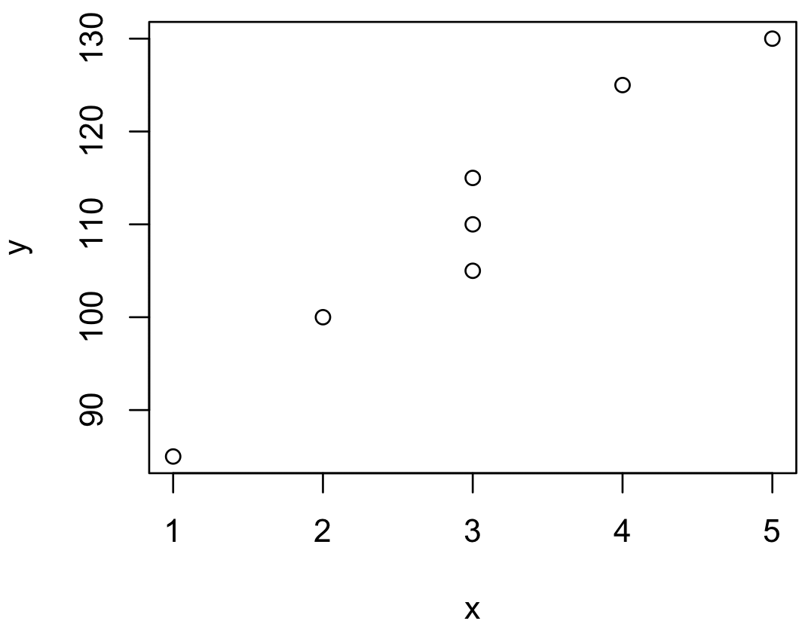
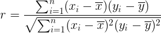
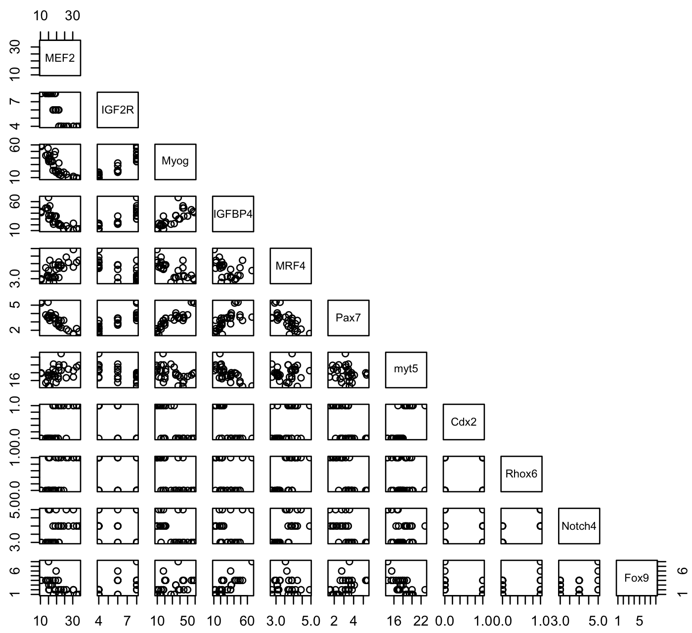
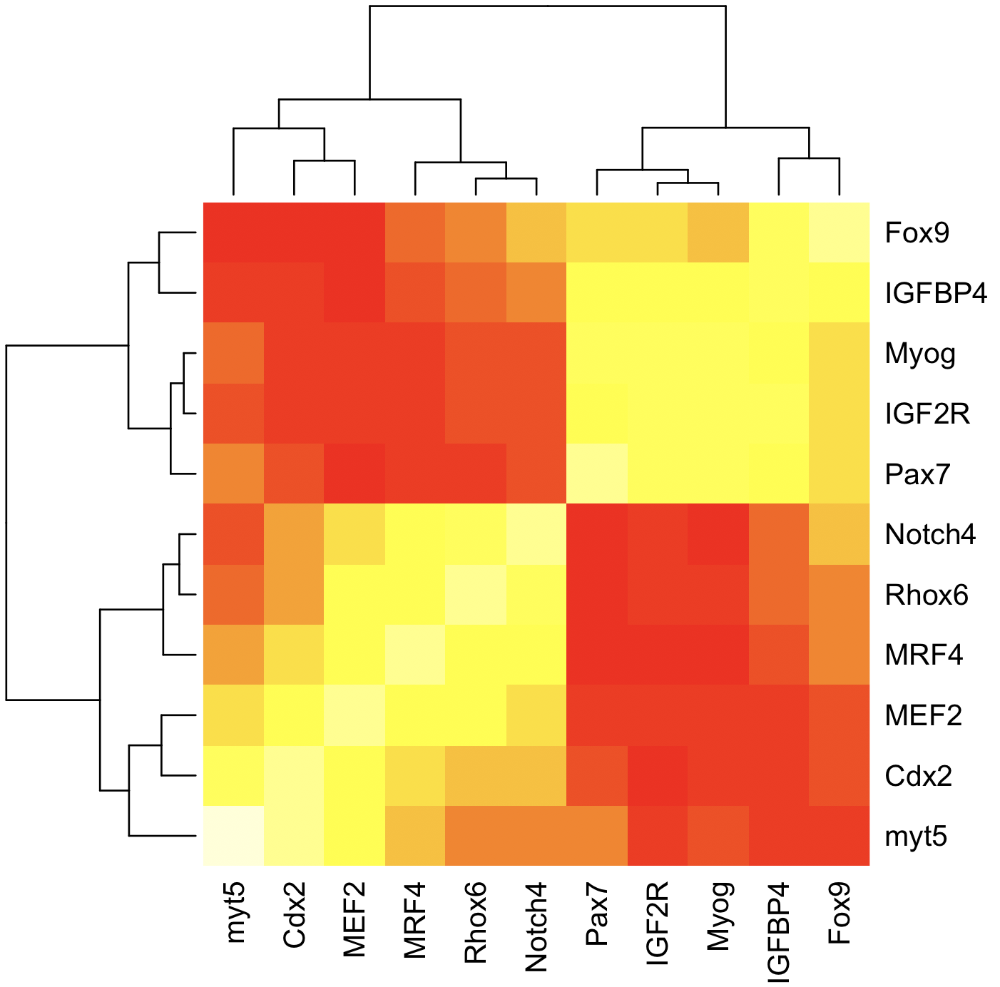
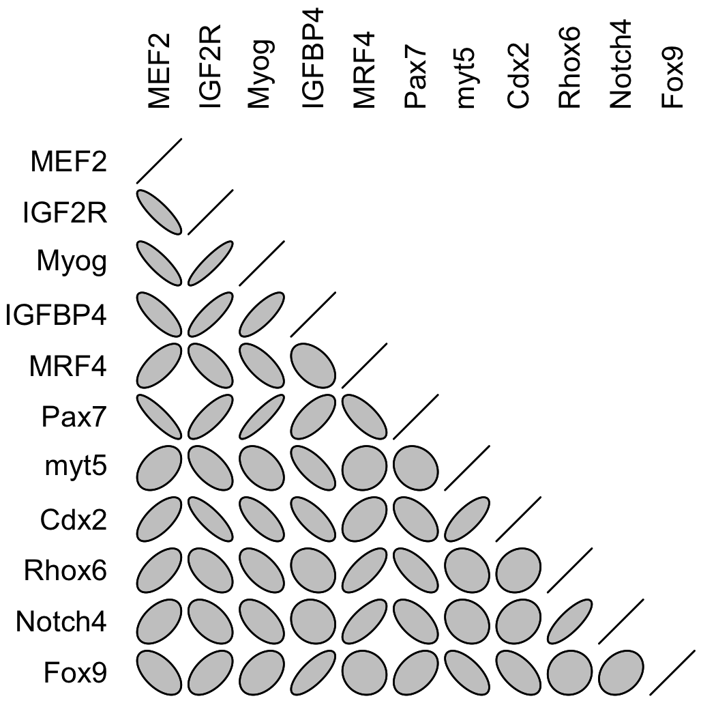
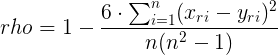
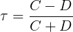
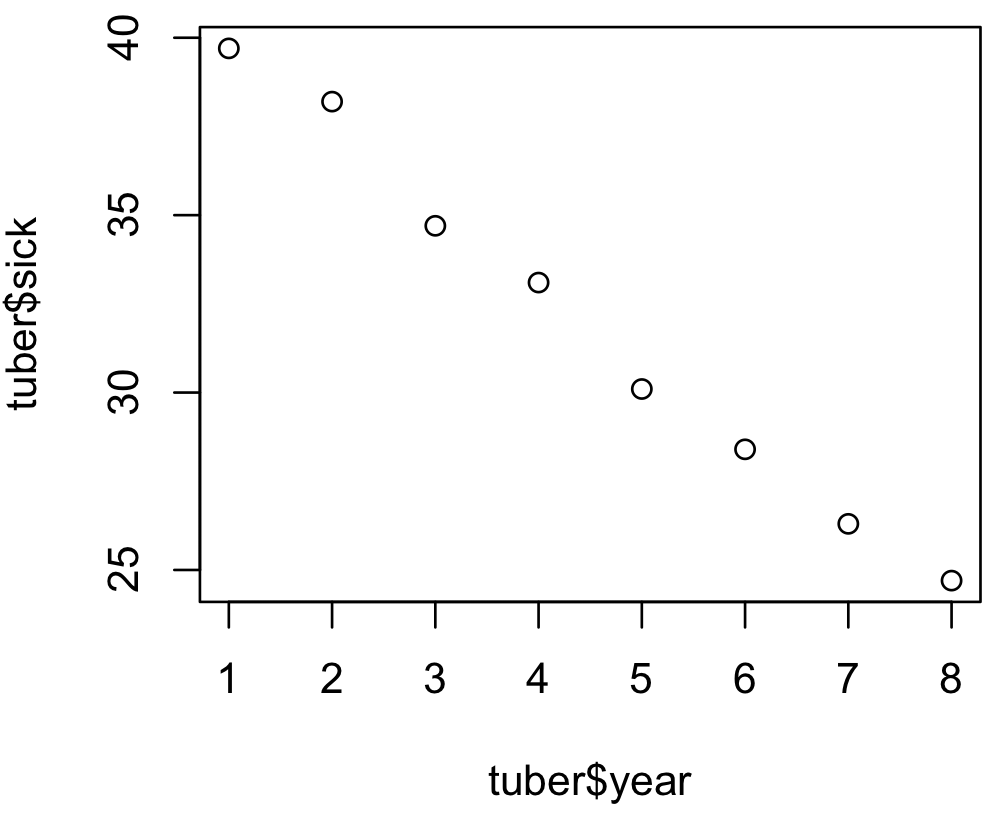
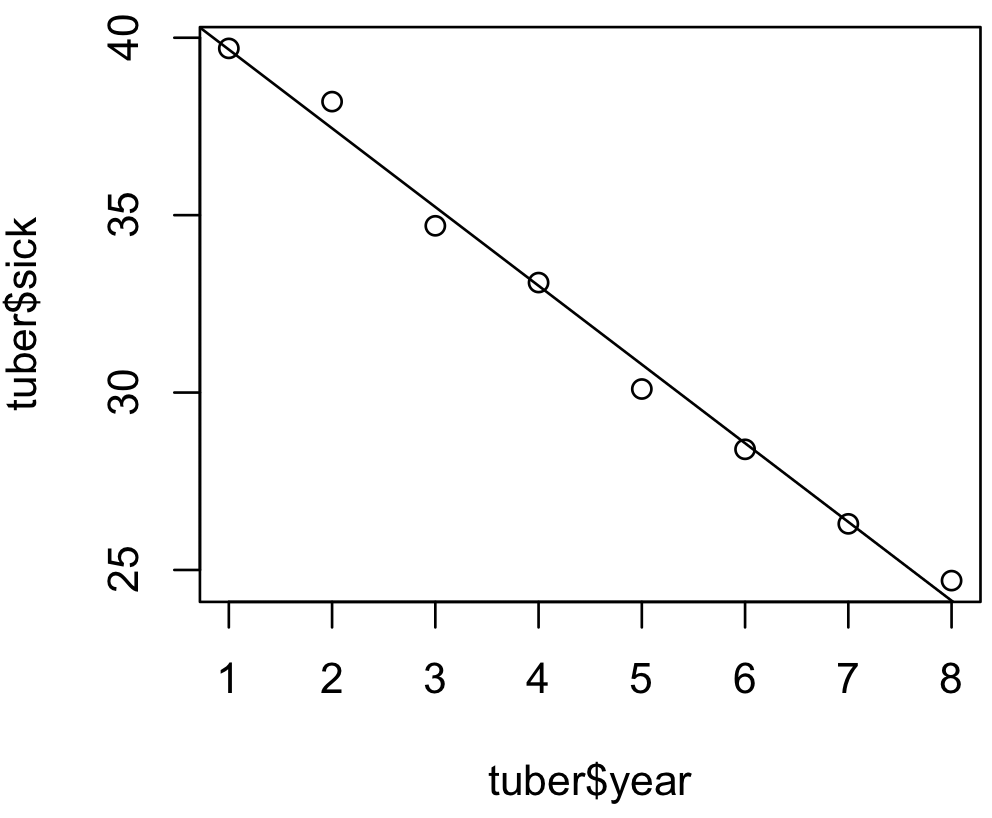

# Wstęp

Dotychczas rozważaliśmy przypadki, w których dysponowaliśmy jedną zmienną. Na przykład,  porównywaliśmy rozkłady jednej zmiennej między dwiema grupami (np. przy użyciu testu *t*) lub między wieloma grupami (np. przu użyciu metody ANOVA). Na dzisiejszych zajęciach będziemy badać związki pomiędzy dwiema różnymi zmiennymi np. poziomem ekspresji genu a wiekiem organizmu. Podstawowym problem statystyki jest stwierdzenie, czy między zmiennymi zachodzi jakiś związek i czy jest on bardziej, czy mniej ścisły.

# 1. Testy niezależności

## 1.1. Test niezależności chi-kwadrat Pearsona
W praktyce często spotykamy się z koniecznością oceny zależności zjawisk niemierzalnych lub kombinacji cech mierzalnych i niemierzalnych (dla mierzalnych zawsze można łatwo policzyć współczynnik korelacji). Na przykład, gdy chorzy klasyfikowani są pod względem różnych kategorii takich jak płeć, dieta czy występowanie wariantu genu. W takich przypadkach sprawdzenie, czy istnieje zależność między dwoma nominalnymi cechami, umożliwia test χ<sup>2</sup> (*chi-square test for independence*). 


### Zad. 1
> Prowadzisz badania nad wpływem preparatów ziołowych na występowanie grypy. Badaniem objęto 380 pacjentów i otrzymano wyniki w tabeli. Zweryfikuj hipotezę (α = 0.05) o niezależności występowania grypy i rodzaju preparatu ziołowego.

| Grypa | Zioło1 | Zioło2 | Placebo
| --- | --- | --- | --- |
| Tak | 20 | 30 | 30 |
| Nie | 100 | 110 | 90 |


#### Układ hipotez
W zadaniu chcemy sprawdzić, czy występowanie grypy zależy od rodzaju preparatu ziołowego. W każdej grupie preparatu odnotowano liczbę ludzi zdrowych i chorych. Na przykład grupa *Zioło1* obejmuje 20 osób chorych i 100 zdrowych. Układ hipotez wygląda następująco:

<pre>H<sub>0</sub>: występowanie grypy i rodzaju zioła są niezależne (zioło nie ma wpływu na zachorowalność)
H<sub>1</sub>: występowanie grypy i rodzaju zioła są zależne</pre>

#### Idea testu
Test niezależności χ<sup>2</sup> Pearsona bazuje na porównywaniu ze sobą wartości obserwowanych (czyli takich, które uzyskaliśmy w badaniu) z wartościami oczekiwanymi (czyli takimi, które zakłada test, gdyby nie było żadnego związku pomiędzy zmiennymi). Jeżeli różnica pomiędzy wartościami obserwowanymi a oczekiwanymi jest duża (istotna statystycznie) to można powiedzieć, że zachodzi zależność pomiędzy jedną zmienną a drugą.


#### Dane wejściowe
Aby wykonać test niezalezności χ<sup>2</sup> w programie R, dane muszą znajdować się w macierzy.

```R
> x = matrix(c(20, 100, 30, 110, 30, 90), nrow = 2)
> x
     [,1] [,2] [,3]
[1,]   20   30   30
[2,]  100  110   90
```

#### Wykonanie testu w R

```R
chisq.test(x)
```

Wynik testu:

```
  Pearson's Chi-squared test

data:  x
X-squared = 2.5258, df = 2, p-value = 0.2828
```

Ponieważ wartość *p-value* jest większa od poziomu istotności α = 0.05, nie ma podstaw do odrzucenia H<sub>0</sub>. Zatem występowanie grypy nie zależy od preparatu ziołowego.


#### Ręczne wykonanie testu niezależności χ<sup>2</sup> (DLA ZAINTERESOWANYCH)

YouTube [17min37sek]:

[](https://youtu.be/hpWdDmgsIRE)

W bibliotece `TeachingDemos` znajduje się bardzo użyteczna funkcja `chisq.detail`, która oprócz przeprowadzenia testu χ<sup>2</sup> wyświetla również liczebności obserwowane i oczekiwane oraz poszczególne składniki statystyki testowej.

```R
library(TeachingDemos)
chisq.detail(x)
```


## 1.2. Test niezależności Fischera

Drugim testem niezależności dla zmiennych nominalnych, obok testu χ<sup>2</sup>, jest dokładny test Fishera (*Fischer's exact test*). Ponieważ test Fischera ma większą moc niż test χ<sup>2</sup> jest on bardziej preferowany niż test χ<sup>2</sup>. Niestety test ten jest kosztowny obliczeniowo i wymaga użycia komputera, dlatego jego użycie nie zawsze jest możliwe w przypadku dużych tabel liczebności.

Test Fishera polega na tym, że z liczebności 380 z zadania symuluje się wszystkie możliwe tabele. Innymi słowy, algorytm rozkłada na różne sposoby dane do sześciu komórek. Odpowiada on na pytanie jakie jest prawdopodobieństwo, że liczności w poszczególnych komórkach ułożą się tak nierównomiernie (lub gorzej) jak to obserwujemy w zadaniu. Prawdopodobieństwo to można policzyć dokładnie przez zliczenia wszystkich możliwych tabel, które można skonstruować na podstawie badanych liczebności. Dlatego 


### Zad. 2
> Wykonaj poprzednie zadanie korzystając z testu niezależności Fischera.


#### Wykonanie testu

```R
fisher.test(x)
```

Wynik testu:

```
  Fisher's Exact Test for Count Data

data:  x
p-value = 0.2845
alternative hypothesis: two.sided
```

Ponieważ wartość *p-value* jest większa od poziomu istotności α = 0.05, nie ma podstaw do odrzucenia H<sub>0</sub>. Zatem występowanie grypy nie zależy od preparatu ziołowego.


### Zad. 3 (samodzielnie)
> Prowadzisz badania nad wpływem polimorfizmu pojedynczych nukleotydów (SNP) na występowanie choroby neurodegeneracyjnej. Testami genetycznymi objęto 270 pacjentów i otrzymano wyniki w tabeli. Zweryfikuj hipotezę (α = 0.05) o niezależności występowania choroby i rodzaju SNP. Wykonaj test chi-kwadrat i dokładny test Fishera.

| Choroba | SNP1 | SNP2 | SNP3
| --- | --- | --- | --- |
| Tak | 43 | 83 | 63 |
| Nie | 7 | 57 | 17 |


### Zad. 4 (samodzielnie)
Genom można sekwencjonować trzema metodami sekwencjonowania. Wysunięto hipotezę, że słaba jakość składania genomu nie zależy od metody sekwencjonowania. Wylosowano próbę 200 genomów i otrzymano następujące wyniki badania jakości dla poszczególnych metod. Wykonaj test chi-kwadrat i dokładny test Fishera.

| Jakość | Metoda1 | Metoda2 | Metoda23
| --- | --- | --- | --- |
| Dobra | 18 | 7 | 25 |
| Zła | 42 | 33 | 75 |


# 2. Miary korelacji dwóch zmiennych

Najczęściej w naszych badaniach mamy do czynienia z cechami mierzalnymi (np. pomiar masy, pomiar ekspresji). Jesteśmy wtedy zainteresowani szukaniem zależności korelacyjnej. Korelacja jest miarą powiązania między dwiema lub większą liczbą zmiennych. Stanowi ona narzędzie dokładnego określania wzajemnego stopnia powiązania zmiennych.

Współczynniki korelacji przyjmują wartości z przedziału [`-1`, `1`]. 
* Wartość `-1` reprezentuje doskonałą korelację ujemną, czyli taką, kiedy wzrostowi wartości jednej zmiennej odpowiada spadek średnich wartości drugiej zmiennej (zależność odwrotnie proporcjonalna).
* Wartość `1` to doskonała korelacja dodatnia (zależność wprost proporcjonalna). 
* Wartość `0` oznacza brak korelacji (zmienne są nieskorelowane). 

**UWAGA:** Badanie zależności korelacyjnej ma sens jedynie, jeśli między dwiema zmiennymi występuje więź przyczynowo-skutkowa. Na przykład moglibyśmy powiedzieć, że w ciepłe letnie dni ilość zjadanych lodów jest niezwykle silnie skorelowana ze wzrostem populacji komarów. W tym przypadku mamy do czynienia jedynie ze współwystępowaniem zjawisk, a nie związkiem przyczynowo skutkowym. Tak samo – można wykazać, że istnieje związek między liczbą gniazd bocianich, a liczbą urodzeń ludzi. Stwierdzenie, czy istnieje związek przyczynowo-skutkowy bywa często trudne.


## 2.1. Współczynnik korelacji liniowej Pearsona (*r*)
W przypadku gdy badane zmienne są ilościowe, używamy współczynnika korelacji liniowej Pearsona. Jest on miarą liniowej zależności zmiennych losowych *X* i *Y*.

### Zad. 5.
> Przypuszcza się, że poziom ekspresji genu miRNA156a zależy w pewnej mierze od stadium rozwojowego rośliny. Poniżej znajdują się informacje o poziomie ekspresji genu w siedmiu różnych stadiach rozwojowych rośliny. Zbadaj stopień skorelowania poziomu ekspresji genu z wiekiem rośliny poprzez obliczenia współczynnika korelacji.

<table>
<tr>
  <td>wiek x<sub>i</sub></td> 
  <td>1</td>
  <td>3</td>
  <td>2</td>
  <td>3</td>
  <td>4</td>
  <td>3</td> 
  <td>5</td>
</tr>
 <td>poziom eksp. y<sub>i</sub></td>
 <td>85</td>
 <td>105</td>
 <td>100</td>
 <td>110</td>
 <td>125</td>
 <td>115</td>
 <td>130</td>
</td>
</table>


#### Obliczenie współczynnika korelacji Pearsona (*r*)

```R
x = c(1, 3, 2, 3, 4, 3, 5)
y = c(85, 105, 100, 110, 125, 115, 130)
```

```R
> cor(x, y)           # Współczynnik korelacji Pearsona
[1] 0.9719274
```

Współczynnik korelacji ma taką samą wartość niezależnie od tego, którą zmienną podamy jako pierwszą.

```R
> cor(y, x)
[1] 0.9719274
```

Na podstawie wartości współczynnika korelacji możemy ocenić siłę związku prostoliniowego między cechami *X* i *Y*. Poniższa skala jest umowna, w literaturze można spotkać również inne.

```
r = 0               # brak korealcji (współzależność nie występuje)
0 < |r| < 0.3       # słaby stopień korelacji
0.3 ≤ |r| < 0.5     # średni stopień korelacji
0.5 ≤ |r| < 0.7     # znaczny stopień korelacji
0.7 ≤ |r| < 0.9     # wysoki stopień korelacji
|r| ≥ 0.9           # bardzo wysoki stopień korelacji
|r| = 1             # korelacja całkowita
```

Współczynnik korelacji *r* = `0.97` oznacza bardzo wysoką współzależność między wiekiem rośliny a poziomem ekspresji genu miRNA156a - wraz z wiekiem rośliny, wzrasta poziom ekspresji genu miRNA156a.


#### Współczynnik determinacji (*r<sup>2</sup>*)
Kwadrat współczynnika korelacji *r<sup>2</sup>* nazywa się współczynnikiem determinacji lub dopasowania (*coefficient of determination*). Informuje on, jaka część zmiennej zależnej (*Y*) jest wyjaśniona przez zmiany zmiennej niezależnej (*X*).

```R
> cor(x, y) ** 2        # Współczynnik dopasowania
[1] 0.9446429
```

Obliczony współczynnik dopasowania *r<sup>2</sup>* wynosi `0.94`. Oznacza to, że w 94% zmiany poziomu ekspresji genu mir156a spowodowane są zmianami wieku rośliny.

#### Wykres rozrzutu
Po obliczeniu wartości współczynnika korelacji zawsze zalecane jest utworzenie wykresu rozrzutu (*scatterplot*). Chodzi o to, aby wizualnie stwierdzić, czy badany związek rzeczywiście najlepiej opisuje funkcja liniowa. Może się okazać, że wyliczona wartość współczynnika jest wysoka, a mimo to między korelowanymi zmiennymi nie występuje taka współzależność.

```R
plot(x, y)
```



Powyższy wykres rozrzutu potwierdza prostoliniową korelację między wiekiem rośliny (*x*) a poziomem ekspresji genu mir156a (*y*).


#### Istotność statystyczna
Dodatkowo, funkcja `cor.test()` przeprowadza test, czy współczynnik korelacji wynosi 0 (podaje również wartość samego współczynnika) oraz znajduje przedział ufności dla współczynnika korelacji.

```R
> cor.test(x, y)

  Pearson's product-moment correlation

data:  x and y
t = 9.237, df = 5, p-value = 0.0002498
alternative hypothesis: true correlation is not equal to 0
95 percent confidence interval:
 0.8164260 0.9959973
sample estimates:
      cor 
0.9719274
```

Test ten pomaga w ocenie, czy istniejąca zależność między *X* i *Y* w naszej wylosowanej próbie jest tylko przypadkowa, czy też jest prawidłowością w populacji. Ponieważ wartość *p-value* (`p-value = 0.0002498`) jest niższa niż poziom istotności α = 0.05 stwierdzamy, że współczynnik korelacji jest istotnie róży od 0, a zatem rozpatrywane cechy są skorelowane w populacji. W powyższym wyniku podany jest również 95% przedział ufności dla współczynnika korelacji, co oznacza, że prawdopodobny współczynnik korelacji całej populacji (nie tylko tej próby) znajduje się w przedziale `0.816`-`0.996`.


#### Ręczne obliczenie współczynnika korelacji Pearsona (DLA ZAINTERESOWANYCH)



```R
> xmean = mean(x)
> ymean = mean(y)
> licznik = sum((x - xmean) * (y - ymean))
> mianownik = sqrt(sum((x-xmean)^2)) * sqrt(sum((y - ymean)^2))
> licznik / mianownik
[1] 0.9719274
```

### Zad. 6
> W pliku http://www.combio.pl/files/exp.csv znajdują się wielokrotne pomiary ekspresji 10 genów zaangażowanych w pewien proces komórkowy. Wykonaj macierz korelacji i przedstaw wyniki na wykresie.


#### Wczytanie danych
Bardzo często będziemy dysponowali większą liczbą zmiennych. W takich przypadkach mamy do czynienia nie z pojedynczymi wartościami współczynnika korelacji, ale z całymi macierzami korelacyjnymi. 

```R
> exp = read.csv('http://www.combio.pl/files/exp.csv')
> head(exp)
  MEF2 IGF2R Myog IGFBP4 MRF4  Pax7  myt5 Cdx2 Rhox6 Notch4 Fox9
1 21.0     6 20.0   22.0 3.90 2.620 16.46    0     1      4    4
2 21.0     6 20.0   22.0 3.90 2.875 17.02    0     1      4    4
3 22.8     4 13.5   18.6 3.85 2.320 18.61    1     1      4    1
4 21.4     6 32.3   22.0 3.08 3.215 19.44    1     0      3    1
5 18.7     8 45.0   35.0 3.15 3.440 17.02    0     0      3    2
6 18.1     6 28.1   21.0 2.76 3.460 20.22    1     0      3    1
```

#### Wykres rozrzutu
Dobrą praktyką jest zrobienie wykresu rozrzutu między każdą parą zmiennych. Bardzo przydatna jest funkcja `pairs()`, która utworzy wykresy rozrzutu dla każdej pary genów.

```R
pairs(exp)
pairs(exp, upper.panel=NULL)
```



#### Obliczenie współczynników korelacji
Aby obliczyć macierz korelacyjną używamy funkcji `cor()`. W wyniku otrzymujemy współczynniki korelacji dla każdej pary 10 genów. Na przykład, współczynnik korelacji między genem `MEF2` a genem `IGF2R` wynosi `-0.8521620`.

```R
> cor(exp)
             MEF2      IGF2R       Myog     IGFBP4        MRF4       Pax7
MEF2    1.0000000 -0.8521620 -0.8476295 -0.7761684  0.68117191 -0.8676594
IGF2R  -0.8521620  1.0000000  0.9022945  0.8324475 -0.69993811  0.7824958
Myog   -0.8476295  0.9022945  1.0000000  0.7908784 -0.71012093  0.8879104
IGFBP4 -0.7761684  0.8324475  0.7908784  1.0000000 -0.44875912  0.6587479
MRF4    0.6811719 -0.6999381 -0.7101209 -0.4487591  1.00000000 -0.7124406
Pax7   -0.8676594  0.7824958  0.8879104  0.6587479 -0.71244065  1.0000000
myt5    0.4186840 -0.5912421 -0.4337101 -0.7082234  0.09120476 -0.1747159
Cdx2    0.6640389 -0.8108118 -0.7101935 -0.7230967  0.44027846 -0.5549157
Rhox6   0.5998324 -0.5226070 -0.5915827 -0.2432043  0.71271113 -0.6924953
Notch4  0.4802848 -0.4926866 -0.5559007 -0.1257043  0.69961013 -0.5832870
Fox9   -0.5509251  0.5269883  0.3948563  0.7498125 -0.09078980  0.4276059
              myt5       Cdx2       Rhox6     Notch4        Fox9
MEF2    0.41868403  0.6640389  0.59983243  0.4802848 -0.55092507
IGF2R  -0.59124207 -0.8108118 -0.52260705 -0.4926866  0.52698829
Myog   -0.43371013 -0.7101935 -0.59158268 -0.5559007  0.39485626
IGFBP4 -0.70822339 -0.7230967 -0.24320426 -0.1257043  0.74981247
MRF4    0.09120476  0.4402785  0.71271113  0.6996101 -0.09078980
Pax7   -0.17471588 -0.5549157 -0.69249526 -0.5832870  0.42760594
myt5    1.00000000  0.7445354 -0.22986086 -0.2126822 -0.65624923
Cdx2    0.74453544  1.0000000  0.16834512  0.2060233 -0.56960714
Rhox6  -0.22986086  0.1683451  1.00000000  0.7940588  0.05753435
Notch4 -0.21268223  0.2060233  0.79405876  1.0000000  0.27407284
Fox9   -0.65624923 -0.5696071  0.05753435  0.2740728  1.00000000
```

#### Mapa ciepła (*heatmap*)
Obliczoną wyżej macierz korelacji można przedstawić graficznie w formie mapy ciepła (*heatmap*). 

```R
heatmap(cor(exp))
```

Na mapie ciepła natężenie koloru odpowiada wartości liczbowej. Bardziej żółte – tym bardziej dodatni współczynnik korelacji, bardziej czerwone – tym bardziej ujemny współczynnik korelacji. Dodatkowo mamy też dendogram, który pokazuje grupy genów o podobnych współczynnikach korelacji. Dendogram jest wynikiem analizy skupień i będzie o nim mowa na ostatnich zajęciach.




#### Wykres elips
Macierze korelacji można również przedstawić graficznie w formie wykresu elips. Funkcja, która go wykonuje nazywa się `plotcorr()` i znajduje się w bibliotece `ellipse`.

```R
install.packages("ellipse")         # Zainstaluj pakiet jeżeli niezainstalowany.
library("ellipse")
plotcorr(cor(exp))
plotcorr(cor(exp), type="lower", diag=TRUE)
```



Im kształt elips bardziej różny od koła, tym zależność między zmiennymi silniejsza. Wysoką korelację pozytywną można zaobserwować na przykład między parami genów: `IGF2R-Myog`, `Myog-Pax7`, natomiast wysoką korelacją negatywną między genami: `MEF2-IGF2R`, `MEF2-Myog`. Z kolei brak korelacji obserwowany jest na przykład między genami `Rhox6-Fox9` lub `MRF4-myt5`. 


## 2.2. Współczynnik korelacji rang Spearmana (*rho*)
Oprócz współczynnika korelacji Pearsona mamy dwie dodatkowe miary prostoliniowego związku między cechami. Jest to współczynnik korelacji rang Spearmana (*rho*) i współczynnik tau Kendalla (*tau*). Służą one do opisu korelacji w przypadku, gdy:
1.  liczba obserwacji jest niewielka, 
2.  istnieją obserwacje odstające lub 
3.  gdy cechy są w skali porządkowe.

Obie miary obliczane są na podstawie rang, a nie samych wartości, jednak różnią się one zarówno pod względem definicji jak i obliczeń.

### Zad. 7
> Grupę 7 studentów oceniono pod względem zdolności matematycznych i plastycznych. Umiejętności te oceniono w skali od 1 do 10, uzyskując wyniki. Oceń stopień i kierunek zależności tych zmiennych.

<table>
<tr>
  <td>math</td> 
  <td>9</td>
  <td>4</td>
  <td>6</td>
  <td>8</td>
  <td>7</td>
  <td>5</td> 
  <td>2</td>
</tr>
 <td>art</td>
 <td>1</td>
 <td>5</td>
 <td>9</td>
 <td>2</td>
 <td>3</td>
 <td>4</td>
 <td>10</td>
</td>
</table>

#### Wprowadzenie danych

```R
x = c(9, 4, 6, 8, 7, 5, 2)
y = c(1, 5, 9, 2, 3, 4, 10)
```

#### Obliczenie współczynnika korelacji rang Spearmana (*rho*)

```R
> cor(x, y, method="spearman")      
[1] -0.8928571
```

lub 

```R
> cor.test(x, y, method="spearman")

  Spearman's rank correlation rho

data:  x and y
S = 106, p-value = 0.0123
alternative hypothesis: true rho is not equal to 0
sample estimates:
       rho 
-0.8928571
```

Współczynnik *rho* przyjął wartość `-0.89`, co oznacza, że istnieje duża korelacja ujemna między zdolnościami plastycznymi a matematycznymi. Wynika z tego, że student o wysokich zdolnościach matematycznych ma niższe zdolność plastyczne i odwrotnie (student o słabych zdolnościach matematycznych ma wysokie zdolności plastyczne). 

#### Ręczne obliczenie współczynnika korelacji Spearmana (DLA ZAINTERESOWANYCH)



```R
x = c(9, 4, 6, 8, 7, 5, 2)
y = c(1, 5, 9, 2, 3, 4, 10)
x_rank = rank(x)                 # 7 2 4 6 5 3 1
y_rank = rank(y)                 # 1 5 6 2 3 4 7
```

```R
> rho = 1 - (6 * sum((x_rank-y_rank)^2)) / (length(x) * (length(x)^2 - 1))
> rho
[1] -0.8928571
```

## 2.3. Współczynnik tau Kendalla (*tau*)
Współczynnik *tau* można uważać za różnice prawdopodobieństw tego, że zmierzone dane są tak samo uszeregowane dla obydwu zmiennych (w przypadku korelacji dodatniej) i tego, że są uszeregowane odwrotnie (w przypadku korelacji ujemnej).

### Zad. 8
> W oparciu o dane z poprzedniego zadania oblicz współczynnik korelacji *tau* Kednalla.


```R
> cor(x, y, method="kendall")
[1] -0.8095238
```

lub 

```R
> cor.test(x, y, method="kendall")

  Kendall's rank correlation tau

data:  x and y
T = 2, p-value = 0.01071
alternative hypothesis: true tau is not equal to 0
sample estimates:
       tau 
-0.8095238 
```

Również w przypadku współczynnika *tau* istnieje dość silna ujemna zależność między zdolnościami matematycznymi a artystycznymi.

#### Ręczne obliczenie współczynnika *tau* (DLA ZAINTERESOWANYCH)

W celu wyliczenia współczynnika korelacji *tau* ustawiamy obserwacje pierwszej zmiennej w kolejności rosnącej. Następnie zliczamy sumę elementów zgodnych (*C*, *concordant*) i sumę elementów niezgodnych (*D*, *disconcordant*), jak przedstawiono w poniższej tabeli:

| x<sub>i</sub> | y<sub>i</sub> | C | D | Komentarz |
| --- | --- | --- | --- | --- |
| 2 | 10 | 0 | 6 | y<sub>i</sub> nie ma już większej liczby niż 10, stąd C = 0 | 
| 4 | 5 | 1 | 4 | w y<sub>i</sub> tylko 9 jest większa od 5, stąd C = 1 |
| 5 | 4 | 1 | 3 | w y<sub>i</sub> tylko 9 jest większa od 4, stąd C = 1 | 
| 6 | 9 | 0 | 3 | y<sub>i</sub> nie ma już większej liczby niż 9, stąd C = 0 |
| 7 | 3 | 0 | 2 | y<sub>i</sub> nie ma już większej liczby niż 3, stąd C = 0 |
| 8 | 2 | 0 | 1 | y<sub>i</sub> nie ma już większej liczby niż 2, stąd C = 0 |
| 9 | 1 | 0 | 0 | y<sub>i</sub> nie ma już większej liczby niż 1, stąd C = 0 | 


Suma elementów zgodnych: `C = 2`
Suma elementów niezgodnych: `D = 19`

Współczynnik tau Kendalla liczymy według wzoru:



```R
> (2-19)/(2+19)
[1] -0.8095238
```

Współczynnik *tau* jest łatwiej definiowalny niż współczynnik *rho*. Poza tym dokładniej oszacowuje wartość *p-value* i jest bardziej odporny na pojedyncze wartości odstające. Jednak ludzie częściej używają współczynnika Spearmana. Dlaczego? Jest łatwiejszy do policzenia, został wprowadzony wcześniej niż współczynnik *tau* i po trzecie, w praktyce wartości współczynnika Spearmana są wyższe niż *tau* (tak jak w naszym przykładzie). A ludzie szukają w swoich badaniach wyższych zależności...


### Zad. 9 (samodzielnie)
>Badania sugerują, że "ból" spowodowany społecznym odrzuceniem jest prawdziwym bólem, w tym sensie, że powoduje aktywność mózgu w takich samych obszarach jak ból fizyczny. W pliku http://www.combio.pl/files/pain.csv znajdują się wyniki tych badań. 1. Wykonaj wykres rozrzutu dla tych danych. 2. Czy istnieje silna zależność liniowa (jak silna)? 3. Czy ta zależność jest istotnie większa od 0?

# 3. Regresja liniowa
W badaniach bardzo często szukamy związku między jedną zmienną niezależną *X* a zmienną zależną *Y*. Związek ten może być dalej wykorzystywany do prognozowania wartości *Y* w zależności od *X*. Przykładowo poszukiwana jest zależność między temperaturą a wydajnością reakcji. Przy odpowiedniej liczbie obserwacji można oszacować równanie pokazujące w przybliżeniu tę zależność, które następnie może być użyte do przewidywania wydajności reakcji w zależności od danej temperatury. Tym zajmuje się regresja – przewidywaniem wartości zmiennej *Y* w zależności od wartości zmiennej *X*.

Chcemy zatem odpowiedzieć sobie na pytanie, jak zmienia się wartość oczekiwanej zmiennej *Y* w zależności od wartości zmiennej *X*. Zależności regresyjnej poszukuje się w pewnej zadanej z góry klasie funkcji, na ogół funkcji wielomianowych, w których najprostszą i zarazem najbardziej popularną jest funkcja liniowa:

```
Y = aX + b
```

gdzie *a* i *b* są nieznanymi parametrami. 

* Parametr *a* to współczynnik kierunkowy, w matematyce jest to tangens kąta nachylenia prostej do osi *X*. W statystyce odpowiada on na pytanie, jaki jest przeciętny przyrost wartości zmiennej zależnej *Y* na jednostkę przyrostu zmiennej niezależnej *X*.  
* Parametr *b* wyznacza wartość zmiennej zależnej *Y* kiedy *X* jest równe 0 – innymi słowy to miejsce na osi *Y*, w którym przecina się prosta regresji.

Wyznaczanie parametrów *a* i *b* za pomocą metody najmniejszych kwadratów (9min21sek)

[](https://youtu.be/PaFPbb66DxQ)


### Zad. 10
> W pliku http://www.combio.pl/files/tuberculosis.csv przedstawiono liczbę zachorowań na gruźlicę układu oddechowego w latach 1995-2002. Liczba zachorowań została podana w przeliczeniu na 100 tys. ludności. Zakładając liniową zależność między rokiem a liczbą zachorowań, dokonaj analizy regresji. Podaj prognozowaną liczbę chorych na gruźlicę w 2012 roku.

#### Wczytanie danych

```R
> tuber = read.csv('http://www.combio.pl/files/tuberculosis.csv')
> head(tuber)
  year sick
1    1 39.7
2    2 38.2
3    3 34.7
```

#### Wykres rozrzutu

```R
plot(tuber$year, tuber$sick)
```



#### Regresja liniowa
Do wykonania analizy regresji wielomianowej służy w R funkcja `lm`, w której podajemy jako argument formułę opisującą model. **UWAGA: W funkcji `lm` najpierw podajemy zmienną zależną (*Y*), a później zmienną niezależną (*X*)**. W naszym przypadku zmienną zależną (*Y*) jest liczba chorych, a zmienną niezależną (*X*) jest rok. O ile w przypadku obliczania współczynników korelacji nie ma znaczenia, którą zmienną podamy jako pierwszą w funkcji `cor`, to w przypadku regresji liniowej zawsze jako pierwszą podajemy zmienną zależną (*Y*).

```R
> model = lm(sick ~ year, data=tuber)
> model

Call:
lm(formula = sick ~ year, data = tuber)

Coefficients:
(Intercept)         year  
     41.886       -2.219
```

Jako wynik otrzymujemy oszacowany model regresyjny – w którym pokazana jest wartość parametru kierunkowego *a* = -2.219 i *b* = 41.886. Zatem prosta regresji ma postać:

```
sick = 41.89 – 2.22*year
```

Dopasowanie wymodelowanej prostej regresji do danych umożliwia funkcja `abline`.

```R
abline(model)
```



Wywołanie funkcji `summary` na zmiennej `model` przedstawia kolejne wartości.

```
> summary(model)

Call:
lm(formula = sick ~ year, data = tuber)

Residuals:
     Min       1Q   Median       3Q      Max 
-0.69048 -0.26071 -0.00952  0.20952  0.75238 

Coefficients:
            Estimate Std. Error t value Pr(>|t|)    
(Intercept) 41.88571    0.41289  101.44 6.18e-11 ***
year        -2.21905    0.08177  -27.14 1.65e-07 ***
---
Signif. codes:  0 ‘***’ 0.001 ‘**’ 0.01 ‘*’ 0.05 ‘.’ 0.1 ‘ ’ 1

Residual standard error: 0.5299 on 6 degrees of freedom
Multiple R-squared:  0.9919,  Adjusted R-squared:  0.9906 
F-statistic: 736.5 on 1 and 6 DF,  p-value: 1.654e-07
```

Opis wyniku:

* `Residuals` - rozkładu residuów, czyli odległości między punktami na wykresie a wymodelowaną prostą (wartości skrajne: `min` i `max` i kwartyle: `1Q`, `median` i `3Q`). 
* `Coefficients` - oszacowanie parametrów funkcji liniowej: 
   * Wartość parametru *b* (`Intercept`) wynosi `41.88`. Oznacza to, że w roku 1994 liczba zachorowań była na poziomie `41.89`.   
   * Wartość parametru *a* wynosi `-2.21905`. Oznacza to, że średnio z roku na rok liczba zachorowań spadała o 2.22 tys. na 100 tys. ludności. 
   * Dla obu powyższych parametrów podany jest błąd standardowy oraz odpowiadające wartości statystyki *t* wraz z wartością *p-value* istotności parametru. Niskie wartości *p-value* tego parametru wskazują, że znacząco różni się od 0. Jeżeli by tak nie było to wskazywałoby, że między zmiennymi raczej nie ma zależności korelacyjnej.
* `Multiple R-squared` to współczynnik determinacji (*r<sup>2</sup>*) = `0.9919`. Jego wysoka wartość świadczy o bardzo dobrym dopasowaniu prostej regresji. Wartość 99.2% współczynnika determinacji informuje nas, że tyle właśnie zmian w liczbie zachorowań na gruźlicę spowodowanych jest czasem, a resztę powodują czynniki losowe. 
* `Adjusted R-squared` to skorygowany współczynnik determinacji. Jego wartość jest zawsze mniejsza i informuje nas, jak dobrze dopasowane byłoby nasze równanie regresji do innej próby z tej samej populacji.

#### Prognozowana liczba chorych na gruźlicę w 2012 roku
Ponieważ rok 1995 ma wartość 1 to rok 2012 ma wartość 18.

```R
> predict(model, data.frame(year=18))
       1 
1.942857
```

lub ręcznie na podstawie wzoru:

```R
> sick = 41.886 - 2.219*18
> sick
[1] 1.944
```

Zatem prognozowana liczba chorych na gruźlicę w 2012 roku to 1.94 tys. na 100 tys. ludzi.


### Zad. 11 (samodzielnie)
> W pliku http://www.combio.pl/files/genomes.csv zebrano dane dotyczące długości kompletnych genomów proteobakterii [kpz] i szacunkowej liczby genów w każdym z nich. Dokonaj analizy regresji liniowej i podaj prognozowaną liczbę genów dla dwóch nowo zsekwencjonowanych genomów bakteryjnych długości 2867 i 3223 kpz.

### Zad. 12 (samodzielnie)
> W pliku http://www.combio.pl/files/sleep.csv zawarte są godziny pójścia spać (ToSleep) oraz godziny wstawania (WakeUp) pewnej grupy studentów (dane są przedstawione w odniesieniu do północy, zatem np. godzina 23 to -1). 1. Narysuj wykres rozrzutu dla tych danych. 2. Znajdź oraz narysuj prostą regresji. 3. Podaj wartość współczynnika determinacji. 4. O której według modelu wstał student, który poszedł spać o północy?

### Zad. 13 (samodzielnie)
> W pliku http://www.combio.pl/files/anscombe.csv znajduje się zestaw danych dla 8 zmiennych (x1, x2, x3, x4, y1, y2, y3, y4). Dla każdej zmiennej x i y oblicz średnią arytmetyczną i odchylenie standardowe. Następnie dla każdej pary zmiennych (x1, y1), (x2,  y2), (x3, y3), (x4, y4) oblicz współczynnik korelacji Pearsona i podaj równanie regresji liniowej.Przedstaw obok siebie (2 rzędy i 2 kolumny) wykresy rozrzutu wszystkich czterech par zmiennych wraz z wymodelowaną linią regresji.

Narysowanie czterech wykresów w 2 rzędach i 2 kolumnach:

```R
par(mfrow=c(2,2))
plot(rnorm(10), rnorm(10))
plot(rnorm(10), rnorm(10))
plot(rnorm(10), rnorm(10))
plot(rnorm(10), rnorm(10))
```