# Wstęp

Dzisiejsze zajęcia poświęcone będą analizie danych wielowymiarowych. Co to są dane wielowymiarowe? Wyobraźmy sobie, że analizujemy 100 różnych komórek (np.: komórki nerwowe, komórki mięśniowe). Dla każdej komórki mamy informacje o poziomie ekspresji wszystkich jej genów (ok. 20 tys!). Mamy zatem 100 komórek razy 20 tys. genów czyli 2 miliony obserwacji. Jak to analizować? W jaki sposób porównywać komórki między sobą, skoro każda komórka ma 20 tys. zmiennych?

# 1. Analiza składowych głównych (PCA)

Analiza składowych głównych (PCA - *Principal Component Analysis*) jest najczęściej używanym narzędziem eksploracyjnej analizy danych. Na metodę tę można spojrzeć jak na pewną technikę redukcji wymiarowości danych. Jest to metoda nieparametryczna, a co za tym idzie, nie wymaga żadnych założeń co do rozkładów badanych danych.

Obejrzyj na YouTube poniższe wyjaśnienie metody PCA [20min15sek]. Jest to najlepsze wytłumaczenie metody PCA, jakie widziałem (a widziałem ich wiele). Poniższy film jest niezbędny do zrozumienia dzisiejszych zadań.

[](https://youtu.be/_UVHneBUBW0)

### Zad. 1
>W pliku http://www.combio.pl/files/cells.tsv znajduje się macierz zawierająca dane dotyczące ekspresji 100 genów (wiersze) w 10 komórkach (kolumny). Przeprowadź analizę składowych głównych (PCA) i sprawdź, czy komórki są do siebie w pewien sposób zbliżone oraz przedstaw je na płaszczyźnie.

#### Wczytanie danych

```R
data = read.table("http://www.combio.pl/files/cells.tsv", sep="\t", header=TRUE)
```

Wyświetlenie pierwszych sześciu wierszy macierzy.

```R
> head(data)
       wt1  wt2  wt3  wt4  wt5  ko1  ko2  ko3  ko4  ko5
gene1 8392 8386 8377 8322 8321   24   29   34   29   37
gene2  324  329  312  328  326 7765 7684 7708 7606 7560
gene3 2077 1949 1971 2091 2073 9044 8960 8952 9005 8945
gene4 8604 8633 8539 8576 8593 3593 3681 3748 3761 3687
gene5 3625 3656 3759 3735 3516 6766 6547 6527 6470 6451
gene6 7146 7163 7141 7074 7232 2690 2702 2697 2736 2662
```

Komórki (próby/*samples*) przedstawione są w kolumnach. W pierwszych 5 kolumnach znajdują się zdrowe komórki (`wt1-wt5`), a kolejne 5 kolumn należy do komórek zmutowanych (`ko1-ko5`). W wierszach macierzy znajdują się zmienne (`gene1-gene100`). Na przykład, ekspresja genu `gene2` w komórce `wt2` wynosi `329`. 


#### Analiza PCA
Analizę PCA w środowisku R przeprowadza funkcja `prcomp`. Funkcja `prcomp` jako argument przyjmuje macierz, w której próby (komórki) powinny być przedstawione w wierszach macierzy, natomiast zmienne (geny) w kolumnach. Ponieważ w naszej macierzy komórki i geny przedstawione są odwrotnie, przed przystąpieniem do analizy PCA poddajemy naszą macierz transpozycji (tj. zamianie wierszy na kolumny i kolumn na wiersze). Transpozycję macierzy umożliwia funkcja `t(data)`. Gdybyśmy nie dokonali transpozycji macierzy to w wyniku PCA otrzymalibyśmy wykres pokazujący spokrewnienie genów, a nie komórek.

Zauważ, że przedziały wartości ekspresji dla niektórych genów mogą być różne, co uniemożliwia porównywanie poziomów ekspresji między genami. Na przykład, wartości ekspresji genu `gene1` znajdują się w przedziale `24-8392`, natomiast ekspresja genu `gene6` mieści się w przedziale `2662-7232`. Dlatego przed przystąpieniem do analizy PCA zawsze zalecane jest skalowanie wartości w obrębie każdej zmiennej (genu) - wówczas każda wartość ekspresji genu wyrażona jest jako *Z*-score, co pozwala na porównywanie poziomów ekspresji między genami.

```R
# Wykonanie analizy PCA po uprzedniej transpozycji macierzy i skalowaniu danych
pca = prcomp(t(data), scale=TRUE)
```

```R
> summary(pca)
Importance of components:
                         PC1     PC2     PC3     PC4     PC5     PC6     PC7
Standard deviation     9.690 1.53357 1.22290 0.91162 0.81021 0.55976 0.48762
Proportion of Variance 0.939 0.02352 0.01495 0.00831 0.00656 0.00313 0.00238
Cumulative Proportion  0.939 0.96256 0.97752 0.98583 0.99239 0.99552 0.99790
                           PC8     PC9      PC10
Standard deviation     0.35534 0.28913 5.665e-15
Proportion of Variance 0.00126 0.00084 0.000e+00
Cumulative Proportion  0.99916 1.00000 1.000e+00
```

W wyniku analizy PCA otrzymano 10 składowych głównych (`PC1-PC10`), które wyjaśniają prawie całą zmienność ekspresji genów we wszystkich 10 komórkach. Liczba składowych głównych, jaką badacz powinien przyjąć zależy od tego, w jakim stopniu reprezentują one zmienne pierwotne, czyli zawartej w nich wariancji zmiennych pierwotnych. Liczba wszystkich składowych jest zawsze równa liczbie zmiennych/genów (czyli 100) i suma wszystkich składowych zawsze niesie 100% wariancji zmiennych pierwotnych. Jednak nasza analiza PCA zwróciła tylko 10 składowych głównych. Wynika z tego, że pozostałe 90 składowych nie ma istotnego znaczenia w wyjaśnieniu zmienności ekspresji genów. Jeśli suma wariancji dla kilku pierwszych składowych stanowi znaczną część całkowitej wariancji zmiennych pierwotnych, wówczas te składowe główne mogą w zadowalającym stopniu zastąpić zmienne pierwotne. Przyjmuje się, że wariancja ta powinna zostać odzwierciedlona w składowych głównych w ponad 80%. Zauważ, że dwie pierwsze składowe główne (`PC1` i `PC2`) wyjaśniają aż 96% (`0.939 + 0.02352 = 0.96252`) wariancji ekspresji genów.

##### 1. Współrzędne składowych głównych: zmienna `pca$x`

Zmienna `pca$x` zawiera współrzędne wszystkich składowych głównych (`PC1`-`PC10`). Są to współrzędne potrzebne do narysowania wykresu podobieństwa komórek. Na przykład, współrzędne komórki `wt1` na osi `PC1` (*X*) i `PC2` (*Y*) wynoszą odpowiednio `-9.240326` i `3.1725190`.

```R
> pca$x
          PC1        PC2         PC3        PC4         PC5          PC6
wt1 -9.240326  3.1725190 -0.94524267 -0.2793250 -0.15333410  0.300333142
wt2 -8.976048 -0.1299124  0.30214710 -0.9604435 -0.38041330 -0.947914096
wt3 -9.277419 -1.8392131 -2.54343418  0.3023259  0.17724766  0.217341588
wt4 -9.309168 -0.6166316  2.05257137  0.4564291 -0.63167625 -0.009764506
wt5 -9.159776 -0.5923568  1.13466797  0.4623101  0.98667105  0.418001213
ko1  9.271719  0.2177052  0.03246361 -1.8244044  0.01290226  0.015847535
ko2  9.116530  1.2270744  0.31557261  0.4731871  1.62109922 -0.177737408
ko3  9.318789 -1.1660177 -0.52283870  0.7103552 -0.01871117 -0.860816200
ko4  9.153879  1.2813409 -0.15352187  1.2493142 -1.25694188  0.141154198
ko5  9.101820 -1.5545081  0.32761476 -0.5897486 -0.35684350  0.903554533
           PC7         PC8        PC9          PC10
wt1 -0.5519909  0.02036940  0.2260791 -5.495604e-15
wt2  0.1151378 -0.55044620 -0.2085556 -5.252743e-15
wt3  0.4930322  0.08900122  0.0463520 -5.079270e-15
wt4  0.3698651  0.28282435  0.4220280 -5.551115e-15
wt5 -0.4343235  0.15754093 -0.4931008 -5.218048e-15
ko1  0.2682988  0.57811009 -0.1318524 -4.635181e-15
ko2  0.5257121 -0.26192983  0.1893307 -5.051515e-15
ko3 -0.8104655  0.22945855  0.1480580 -4.884981e-15
ko4  0.3645049 -0.03128315 -0.3632910 -5.467848e-15
ko5 -0.3397710 -0.51364537  0.1649519 -5.190293e-15
```

Ponieważ w naszym zadaniu dwie pierwsze składowe (`PC1` i `PC2`) wyjaśniają aż 96% zmienności oryginalnych danych rysujemy wykres 2D (na płaszczyźnie *XY*).

```R
plot(pca$x[,1], pca$x[,2], xlab="PC1", ylab="PC2")
```
  
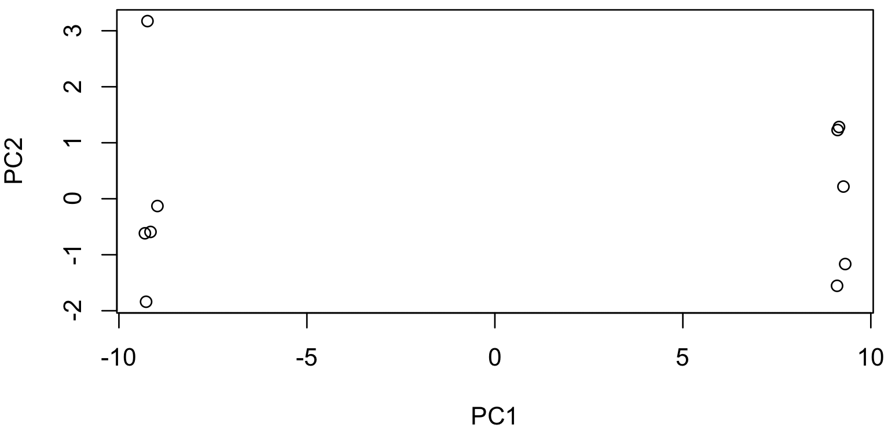

Na powyższym wykresie można zauważyć dwie grupy prób (komórek) - pięć komórek znajduje się po lewej stronie wykresu, a pozostałe 5 komórek po prawej stronie wykresu. Na wykresie nie widzimy jednak, które dokładnie komórki tworzą lewą i prawą grupę. W celu wyświetlenia tych informacji możemy skorzystać z biblioteki ggplot2.

```R
# Nie przejmuj się jeżeli nie rozumiesz poniższego kodu.
# Za chwilę poznasz dużo prostszy sposób rysowania wykresu.
library(ggplot2)
pca.data = data.frame(Sample=rownames(pca$x), X=pca$x[,1], Y=pca$x[,2])
ggplot(
  data=pca.data, 
  aes(x=X, y=Y, label=Sample)
) + geom_text() + xlab("PC1") + ylab("PC2") + theme_bw() + ggtitle("My PCA Graph")
```

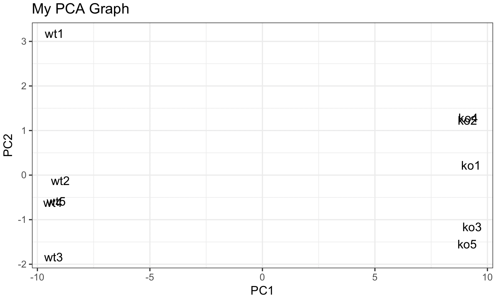

Na powyższym wykresie widać wyraźny podział na komórki normalne (tj. `wt1-wt5`) i komórki zmutowane (tj. `ko1-ko5`).


##### 2. Udział składowych PC w wyjaśnienie zmienności: zmienna `pca$sdev`

Zmienna `pca$sdev` to wektor zawierający odchylenia standardowe dla każdej składowej głównej (`PC1`-`PC10`). Im wyższa wartość odchylenia standardowego, tym większy wpływ składowej głównej w wyjaśnienie zmienności ekspresji genów. 

```R
> pca$sdev
[1] 9.690419e+00 1.533573e+00 1.222895e+00 9.116216e-01 8.102055e-01
[6] 5.597599e-01 4.876233e-01 3.553427e-01 2.891277e-01 5.664734e-15
```

Składowa głowna `PC1` ma najwyższe odchylenie standardowe (*s* = `9.69`) z wszystkich pozostałych składowych, a więc tłumaczy ona w największym stopniu zmienność ekspresji genów. Wartości odchylenia standardowego nie mówią nam jednak zbyt wiele, dlatego zamienia się je na procentowy udział każdej składowej w wyjaśnienie wariancji oryginalnych danych.

```R
> pca.var = pca$sdev^2    # Wariancja to odch. std. podniesione do kwadratu                    
> pca.percent = round(pca.var/sum(pca.var)*100, 1)
> pca.percent
[1] 93.9  2.4  1.5  0.8  0.7  0.3  0.2  0.1  0.1  0.0
```

Składowa `PC1` wyjaśnia 93.9% całkowitej wariancji w ekspresji genów, a składowa PC2 wyjaśnia 2.4% całkowitej wariancji. Obliczony procentowy udziału składowych `PC1`-`PC10` najczęściej przedstawia się na wykresie słupkowym. Formalnie, wykres ten w analizie PCA nazywa się wykresem osypiska (*scree plot*).

```R
plot(pca)
```

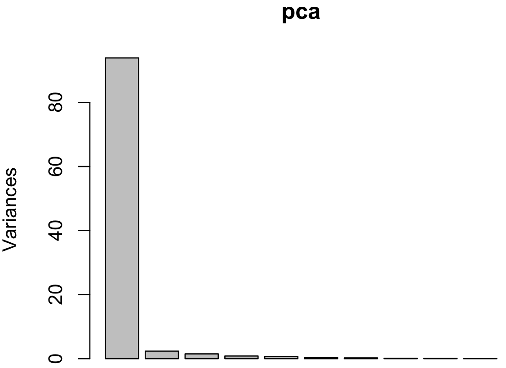

Jeżeli chcemy nadać inny styl wykresowi osypiska to zwykle wykonujemy go za pomocą funkcji `barplot`, na przykład:

```R
barplot(pca.percent, 
    main="Scree plot", 
    xlab="Principal Component", 
    ylab="Percent Variation",
    names.arg = paste("PC", 1:10, sep=""),
    col="blue"
)
```

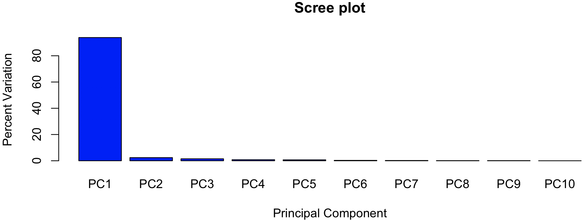

##### 3. Ładunki: zmienna `pca$rotation`

Zmienna `pca$rotation` przedstawia ładunki (*loadings*) wszystkich genów we wszystkich składowych. Ładunki to współczynniki pokazujące wkład poszczególnych zmiennych bazowych (genów) w tworzeniu składowych głównych. Innymi słowy, ładunki pozwalają zobaczyć, które geny mają największy wpływ na umiejscowanie komórek na wykresie PCA.

```R
pca$rotation
```

Im wartość bezwzględna z ładunku większa, tym zmienna ma większy wkład w budowę składowej głównej PC. Wartości ładunków nie są niczym innym jak współrzędnymi obserwacji w nowym układzie współrzędnych utworzonym przez składowe główne.

Wyświetlmy ładunki dla PC1:

```R
loading_scores = pca$rotation[,1]
```

Geny, które przesuwają próby (komórki) na lewą stronę wykresu PCA mają niskie ujemne wartości, natomiast geny, które przesuwają próby (komórki) w prawą stronę mają wysokie dodatnie wartości. Ponieważ jesteśmy zainteresowani obiema stronami wykresu PCA jednocześnie, uszeregujmy malejąco bezwzględne wartości ładunków (nie chcemy znać kierunku, chcemy jedynie zobaczyć, które geny mają największy wpływ na podział na dwie grupy).

```R
gene_scores = abs(loading_scores)
gene_scores_ranked = sort(gene_scores, decreasing=TRUE)
```

Wyświetlmy nazwy 10 genów o najwyższych wartościach bezwzględnych.

```R
> top_10_genes = names(gene_scores_ranked[1:10])
> top_10_genes
[1] "gene37" "gene43" "gene2"  "gene1"  "gene96" "gene90" "gene13" "gene52"
[9] "gene72" "gene19"
```

Na koniec możemy zobaczyć, które z powyższych genów mają dodatnie ładunki, a które ujemne.

```R
> pca$rotation[top_10_genes,1]
    gene37     gene43      gene2      gene1     gene96     gene90     gene13 
 0.1031896  0.1031858  0.1031855 -0.1031851  0.1031851 -0.1031834 -0.1031829 
    gene52     gene72     gene19 
-0.1031827  0.1031821  0.1031807
```

Geny o ujemnych ładunkach (np. `gene1`, `gene90`) powodują, że próby (komórki) są po lewej stronie wykresu, natomiast geny o dodatnich ładunkach (`gene37`, `gene43`) koncentrują próby (komórki) po prawej stronie.

##### Wykres biplot

Wkład poszczególnych zmiennych (genów) można również zwizualizować na wykresie *biplot*.

```R
> biplot(pca)
```

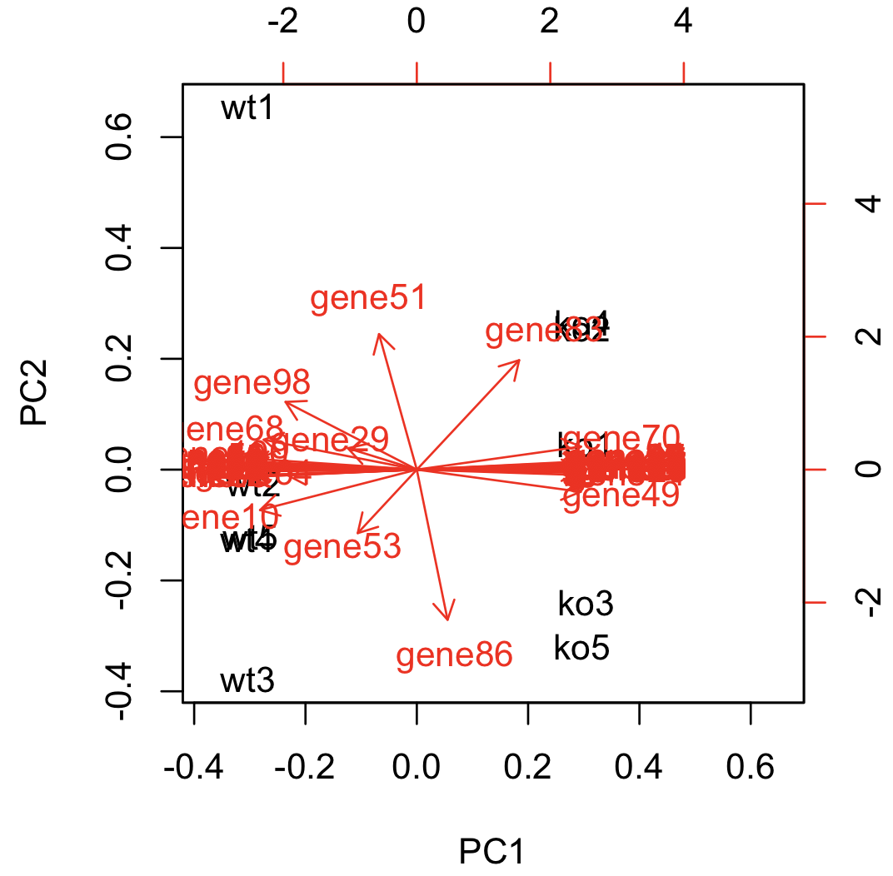


Strzałki oznaczają zmienne (geny). Kierunek strzałek pokazuje wpływ genów odpowiednio na pierwszą i drugą składową - strzałki zwrócone w lewą/prawą stronę mają wpływ na PC1, natomiast strzałki zwróconę w górę/dół mają wpływ na PC2. Duża liczba zmiennych (genów) w naszych danych uniemożliwia odczytanie na wykresie genów mających wpływ na PC1 (jednak wiemy już, które geny mają istotny wpływ na PC1 z wcześniej wykonanej analizy ładunków). Na wykresie możemy za to odczytać geny mające największy wpływ na PC2 (np. `gene51`, `gene86`, `gene53`). 


Kąt przecięcia strzałek na wykresie jest proporcjonalny do korelacji między zmiennymi (genami), a długość strzałek odzwierciedla odchylenie standardowe. Jeżeli strzałki mają przeciwne zwroty to dane zmienne są ujemnie skorelowane (nie można jednak ocenić wartości korelacji), jeżeli zwroty są prostopadłe to zmienne są nieskorelowane, a jeżeli zwroty są bliskie to zmienne są dodatnio skorelowane. Na przykład, geny `gene51` i `gene86` są ujemnie skorelowane, między genami `gene51` i `gene70` nie ma korelacji, z kolei geny `gene70` i `gene49` są dodatnio skorelowane.


### Zad. 2
>Wbudowany w program R zbiór danych `USArrests` zawiera informacje dotyczące wykroczeń kryminalnych (liczby morderstw, napadów i gwałtów) przypadających na 100 000 osób w poszczególnych stanach USA w roku 1973 roku oraz procent ludności mieszkającej w miastach. Przeprowadź analizę PCA, aby sprawdzić, czy stany są do siebie w pewien sposób zbliżone.

#### Podgląd danych

```R
> data(USArrests)
> head(USArrests)
           Murder Assault UrbanPop Rape
Alabama      13.2     236       58 21.2
Alaska       10.0     263       48 44.5
Arizona       8.1     294       80 31.0
Arkansas      8.8     190       50 19.5
California    9.0     276       91 40.6
Colorado      7.9     204       78 38.7
```

Próby (stany USA) są w wierszach macierzy, a zmienne w kolumnach. Dlatego nie ma potrzeby transponowania macierzy.

#### Analiza PCA

```R
> pca = prcomp(USArrests, scale=TRUE)
> summary(pca)
Importance of components:
                          PC1    PC2     PC3     PC4
Standard deviation     1.5749 0.9949 0.59713 0.41645
Proportion of Variance 0.6201 0.2474 0.08914 0.04336
Cumulative Proportion  0.6201 0.8675 0.95664 1.00000
```

Otrzymaliśmy cztery składowe główne (`PC1`-`PC4`), przy czym dwie pierwsze wyjaśniają 86.8% zmienności oryginalnych danych (`0.868 = 0.6201 + 0.2474`).

##### Wykres osypiska

```R
barplot(pca$sdev^2 / sum(pca$sdev^2) * 100, names.arg = paste("PC", 1:4, sep=""))
```

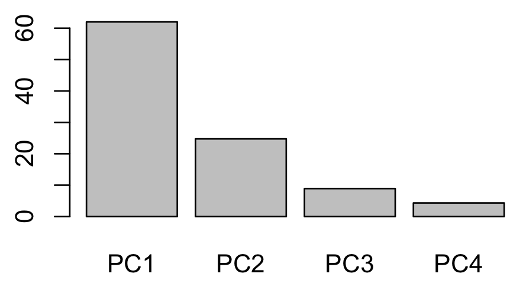


##### Wartości ładunków
Wpływ wykroczeń kryminalnych na PC1 i PC2 pokazują wartości ładunków.

```R
> pca$rotation
                PC1        PC2        PC3         PC4
Murder   -0.5358995  0.4181809 -0.3412327  0.64922780
Assault  -0.5831836  0.1879856 -0.2681484 -0.74340748
UrbanPop -0.2781909 -0.8728062 -0.3780158  0.13387773
Rape     -0.5434321 -0.1673186  0.8177779  0.08902432
```

Z powyższych wartości wynika, że napady (*Assault*) mają największy wpływ na PC1 (`-0.583`), później gwałty (*Rape*) (`-0.543`) i morderstwa (*Murder*) (`-0.536`), a najmniejszy wpływ na PC1 ma procent ludności miejskiej (*UrbanPop*) (`-0.278`). Z kolei, *UrbanPop* ma największy wpływ na główną składową PC2 (`0.418`).


##### Wykres biplot

```R
biplot(pca, cex=0.7)    # Parametr cex ustawia wielkość czcionki
```

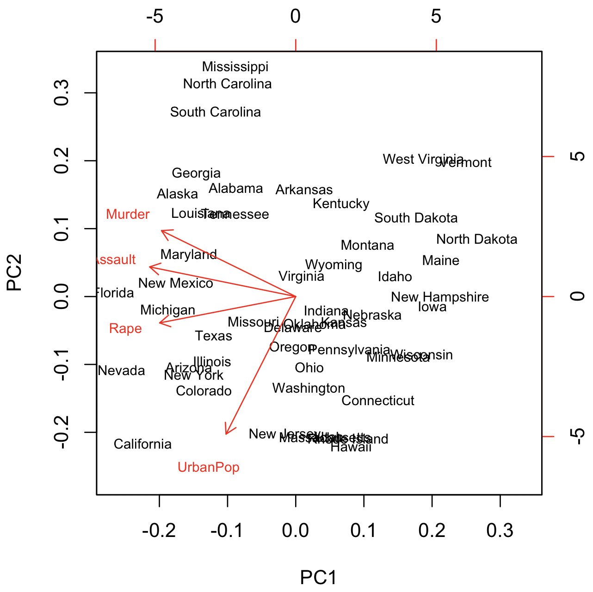

Możemy zaobserwować pewne grupowanie się stanów. Na przykład, stany Wirginia Zachodnia oraz Vermont zdają się tworzyć jedną grupę. Na pierwszą składową `PC1` największy wpływ mają napady, gwałty i morderstwa, a na drugą składową `PC2` największy wpływ ma procent ludności miejskiej (*UrbanPop*). Trzy pierwsze zmienne (napady, gwałty i morderstwa) są ze sobą skorelowane, natomiast procent ludności z posotałymi nie jest (przypomnienie: pokazuje to kąt pomiędzy strzałkami - im bliższy kąt prosty, tym zależność słabsza). Możemy zatem pokusić się o zaproponowanie modelu uproszczonego bez zmiennej *UrbanPop*.


```R
> summary(prcomp(~Murder + Assault + Rape, data=USArrests, scale=TRUE))
Importance of components:
                          PC1    PC2     PC3
Standard deviation     1.5358 0.6768 0.42822
Proportion of Variance 0.7862 0.1527 0.06112
Cumulative Proportion  0.7862 0.9389 1.00000
```

Po wykluczeniu zmiennej `UrbanPop` z analizy PCA, główne składowe `PC1` i `PC2` wyjaśniają prawie 94% zmienności w oryginalnych danych (`0.7862 + 0.1527 = 0.94`).


# 2. Skalowanie wielowymiarowe (MDS)

Metoda MDS (*Multidimensional Scaling*) i PCA są bardzo podobne do siebie. Obie metody służą do redukcji wielowymiarowości do dwóch lub trzech zmiennych. Metoda PCA pracuje na korelacjach między zmiennymi natomiast metoda MDS operuje na odległościach między zmiennymi.

Choć metoda PCA jest bardzo popularna, w niektórych sytuacjach bardziej odpowiednia jest metoda MDS:

1. Po pierwsze, w przypadku, gdy między zmiennymi nie istnieją korelacje, metoda PCA nie zidentyfikuje dwóch głównych składowych, które wyjaśniałyby całą zmienność danych – zamiast tego będziemy mieli tyle składowych, ile zmiennych, przy czym każda składowa będzie miała ten sam wkład w wyjaśnienie zmienności danych.
2. Po drugie, PCA używa jedynie zmiennych ilościowych, metoda MDS może operować również na danych jakościowych.
3. Po trzecie, w metodzie PCA konieczne jest posiadanie pełnych danych z doświadczenia (to znaczy, że nie da się jej użyć, jeżeli mamy wyłącznie informacje o podobieństwie obiektów). Natomiast MDS pracuje na macierzy niepodobieństwa między próbami.

## 2.1. Metryczne skalowanie MDS = PCoA 

Metryczne skalowanie MDS nazywa się analizą współrzędnych głównych (PCoA *Principle Coordinate Analysis*). Obejrzyj film na Youtube dotyczący PCoA [8min17sek]:

[](https://youtu.be/GEn-_dAyYME)


### Zad. 3
>Przeprowadź skalowanie wielowymiarowe metryczne (PCoA) zbioru danych `USArrests`.

#### Dane wejściowe

Dane `USArrests` obejmują liczbę wykroczeń kryminalnych dla każdego stanu USA. Ponieważ metoda PCoA wymaga, aby dane wejściowe obejmowały macierz niepodobieństw (dystansów), musimy zamienić macierz oryginalnych danych na macierz dystansów za pomocą funkcji `dist`.

```R
dist(USArrests, method="euclidean")
```

Funkcja `dist` obsługuje sześć innych dystansów (np. dystans Manhattan).

```R
dist(USArrests, method="manhattan")
```

Odległości między próbami (stanami) można również liczyć na danych przeskalowanych, chociaż nie jest to wymagane w analizie MDS/PCoA.

```R
dist(scale(USArrests, scale=TRUE, center=TRUE), method="euclidean")
````

#### Analiza MDS
Wykonanie analizy MDS przeprowadza funkcja `cmdscale` (*Classical Multi-Dimensional Scaling*). W wyniku zwracane są współrzędne prób (stanów USA) potrzebne do narysowania ich na wykresie.

```R
> distances = dist(USArrests, method="euclidean")
> mds = cmdscale(distances)
> head(mds)
                 [,1]      [,2]
Alabama     -71.33523  28.93059
Alaska     -116.72760  55.27836
Arizona    -146.05263 -25.17769
Arkansas    -16.10837  33.62339
California -146.87833 -39.35231
Colorado    -52.71693 -41.60109
```

Utworzenie wykresu:

```R
plot(mds, type="n")
text(mds, rownames(mds), cex = 0.6)
```

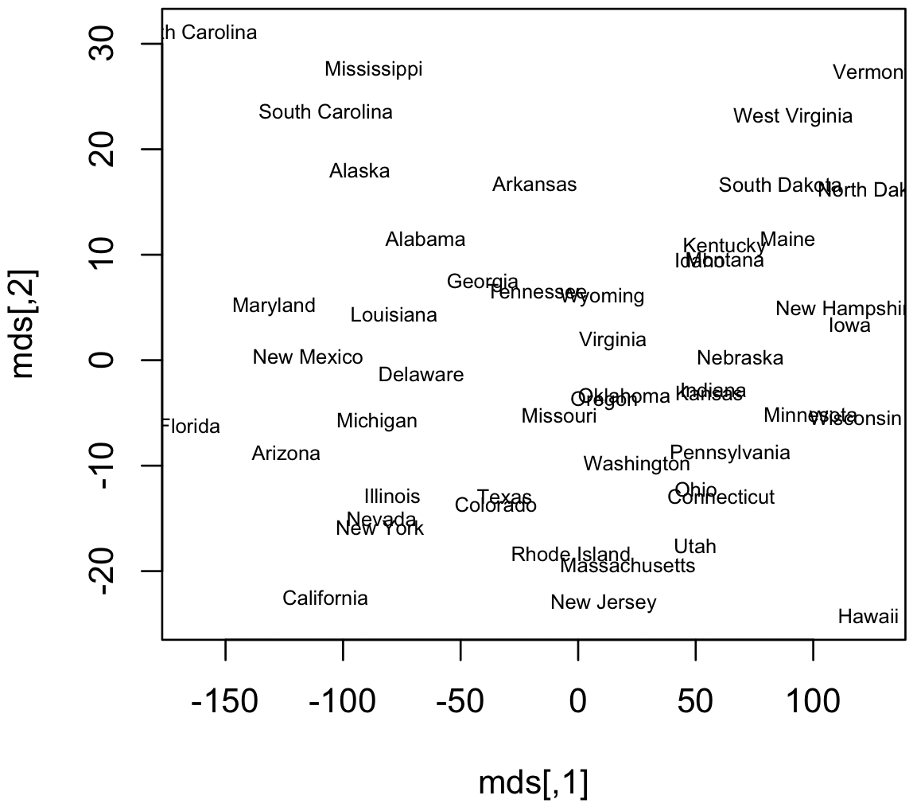

Podobnie jak w przypadku analizy PCA, stany Vermont i Wirginia Zachodnia są blisko siebie na wykresie. 


#### Ładunki

Aby sprawdzić ile wariancji wyjaśnia każda z dwóch osi, wywołujemy funkcję `cmdscale` z atrybutem `eig`:

```R
mds = cmdscale(distances, eig=TRUE)
```

W wyniku otrzymamy dodatkowo *eigenvector* (wektor własny), czyli listę ładunków:

```R
> mds.var.per = round(mds$eig/sum(mds$eig)*100, 1)
> mds.var.per
 [1] 96.6  2.8  0.6  0.1  0.0  0.0  0.0  0.0  0.0  0.0  0.0  0.0  0.0  0.0  0.0
[16]  0.0  0.0  0.0  0.0  0.0  0.0  0.0  0.0  0.0  0.0  0.0  0.0  0.0  0.0  0.0
[31]  0.0  0.0  0.0  0.0  0.0  0.0  0.0  0.0  0.0  0.0  0.0  0.0  0.0  0.0  0.0
[46]  0.0  0.0  0.0  0.0  0.0
```
Oś *X* wyjasnia 96.6% wariancji w danych, natomiast oś *Y* tłumaczy 2.8% wariancji.


### Zad. 4
>Zbiór danych `eurodist` zawiera odległości (km) pomiędzy 21 miastami Europy. Zastosuj skalowanie metryczne i sprawdź na wykresie, czy ułożenie miast zbliżone jest do ich układu na mapie.

```R
mds = cmdscale(eurodist)     # eurodist to macierz dystansów (nie musimy ich liczyć)
```

```R
plot(mds[,1], -mds[,2])
text(mds[,1]+300, -mds[,2], rownames(mds), cex = 0.6)
```

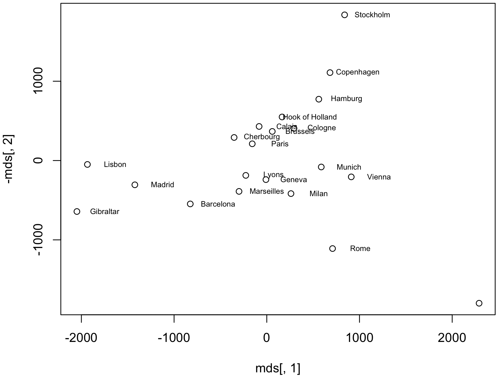


# 3. Wykresy obrazkowe

Czasami do wizualizacji prób, które mają wiele zmiennych wystarczają bardzo proste metody, które pomagają raczej jedynie we wstępnej analizie danych. Tego typu wykresy to wielowymiarowe wykresy obrazkowe (*glyphs*). Podstawową ich ideą jest przedstawienie pojedynczych prób za pomocą obiektów graficznych, których własności przypisano do zmiennych. Tak skonstruowane obiekty są unikatowe dla każdej konfiguracji i jako takie mogą zostać rozpoznane przez badacza w sposób wizualny.

### Zad. 7
> Utwórz wykresy obrazkowe (typu twarze Chernoffa, wykres gwiazdowy i wykres radarowy) dla zbioru danych `state.x77`, który zawiera 8 statystyk dotyczących amerykańskich stanów.

#### Podgląd danych

```R
> head(state.x77)
           Population Income Illiteracy Life Exp Murder HS Grad Frost   Area
Alabama          3615   3624        2.1    69.05   15.1    41.3    20  50708
Alaska            365   6315        1.5    69.31   11.3    66.7   152 566432
Arizona          2212   4530        1.8    70.55    7.8    58.1    15 113417
Arkansas         2110   3378        1.9    70.66   10.1    39.9    65  51945
California      21198   5114        1.1    71.71   10.3    62.6    20 156361
Colorado         2541   4884        0.7    72.06    6.8    63.9   166 103766
```

#### Twarze Chernoffa (*Chernoff's faces*)
Twarze Chernoffa (Herman Chernoff – amerykański statystyk). Dla każdego stanu (próby) rysowany jest oddzielny rysunek twarzy. Do kształtów, kolorów i rysów twarzy (np. szerokość nosa, kąt brwi, wysokość uszu) przypisywane są względne wartości wybranych zmiennych.

```R
> install.packages("aplpack")
> library("aplpack")
> faces(state.x77, cex=1)
effect of variables:
 modified item       Var         
 "height of face   " "Population"
 "width of face    " "Income"    
 "structure of face" "Illiteracy"
 "height of mouth  " "Life Exp"  
 "width of mouth   " "Murder"    
 "smiling          " "HS Grad"   
 "height of eyes   " "Frost"     
 "width of eyes    " "Area"      
 "height of hair   " "Population"
 "width of hair   "  "Income"    
 "style of hair   "  "Illiteracy"
 "height of nose  "  "Life Exp"  
 "width of nose   "  "Murder"    
 "width of ear    "  "HS Grad"   
 "height of ear   "  "Frost"
```

Na przykład, zmienna `Population` wyrażona jest jako wysokość twarzy, zatem najwyższe twarze odpowiadają stanom o największej populacji (np. Kalifornia, Teksas).


Za pomocą twarzy Chernoffa można zwizualizować do 15 zmiennych, dodatkowe 15 uzyskamy, jeśli osobno potraktujemy lewą i prawą połowę twarzy.

#### Wykres gwiazdowy (*star plot*)
Na wykresie gwiazdowym dla każdej próby również rysowany jest oddzielny obrazek w kształcie gwiazdy. Względne wartości wybranych zmiennych dla każdego przypadku reprezentowane są przez długości ramion gwiazdy (zgodnie z ruchem wskazówek zegara począwszy od godz. 12:00). Końce ramion są połączone linią.

```R
stars(state.x77, key.loc=c(16, 1.5)) # parameter key.loc podaje wsółrzędne (x,y) legendy
```

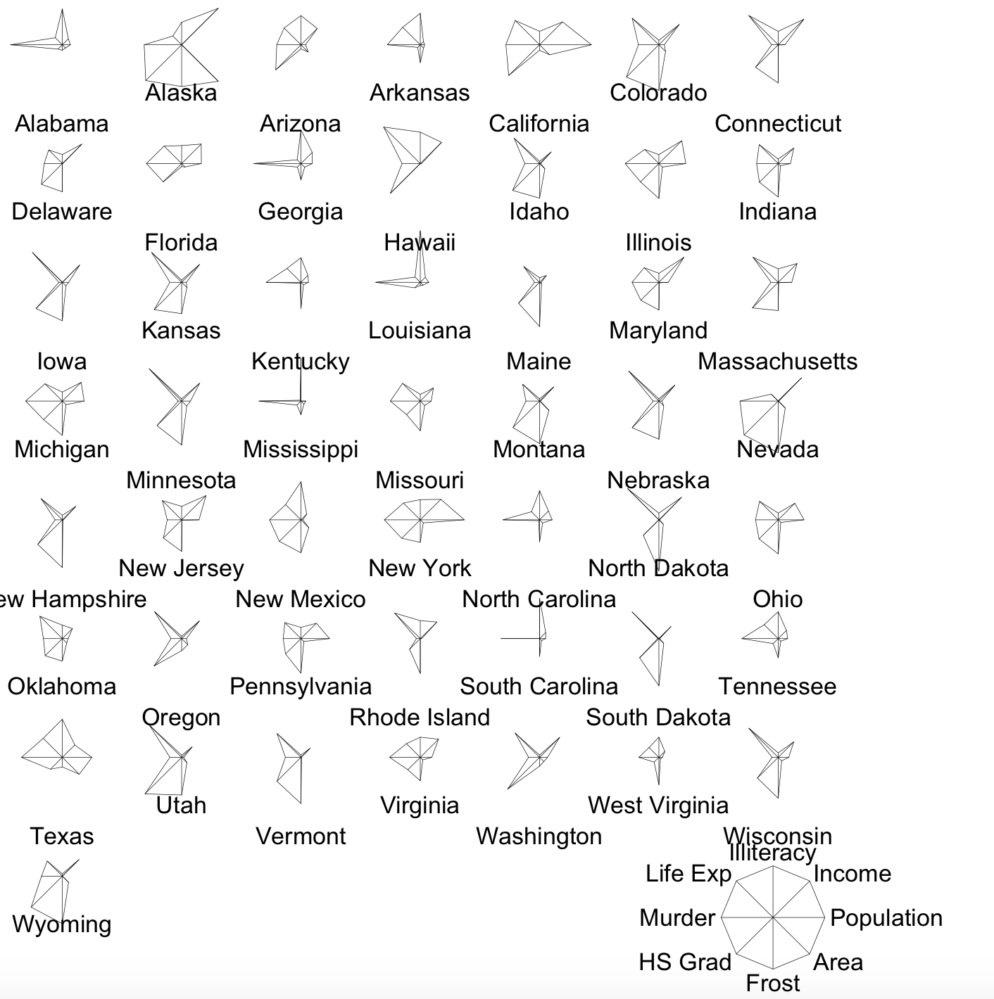

Na przykład Alaska jest stanem o największej powierzchni (1.7 mln km<sup>2</sup>) - wskazuje na to najdłuższe prawe dolne ramię gwiazdy (`Area`). Na przykład stan Missisipi jedyne co ma najwyższe to liczbę morderstw i ludzi niepotrafiących czytać i pisać.

#### Wykres radarowy (*radar plot*)
Wykres radarowy jest szczególnym przypadkiem wykresu gwiazd. W przypadku wykresu radarowego wszystkie gwiazdy nanosimy na siebie.

```R
stars(state.x77, locations=c(0,0), radius=F, key.loc=c(0,0), lty=2)
```

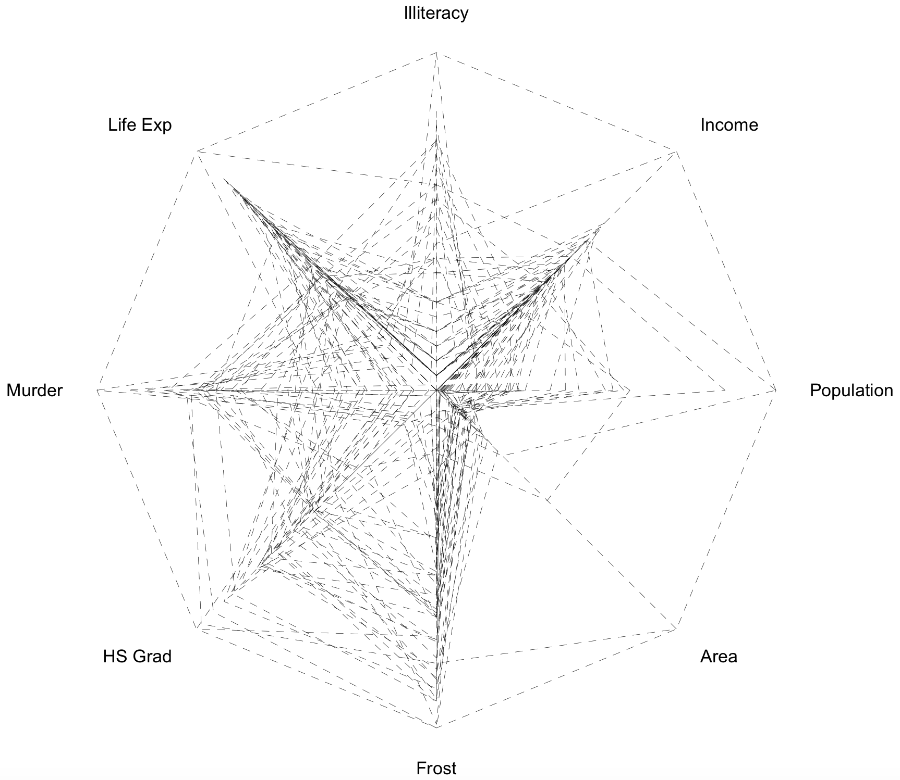

Na wykresie radarowym nie widzimy cech poszczególnych stanów. Najczęsciej linie na wykresie należące do danego stanu zaznacza się innym kolorem i następnie tworzy się legendę kolorów. Wykres radarowy nie jest zbyt czytelnym wykresem.